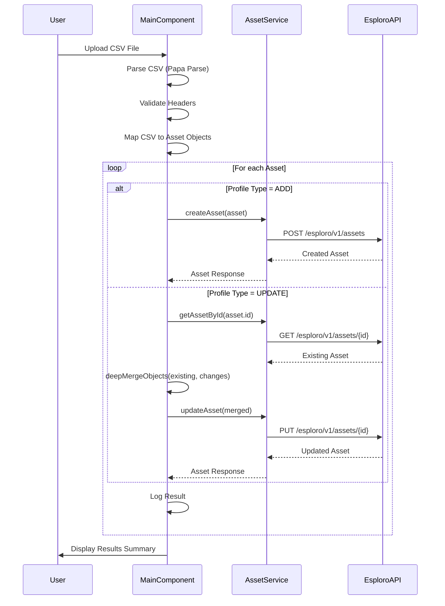

# Esploro Asset API Usage Analysis Report

> **⚠️ HISTORICAL DOCUMENT**: This report analyzes API usage for a CSV-based asset loader that is NO LONGER the current application. The **current application** is a simple file uploader (not CSV-based). For current information, see:
> - **[explaination.md](explaination.md)** - Current application documentation
> - **[documentation/CLEANUP_SUMMARY.md](documentation/CLEANUP_SUMMARY.md)** - What changed and why
> - **[README.md](README.md)** - Current user documentation

---

## Executive Summary (Historical)

This report provides a historical analysis of how the **Esploro CSV Asset Loader** Angular application interacted with the Esploro Asset REST API (`/esploro/v1/assets`). This version implemented CRUD workflows for managing research assets through CSV bulk operations.

**Note**: The current application uses a much simpler API integration focused on file attachment.

## Phase 1: API Configuration and Authentication

### 1.1 API Configuration Architecture

**Key Finding**: This application uses the Ex Libris Cloud App framework, which handles API configuration and authentication automatically through the `CloudAppRestService`.

#### Base URL Configuration
- **No explicit base URL configuration**: The application leverages the Ex Libris Cloud App framework where API calls are proxied through the platform
- **Relative URL pattern**: All API calls use relative URLs like `/esploro/v1/assets/{id}`
- **Platform-managed routing**: The Ex Libris platform automatically routes requests to the appropriate Esploro instance

#### Authentication Mechanism
- **Framework-managed authentication**: Uses `CloudAppRestService` from `@exlibris/exl-cloudapp-angular-lib`
- **Automatic API key injection**: The Cloud App framework automatically injects authentication headers
- **User context inheritance**: Inherits user permissions and institutional context from the Esploro session
- **No hardcoded credentials**: No API keys or authentication tokens visible in source code

```typescript
// From asset.service.ts - CloudAppRestService injection
constructor(private restService: CloudAppRestService) { }
```

### 1.2 HTTP Client Implementation

**No Custom Interceptors**: The application relies entirely on the Ex Libris `CloudAppRestService`, which handles:
- Authentication header injection
- Content-Type and Accept headers
- Error handling and response parsing
- Institutional context routing

## Phase 2: Asset Retrieval (GET Requests) Analysis

### 2.1 GET Request Implementation

The application implements asset retrieval through the `AssetService.getAssetById()` method:

```typescript
/** (GET) Fetch asset from Esploro API */
getAssetById(id: string): Observable<Asset> {
  return this.restService.call({
    url: `/esploro/v1/assets/${id}`,
    headers: { 
      "Content-Type": "application/json",
      Accept: "application/json" 
    },
  })
}
```

#### Request Parameters
- **Path Parameter**: Asset ID (required)
- **No query parameters**: The application doesn't use limit, offset, or DOI search parameters
- **Headers**: Standard JSON content negotiation headers

### 2.2 GET Request Usage Patterns

#### Triggering Events
1. **UPDATE operations**: GET request is made before updating to retrieve existing asset data
2. **Merge workflow**: Used in `processAsset()` method for UPDATE profile type

```typescript
case 'UPDATE':
  return this.assetService.getAssetById(asset.id).pipe(
    catchError(e=>{throw(e)}),
    switchMap(original=>{
      if (original==null) {
        return of(this.handleError({message: this.translate.instant("Error.EmptyAssetApiGET"), type: CustomResponseType.error}, asset, index));
      } else {
        let new_asset = deepMergeObjects(original, asset);
        return this.assetService.updateAsset(new_asset);
      }
    }),
    catchError(e=>of(this.handleError(e, asset, index)))
  )
```

#### Response Handling
- **TypeScript Interface**: Uses comprehensive `Asset` interface (151 lines) for type safety
- **Error Handling**: Implements null checking and custom error messages
- **Data Merging**: Uses `deepMergeObjects()` utility to preserve existing data during updates

## Phase 3: Asset Creation and Updates Analysis

### 3.1 Asset Creation (POST) Implementation

```typescript
/** (POST) Create asset via Esploro API */
createAsset(asset: Asset): Observable<Asset> {
  return this.restService.call({
    url: `/esploro/v1/assets`,
    headers: { 
      "Content-Type": "application/json",
      Accept: "application/json" 
    },
    requestBody: asset,
    method: HttpMethod.POST
  })
}
```

#### POST Request Characteristics
- **Endpoint**: `/esploro/v1/assets`
- **Method**: `HttpMethod.POST`
- **No query parameters**: Unlike the documentation examples, this app doesn't use:
  - `is_draft=true`
  - `author_affiliation_enhancement=true`
  - `override_author_affiliations=true`
  - `open_access_enrichment=true`
  - `reject_duplicate=true`
  - `import_profile=API`

#### Request Body Structure
The application uses a comprehensive Asset interface that supports:

**Core Fields**:
```typescript
{
  title: string;                    // Required
  asset_type: { value: string };    // Required  
  organization: { value: string };  // Required
  publication_date?: string;
}
```

**Complex Nested Structures**:
- **Authors**: Array of author objects with researcher linking
- **Identifiers**: DOI, ISBN, and other identifier types
- **Content**: Abstracts, keywords, subjects
- **Publication Details**: Journal, conference information
- **Rights Management**: Access policies, licenses, embargo dates
- **Funding**: Grant and funding information

### 3.2 Asset Update (PUT) Implementation

```typescript
/** (PUT) Update asset via Esploro API */
updateAsset(asset: Asset): Observable<Asset> {
  return this.restService.call({
    url: `/esploro/v1/assets/${asset.id}`,
    headers: { 
      "Content-Type": "application/json",
      Accept: "application/json" 
    },
    requestBody: asset,
    method: HttpMethod.PUT
  })
}
```

#### Update Strategy: Fetch-Merge-Update Pattern
The application implements a sophisticated update pattern:

1. **Fetch existing asset** via GET request
2. **Deep merge changes** using `deepMergeObjects()` utility
3. **Update complete asset** via PUT request

```typescript
// From main.component.ts processAsset method
let new_asset = deepMergeObjects(original, asset);
return this.assetService.updateAsset(new_asset);
```

**Key Benefits**:
- Preserves existing field values not included in CSV
- Prevents accidental data loss
- Maintains referential integrity

### 3.3 PATCH Operations Analysis

**Important Finding**: The application does **NOT** implement PATCH operations with `op=patch` parameter as described in the provided documentation. Instead, it uses:
- **PUT method only** for updates
- **Complete asset replacement** rather than partial updates
- **No action parameter** (add/replace) implementation

## Phase 4: Data Processing and Workflow Analysis

### 4.1 CSV-to-API Workflow



### 4.2 Parallel Processing Implementation

```typescript
// From main.component.ts
const maxParallelCalls = assets.every(res=>res.id) ? MAX_PARALLEL_CALLS : 1;

let assetProcessingObservables = from(assets.map((asset, index) => 
  this.processAssetWithLogging(asset, index)
));

assetProcessingObservables.pipe(
  mergeMap(assetProcessingObservable => assetProcessingObservable, maxParallelCalls),
  tap(result => resultsArray.push(result)),
  catchError(error => {
    this.log(`${this.translate.instant("Main.Failed")}: ${error.message}`);
    return throwError(error);
  })
)
```

**Performance Features**:
- **Configurable concurrency**: `MAX_PARALLEL_CALLS = 5`
- **Thread-safe handling**: Reduces parallelism to 1 when asset IDs are generated
- **RxJS-based**: Uses `mergeMap` with concurrency limit
- **Error resilience**: Individual failures don't stop batch processing

### 4.3 Data Mapping and Transformation

#### CSV Field Mapping
The application uses a sophisticated profile-based field mapping system:

```typescript
mapAsset = (parsedAsset: any, selectedProfile: Profile) => {
  const arrayIndicator = new RegExp(/\[\d*\]/);
  
  const mapCsvToProfileFields = (parsedAsset: any, selectedProfile: Profile) => {
    return Object.entries<string>(parsedAsset).reduce((mappedFields, [csvKey, csvValue]) => {
      const profileField = selectedProfile.fields.find(profileField => 
        profileField.header === csvKey
      );
      if (profileField && profileField.fieldName && csvValue) {
        let fieldName = profileField.fieldName;
        if (arrayIndicator.test(fieldName)) { // array field
          fieldName = fieldName.replace(arrayIndicator, 
            `[${Object.keys(mappedFields).filter(k => 
              k.replace(arrayIndicator, '[]') === fieldName
            ).length}]`);
        }
        mappedFields[fieldName] = ['true', 'false'].includes(csvValue) ? 
          (csvValue === 'true') : csvValue;
      }
      return mappedFields;
    }, {});
  };
  
  // Apply default values and convert to nested object
  let mappedAsset = mapCsvToProfileFields(parsedAsset, selectedProfile);
  setDefaultValues(mappedAsset, selectedProfile);
  mappedAsset = dot.object(mappedAsset); // Convert dot notation to nested objects
  
  return mappedAsset;
}
```

**Key Features**:
- **Dynamic field mapping**: CSV headers mapped to Esploro field paths via profiles
- **Array field support**: Handles multiple values (authors, identifiers, keywords)
- **Boolean conversion**: Converts string "true"/"false" to boolean values
- **Dot notation support**: Uses `dot-object` library for nested field creation
- **Default value injection**: Applies profile-defined default values

## Phase 5: Error Handling and Validation

### 5.1 API Error Handling

```typescript
private handleError(e: RestErrorResponse | CustomResponse, asset: any, index: number) {
  if (asset) {
    const props = ['id', 'title']
      .map(p => asset[p])
      .filter(value => !isEmptyString(value));
    
    if (props.length > 0) {
      e.message += ` (${props.join(', ')}, row ${index+2})`;
    } else {
      e.message += ` (row ${index+2})`;
    }
  }
  return e;
}
```

**Error Handling Features**:
- **Row-level tracking**: Associates errors with specific CSV rows
- **Asset identification**: Includes asset ID/title in error messages
- **Custom error types**: Supports both REST API and application-defined errors
- **Graceful degradation**: Individual failures don't stop batch processing

### 5.2 Data Validation

#### Pre-API Validation
- **CSV header validation**: Ensures CSV headers match selected profile
- **Required field validation**: Validates mandatory fields based on operation type
- **Field format validation**: Type checking and format validation

#### Profile-Based Validation Rules
```typescript
// For ADD operations
mandatoryFieldsAdd = [
  {header: 'title', fieldName: 'title'},
  {header: 'asset_type', fieldName: 'asset_type.value'},
  {header: 'organization', fieldName: 'organization.value'}
];

// For UPDATE operations  
mandatoryFieldsUpdate = [{header: 'id', fieldName: 'id'}];
```

## Phase 6: Architecture Summary

### 6.1 Service Architecture

```
Angular Application
├── MainComponent
│   ├── CSV Processing (Papa Parse)
│   ├── Profile Management
│   └── Batch Processing Logic
├── AssetService
│   ├── createAsset() → POST /esploro/v1/assets
│   ├── getAssetById() → GET /esploro/v1/assets/{id}
│   ├── updateAsset() → PUT /esploro/v1/assets/{id}
│   └── mapAsset() → CSV-to-Asset transformation
└── CloudAppRestService (Ex Libris Framework)
    ├── Authentication Management
    ├── Request/Response Handling
    └── Error Processing
```

### 6.2 Key Design Patterns

1. **Service Layer Pattern**: Clear separation between UI logic and API calls
2. **Observer Pattern**: RxJS Observables for async operations
3. **Strategy Pattern**: Profile-based field mapping strategies
4. **Template Method**: Consistent request/response handling via CloudAppRestService
5. **Merge Pattern**: Fetch-merge-update for data preservation

### 6.3 Performance Characteristics

- **Batch Processing**: Up to 500 assets per operation
- **Parallel Execution**: Configurable concurrency (default: 5 concurrent requests)
- **Memory Management**: Streaming CSV processing
- **Progress Tracking**: Real-time progress updates during bulk operations

## Phase 7: Notable Differences from Documentation

### 7.1 Missing Query Parameters

The application **does not implement** several query parameters mentioned in the provided documentation:

**POST Request Parameters (Not Implemented)**:
- `is_draft=true`
- `author_affiliation_enhancement=true` 
- `override_author_affiliations=true`
- `open_access_enrichment=true`
- `reject_duplicate=true`
- `import_profile=API`

### 7.2 No PATCH Implementation

The application **does not use** PATCH operations with:
- `op=patch` parameter
- `action` parameter (add/replace)
- Partial update semantics

Instead, it uses **full asset replacement** via PUT operations after fetching and merging existing data.

### 7.3 Simplified API Integration

The application prioritizes:
- **Simplicity**: Uses only GET, POST, and PUT operations
- **Data Safety**: Fetch-merge-update pattern prevents data loss
- **Framework Integration**: Leverages Ex Libris Cloud App infrastructure
- **Bulk Operations**: Optimized for CSV-based batch processing

## Conclusion

The Esploro CSV Asset Loader demonstrates a well-architected integration with the Esploro Asset API, prioritizing data safety, user experience, and institutional workflow efficiency. While it doesn't implement every API feature documented, it provides a robust, production-ready solution for bulk asset management within the Ex Libris ecosystem.