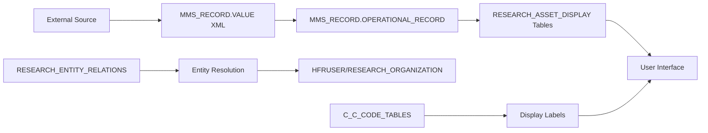
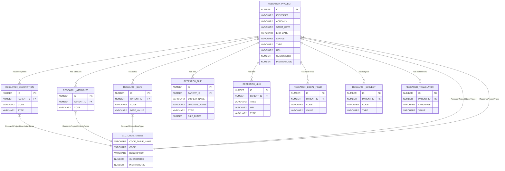

# Complete Esploro Assets Database Schema

## Core Asset Tables

### MMS_RECORD (Master Bibliographic Records)
**Purpose**: Core bibliographic metadata for all assets
- **MMS_ID** (NUMBER, PK): Master bibliographic ID
- **VALUE** (CLOB): Core XML metadata content
- **LIFE_CYCLE** (NUMBER): 0=Active, 1=?, 2=Suppressed, 3=Deleted
- **OBJECTTYPE** (VARCHAR2): Type of object (BIB_MMS)
- **ORIGINATING_SYSTEM** (VARCHAR2): Source system
- **ORIGINATING_SYSTEM_ID** (VARCHAR2): External system ID
- **VERSION** (NUMBER): Record version

### RESEARCH_ASSET (Research Asset Core)
**Purpose**: Core research asset metadata linking to MMS_RECORD
- **ID** (NUMBER, PK): Unique asset identifier
- **MMS_ID** (NUMBER, FK): Links to MMS_RECORD.MMS_ID
- **ASSET_VALUE** (CLOB): Research-specific asset metadata

### RESEARCH_ASSET_DISPLAY (Asset Display Fields)
**Purpose**: Flattened display fields for asset presentation
- **ID** (NUMBER, PK): Unique display record ID
- **MMS_ID** (NUMBER, FK): Links to MMS_RECORD.MMS_ID
- **TITLE** (VARCHAR2(4000)): Asset title
- **DOI** (VARCHAR2(765)): Digital Object Identifier
- **MATERIAL_TYPE** (VARCHAR2(765)): Type of research material
- **PUBLICATION_TITLE** (VARCHAR2(4000)): Journal/publication name
- **DATE_PUBLISHED** (VARCHAR2(150)): Publication date
- **DATE_CREATED** (VARCHAR2(150)): Creation date
- **OPEN_ACCESS** (VARCHAR2(60)): Open access status
- **PEER_REVIEW** (VARCHAR2(60)): Peer review status
- **KEYWORDS** (VARCHAR2(4000)): Associated keywords
- **LANGUAGES** (VARCHAR2(4000)): Languages
- **PROVENANCE** (VARCHAR2(765)): Data provenance
- **LOCAL_FIELD_1...50** (VARCHAR2(4000)): Customizable local fields

### RESEARCH_ASSET_EXTENSION (Asset Technical Data)
**Purpose**: Technical and administrative asset information
- **ID** (NUMBER, PK): Unique extension ID
- **MMS_ID** (NUMBER, FK): Links to MMS_RECORD.MMS_ID
- **ASSET_DOI** (VARCHAR2(765)): Asset DOI
- **DEPOSIT_STATUS** (VARCHAR2(765)): Deposit workflow status
- **DEPOSIT_TYPE** (VARCHAR2(765)): Type of deposit
- **EMBARGO_EXPIRY_DATE** (VARCHAR2(20)): Embargo end date
- **ACCESS_STATUS_INDICATOR** (VARCHAR2(765)): Access permissions
- **ASSET_OWNER_ID** (NUMBER): Owner user ID
- **IS_FUNDED** (NUMBER): Funding indicator (0/1)
- **HAS_INVENTORY** (NUMBER): Has digital files (0/1)

---

## Core User and Researcher Tables

### HFRUSER (Core User Records)
**Purpose**: Central table for all user records in the system, including both staff and patrons
**Key Fields**:
- **ID** (NUMBER, NOT NULL, PK): Unique user identifier
- **USER_NAME** (VARCHAR2(255)): Login username
- **FIRST_NAME** (VARCHAR2(255)): User's first name
- **LAST_NAME** (VARCHAR2(255)): User's last name
- **MIDDLE_NAME** (VARCHAR2(255)): User's middle name
- **RECORD_TYPE** (NUMBER(10)): Type of user record
- **USER_TYPE** (NUMBER(10)): Classification of user type
- **STATUS** (NUMBER(10)): User account status (0=Active, etc.)
- **EXPIRY_DATE** (TIMESTAMP WITH TIME ZONE): Account expiration date
- **PURGE_DATE** (TIMESTAMP WITH TIME ZONE): Date for record purging
- **CUSTOMERID** (NUMBER(19), NOT NULL): Tenant identifier
- **INSTITUTIONID** (NUMBER(19), NOT NULL): Institution identifier
- **JOB_TITLE** (VARCHAR2(255)): User's job title
- **EXTERNAL_ID** (VARCHAR2(255)): External system identifier
- **BIRTH_DATE** (TIMESTAMP WITH TIME ZONE): User's birth date
- **GENDER** (NUMBER(10)): Gender code
- **CAMPUS_CODE** (VARCHAR2(50)): Associated campus code
- **DEFAULT_LANGUAGE** (VARCHAR2(255)): Preferred language setting

**Critical Tenant Context**: Every query MUST include WHERE clauses for CUSTOMERID and INSTITUTIONID

**Sample Query**:
```sql
SELECT ID, USER_NAME, FIRST_NAME, LAST_NAME, RECORD_TYPE, USER_TYPE, STATUS
FROM HFRUSER
WHERE CUSTOMERID = 530 AND INSTITUTIONID = 541;
```

### RESEARCH_PERSON (Researcher Extension)
**Purpose**: Extends HFRUSER with researcher-specific information and profile data
**Key Fields**:
- **ID** (NUMBER, NOT NULL, PK): Unique researcher record ID
- **USER_ID** (NUMBER(19), NOT NULL, FK): Links to HFRUSER.ID (1:1 relationship)
- **URL_IDENTIFIER** (VARCHAR2(255)): Unique URL slug for researcher profile
- **DISPLAY_TITLE** (VARCHAR2(255)): Public display title for researcher
- **POSITION** (VARCHAR2(255)): Current position/title
- **RESEARCHER_TYPE** (VARCHAR2(20), NOT NULL): Type (AFFILIATED, PROXY, etc.)
- **DATA** (CLOB): Complete researcher profile XML data
- **PHOTO_URL** (VARCHAR2(4000)): URL to profile photo
- **DEFAULT_PUBLICATION_LANGUAGE** (VARCHAR2(20)): Preferred publication language
- **AUTO_CAPTURE** (VARCHAR2(255)): Auto-capture settings
- **RESEARCHER_FIRST_NAME** (VARCHAR2(255)): Researcher's first name
- **RESEARCHER_LAST_NAME** (VARCHAR2(255)): Researcher's last name
- **RESEARCHER_MIDDLE_NAME** (VARCHAR2(255)): Researcher's middle name
- **RESEARCHER_ORCID_TRUST** (VARCHAR2(255)): ORCID trust level
- **PREVIOUS_AFFILIATED** (NUMBER(1)): Previously affiliated flag
- **CUSTOMERID** (NUMBER(19), NOT NULL): Tenant identifier
- **INSTITUTIONID** (NUMBER(19), NOT NULL): Institution identifier

**User-to-Researcher Relationship**:
```sql
SELECT h.USER_NAME, h.FIRST_NAME, h.LAST_NAME, 
       rp.URL_IDENTIFIER, rp.DISPLAY_TITLE, rp.POSITION
FROM HFRUSER h
JOIN RESEARCH_PERSON rp ON h.ID = rp.USER_ID
WHERE h.CUSTOMERID = 530 AND h.INSTITUTIONID = 541
  AND rp.CUSTOMERID = 530 AND rp.INSTITUTIONID = 541;
```

### RESEARCH_ASSET_VERSION (Asset Versioning System)
**Purpose**: Complete versioning history with CLOB metadata storage
- **ID** (NUMBER 19,0, PK): Unique version identifier
- **VERSION** (NUMBER 10,0, NOT NULL): Version number for asset evolution
- **MMS_ID** (NUMBER 19,0, FK): Links to MMS_RECORD.MMS_ID
- **CUSTOMERID** (NUMBER 19,0, NOT NULL): Multi-tenant partitioning (4720)
- **INSTITUTIONID** (NUMBER 19,0, NOT NULL): Institution partitioning (4721)
- **CREATE_DATE** (TIMESTAMP(6) WITH TIME ZONE): Version creation timestamp
- **CREATOR** (VARCHAR2 765): User who created this version
- **MODIFICATION_DATE** (TIMESTAMP(6) WITH TIME ZONE): Last modification timestamp
- **MODIFIED_BY** (VARCHAR2 765): User who last modified version
- **MODIFICATION_HISTORY** (VARCHAR2 3000): Change log details
- **ACCESS_DATA** (CLOB): JSON access control and permissions
- **ENTITY_RELATIONS** (CLOB): Complex JSON creator/contributor relationships
- **MMS_RECORD_VALUE** (CLOB, NOT NULL): XML bibliographic metadata with namespaces
- **RESEARCH_ENTITY_VALUE** (CLOB, NOT NULL): Structured research-specific data
- **VISIBILITY_DATA** (CLOB): Publication and discovery settings
- **ORIGINATING_SYSTEM** (VARCHAR2 765): Source system identifier
- **ORIGINATING_SYSTEM_ID** (VARCHAR2 765): External system record ID
- **ORIGINATING_SYSTEM_VERSION** (VARCHAR2 765): External system version

## Digital Content Management

### HDEMETADATA (Digital Inventory)
**Purpose**: Hierarchical digital object metadata (IED->REP->FILE)
- **ID** (NUMBER, PK): Unique metadata ID
- **MID** (VARCHAR2(765)): Metadata identifier
- **MMSID** (NUMBER, FK): Links to MMS_RECORD.MMS_ID
- **OBJECTTYPE** (VARCHAR2(765)): IED, REP, FILE
- **PARENTID** (VARCHAR2(765)): Links to parent MID (hierarchy)
- **VALUE** (CLOB): XML metadata for inventory, file paths for files
- **ENTITYTYPE** (VARCHAR2(765)): Entity type classification
- **LIFECYCLE** (VARCHAR2(765)): Object lifecycle status

### RESEARCH_FILE (File Management)
**Purpose**: Individual file metadata and access control
- **ID** (NUMBER, PK): Unique file ID
- **ORIGINAL_NAME** (VARCHAR2(765)): Original filename
- **DISPLAY_NAME** (VARCHAR2(765)): Display filename
- **MIME_TYPE** (VARCHAR2(765)): File MIME type
- **SIZE_BYTES** (NUMBER): File size
- **MD5** (VARCHAR2(765)): File checksum
- **ACCESS_RIGHTS_ID** (NUMBER): Access permission level
- **EMBARGO_EXPIRY_DATE** (VARCHAR2(765)): File embargo date
- **LOCATION_PATH** (VARCHAR2(765)): Storage location
- **IS_SUPPLEMENTAL** (NUMBER): Supplemental file flag (0/1)
- **SORT_ORDER** (NUMBER): Display order

***NOTE** RESEARCH_FILE is not the asset files, but the files attached to the research entities like CRIS e.g. Project files*
The table HDEMETADATA where HDEMETADATA.OBJECTTYPE = FILE is where the files directly attributed to the asset records at the metadata level (Journal Article PDFs, Dissertations PDFs, Datasets CSVs, Conference Slides PPTXs) are stored:

```sql
SELECT
  files.*
FROM
  HDEMETADATA ied
  JOIN HDEMETADATA representation ON ied.mid = representation.parentid AND representation.customerid = ied.customerid AND representation.institutionid = ied.institutionid
  JOIN HDEMETADATA files ON representation.mid = files.parentid AND files.customerid = representation.customerid AND files.institutionid = representation.institutionid
WHERE
  ied.customerid = 4720
  AND ied.institutionid = 4721
  AND ied.objecttype = 'IED'
  AND files.lifecycle <> 'DELETED'
  AND ied.mmsid = <MMS_ID> ; -- Replace <MMS_ID> with the actual ID
```

## People and Organizations

### HFRUSER (Users)
**Purpose**: System user accounts
- **ID** (NUMBER, PK): Unique user ID
- **USER_NAME** (VARCHAR2(765)): Login username
- **FIRST_NAME** (VARCHAR2(765)): User first name
- **LAST_NAME** (VARCHAR2(765)): User last name
- **MIDDLE_NAME** (VARCHAR2(765)): User middle name
- **STATUS** (NUMBER): Account status
- **USER_TYPE** (NUMBER): Type of user account
- **EXTERNAL_ID** (VARCHAR2(765)): External system identifier

### RESEARCH_PERSON (Researchers)
**Purpose**: Researcher profiles and metadata
- **ID** (NUMBER, PK): Unique researcher ID
- **USER_ID** (NUMBER, FK): Links to HFRUSER.ID
- **RESEARCHER_FIRST_NAME** (VARCHAR2(765)): Research profile first name
- **RESEARCHER_LAST_NAME** (VARCHAR2(765)): Research profile last name
- **RESEARCHER_MIDDLE_NAME** (VARCHAR2(765)): Research profile middle name
- **RESEARCHER_TYPE** (VARCHAR2(60)): Type of researcher
- **POSITION** (VARCHAR2(765)): Academic position
- **AUTO_CAPTURE** (VARCHAR2(255)): Auto-capture setting
- **PORTAL_FIELD** (VARCHAR2(255)): Portal visibility
- **URL_IDENTIFIER** (VARCHAR2(255)): URL slug for researcher
- **DATA** (CLOB): Extended researcher metadata

### RESEARCH_ORGANIZATION (Organizations)
**Purpose**: External and internal organizations
- **ID** (NUMBER, PK): Unique organization ID
- **ORGANIZATION_NAME** (VARCHAR2(765)): Organization name
- **ORGANIZATION_CODE** (VARCHAR2(765)): Unique org code
- **ORGANIZATION_TYPE** (VARCHAR2(60)): Type of organization
- **ORGANIZATION_CATEGORY** (VARCHAR2(60)): Organization category
- **PARENT_ORGANIZATION_ID** (NUMBER, FK): Parent org (hierarchy)
- **STATUS** (VARCHAR2(60)): Organization status
- **COUNTRY** (VARCHAR2(4000)): Country location
- **DESCRIPTION** (VARCHAR2(3072)): Organization description

### ACADEMIC_UNIT (Academic Departments)
**Purpose**: Academic organizational structure
- **ID** (NUMBER, PK): Unique unit ID
- **CODE** (VARCHAR2(765)): Unit code
- **PARENT_ID** (NUMBER, FK): Parent unit (hierarchy)
- **TYPE** (VARCHAR2(189)): Unit type (Department, Faculty, etc.)
- **ACTIVE** (NUMBER): Active status (0/1)
- **START_DATE** (VARCHAR2(300)): Unit start date
- **END_DATE** (VARCHAR2(300)): Unit end date
- **WEBSITE_URL** (VARCHAR2(4000)): Unit website

## Relationships and Associations

### RESEARCH_ENTITY_RELATIONS (Cross-Entity Relations)
**Purpose**: Many-to-many relationships between entities
- **ID** (NUMBER, PK): Unique relation ID
- **SOURCE_ENTITY_ID** (NUMBER): Source entity ID
- **TARGET_ENTITY_ID** (NUMBER): Target entity ID
- **SOURCE_ENTITY_TYPE** (VARCHAR2(192)): ASSET, PERSON, ORG, GRANT, PROJECT
- **TARGET_ENTITY_TYPE** (VARCHAR2(192)): ASSET, PERSON, ORG, GRANT, PROJECT
- **RELATION_TYPE** (VARCHAR2(192)): Type of relationship
- **STATUS** (VARCHAR2(192)): Relation status
- **ORDERING** (NUMBER): Display order

### RESEARCH_ASSET_REL_DISPLAY (Asset-to-Asset Relations)
**Purpose**: Direct asset relationships for display
- **ID** (NUMBER, PK): Unique relation ID
- **SOURCE_ID** (NUMBER, FK): Source asset MMS_ID
- **TARGET_ID** (NUMBER, FK): Target asset MMS_ID
- **RELATION_TYPE** (VARCHAR2(765)): e.g., "isnewversionof"
- **RELATION_CATEGORY** (VARCHAR2(765)): Relation category
- **STATUS** (NUMBER): Relation status (active/inactive)
- **ORDERING** (NUMBER): Display order

## Research Context

### RESEARCH_GRANT (Funding Information)
**Purpose**: Grant and funding data
- **ID** (NUMBER, PK): Unique grant ID
- **GRANT_ID** (VARCHAR2(765)): External grant identifier
- **GRANT_NAME** (VARCHAR2(765)): Grant title
- **FUNDER_ABBREVIATION** (VARCHAR2(765)): Funding agency
- **AMOUNT** (FLOAT): Grant amount
- **CURRENCY_OF_AMOUNT** (VARCHAR2(765)): Currency code
- **START_DATE** (TIMESTAMP): Grant start date
- **END_DATE** (TIMESTAMP): Grant end date
- **STATUS** (VARCHAR2(60)): Grant status
- **TYPE** (VARCHAR2(765)): Grant type
- **DESCRIPTION** (VARCHAR2(4000)): Grant description

### RESEARCH_PROJECT (Projects)
**Purpose**: Research project metadata
- **ID** (NUMBER, PK): Unique project ID
- **IDENTIFIER** (VARCHAR2(765)): Project identifier
- **ACRONYM** (VARCHAR2(900)): Project acronym
- **START_DATE** (VARCHAR2(300)): Project start
- **END_DATE** (VARCHAR2(300)): Project end
- **STATUS** (VARCHAR2(765)): Project status
- **TYPE** (VARCHAR2(765)): Project type
- **URL** (VARCHAR2(4000)): Project URL
- **SOURCE_SYSTEM** (VARCHAR2(300)): Originating system

### RESEARCH_COLLECTIONS (Collections)
**Purpose**: Asset groupings and collections
- **ID** (NUMBER, PK): Unique collection ID
- **COLLECTION_CODE** (VARCHAR2(150)): Collection identifier
- **SET_ID** (NUMBER): Collection set identifier
- **STATUS** (VARCHAR2(765)): Collection status
- **SORT_ORDER** (NUMBER): Display order
- **IS_FEATURED** (NUMBER): Featured flag (0/1)
- **DISPLAY_IN_PORTAL** (NUMBER): Portal display flag (0/1)

## Workflow and Auto-Capture

### AC_ASSETS (Asset Auto-Capture)
**Purpose**: Assets in auto-capture workflow
- **ID** (NUMBER, PK): Unique workflow ID
- **MMS_ID** (NUMBER, FK): Created asset MMS_ID
- **SOURCE_ASSET_VALUE** (CLOB): Source metadata
- **ESPLORO_VALUE** (CLOB): Processed metadata
- **JOB_ID** (NUMBER): Batch job identifier
- **PROFILE_CODE** (VARCHAR2(765)): Capture profile
- **HANDLING_OPERATION** (VARCHAR2(765)): Processing action

### AC_RESEARCHER_ASSETS (Researcher-Asset Workflow)
**Purpose**: Links researchers to workflow assets
- **ID** (NUMBER, PK): Unique association ID
- **AC_ASSETS_ID** (NUMBER, FK): Links to AC_ASSETS.ID
- **USER_ID** (NUMBER, FK): Links to HFRUSER.ID
- **USER_IDENTIFIER** (VARCHAR2(1000)): External user ID
- **JOB_ID** (NUMBER): Batch job identifier

## Entity Relationship Diagram

-- PL/SQL Approach: Search for specific ID across all tables
SET SERVEROUTPUT ON SIZE 100000

DECLARE
  match_count INTEGER;
  v_sql VARCHAR2(4000);
  search_value VARCHAR2(50) := '7450210880000561';
  total_checked NUMBER := 0;
  total_found NUMBER := 0;
BEGIN
  DBMS_OUTPUT.PUT_LINE('Starting search for ID: ' || search_value);
  DBMS_OUTPUT.PUT_LINE('===========================================');
  
  -- Search in all numeric columns across all accessible tables
  FOR t IN (SELECT owner, table_name, column_name, data_type
            FROM all_tab_columns
            WHERE data_type IN ('NUMBER', 'INTEGER', 'NUMERIC', 'DECIMAL', 'FLOAT')
            AND owner NOT IN ('SYS', 'SYSTEM', 'ANONYMOUS', 'CTXSYS', 'DBSNMP', 'EXFSYS', 'LBACSYS', 
                             'MDSYS', 'MGMT_VIEW', 'OLAPSYS', 'OWBSYS', 'ORDPLUGINS', 'ORDSYS',
                             'SI_INFORMTN_SCHEMA', 'SYSMAN', 'TSMSYS', 'WK_TEST', 'WKPROXY', 
                             'WMSYS', 'XDB', 'APEX_040000', 'APEX_PUBLIC_USER', 'DIP',
                             'FLOWS_30000', 'FLOWS_FILES', 'MDDATA', 'ORACLE_OCM', 'XS$NULL',
                             'SPATIAL_CSW_ADMIN_USR', 'SPATIAL_WFS_ADMIN_USR', 'PUBLIC',
                             'OUTLN', 'WKSYS', 'APEX_040200')
            ORDER BY owner, table_name, column_name
            ) LOOP
    
    BEGIN
      total_checked := total_checked + 1;
      
      v_sql := 'SELECT COUNT(*) FROM ' || t.owner || '.' || t.table_name || 
               ' WHERE ' || t.column_name || ' = ' || search_value;
      
      EXECUTE IMMEDIATE v_sql INTO match_count;
      
      IF match_count > 0 THEN
        total_found := total_found + 1;
        DBMS_OUTPUT.PUT_LINE('*** MATCH FOUND ***');
        DBMS_OUTPUT.PUT_LINE('Schema: ' || t.owner);
        DBMS_OUTPUT.PUT_LINE('Table: ' || t.table_name);
        DBMS_OUTPUT.PUT_LINE('Column: ' || t.column_name);
        DBMS_OUTPUT.PUT_LINE('Data Type: ' || t.data_type);
        DBMS_OUTPUT.PUT_LINE('Match Count: ' || match_count);
        DBMS_OUTPUT.PUT_LINE('Full Location: ' || t.owner || '.' || t.table_name || '.' || t.column_name);
        DBMS_OUTPUT.PUT_LINE('---');
      END IF;
      
      -- Progress indicator
      IF MOD(total_checked, 100) = 0 THEN
        DBMS_OUTPUT.PUT_LINE('Checked ' || total_checked || ' columns...');
      END IF;
      
    EXCEPTION
      WHEN OTHERS THEN
        -- Skip tables we don't have access to or other errors
        NULL;
    END;
    
  END LOOP;
  
  DBMS_OUTPUT.PUT_LINE('===========================================');
  DBMS_OUTPUT.PUT_LINE('Search completed!');
  DBMS_OUTPUT.PUT_LINE('Total columns checked: ' || total_checked);
  DBMS_OUTPUT.PUT_LINE('Total matches found: ' || total_found);
  
END;
/

## Key Schema Insights

### 1. **Multi-Table Asset Model**
- **MMS_RECORD**: Core bibliographic metadata (XML)
- **RESEARCH_ASSET**: Research-specific metadata overlay
- **RESEARCH_ASSET_DISPLAY**: Flattened fields for UI display
- **RESEARCH_ASSET_EXTENSION**: Administrative/technical metadata
- **RESEARCH_ASSET_VERSION**: Complete versioning system with CLOB metadata

### 2. **Hierarchical Digital Content**
- **HDEMETADATA**: Three-level hierarchy (IED → REP → FILE) 
  - Represents how to get the files for an asset:
  ```sql
  SELECT
  files.*
FROM
  HDEMETADATA ied
  JOIN HDEMETADATA representation ON ied.mid = representation.parentid AND representation.customerid = ied.customerid AND representation.institutionid = ied.institutionid
  JOIN HDEMETADATA files ON representation.mid = files.parentid AND files.customerid = representation.customerid AND files.institutionid = representation.institutionid
WHERE
  ied.customerid = <CUSTOMERID> -- Replace <CUSTOMERID> with actual ID
  AND ied.institutionid = <INSTITUTIONID> -- Replace <INSTITUTIONID> with actual ID
  AND ied.objecttype = 'IED'
  AND files.lifecycle <> 'DELETED'
  AND ied.mmsid = <MMS_ID> ; -- Replace <MMS_ID> with the actual ID
  ``` 
- **RESEARCH_FILE**: This represents the files uploaded to research entities such as Projects, Grants etc. Asset files information is stored in HDEMETADATA, while the *file* itself (BINARY_DATA) is stored in HDESTREAMREF table in AWS 

### 3. **Flexible Relationship Model**
- **RESEARCH_ENTITY_RELATIONS**: Generic many-to-many between any entities
- **RESEARCH_ASSET_REL_DISPLAY**: Optimized asset-to-asset relationships

### 4. **Multi-Institution Support**
- All tables include CUSTOMERID, INSTITUTIONID for multi-tenancy
- Composite primary keys include institutional identifiers

### 5. **Workflow Integration**
- **AC_*** tables: Auto-capture workflow for importing external assets
- **RESEARCH_PERSON**: Auto-capture settings per researcher

### 6. **Asset Versioning Architecture**
- **RESEARCH_ASSET_VERSION**: Complete audit trail with CLOB metadata storage
- **Multi-CLOB Design**: Separate CLOBs for different metadata types (XML, JSON)
- **Version Evolution**: Systematic field additions without breaking existing structure
- **JSON Transformation**: Complex nested JSON parsing for creator/contributor relationships

## Critical Relationship Patterns

### **MMS_ID as Central Hub**
All asset-related tables link via MMS_ID (19-digit NUMBER):
- **MMS_RECORD** ← Primary bibliographic record
- **RESEARCH_ASSET** ← Research metadata overlay  
- **RESEARCH_ASSET_DISPLAY** ← Flattened display fields
- **RESEARCH_ASSET_EXTENSION** ← Technical metadata
- **RESEARCH_ASSET_VERSION** ← Complete versioning history
- **HDEMETADATA** ← Digital inventory hierarchy

### **Entity Relationship JSON Structure**
**RESEARCH_ASSET_VERSION.ENTITY_RELATIONS** CLOB contains:
```json
{
  "creators": [{
    "targetEntityId": 52247800540004721,
    "targetEntityType": "PERSON", 
    "targetSupplement": "{\"orcid\":\"0000-0002-3265-7328\",\"publishedAffiliation\":\"41___DREXEL_UNIVERSITY_(PHILADELPHIA)\"}"
  }]
}
```

### **Multi-Tenant Data Partitioning**
All tables include consistent partitioning:
- **CUSTOMERID**: 4720 (Ex Libris customer identifier)
- **INSTITUTIONID**: 4721 (Institution within customer)
- **LIBRARYID**: Library within institution (optional)
- **LIBRARYUNITID**: Unit within library (optional)

This schema supports the full Esploro research asset management lifecycle from creation through discovery, while maintaining flexibility for different institutional configurations and workflows.

---

# **Asset Structure Investigation Results** 🔬

*Comprehensive database investigation completed on September 24, 2025*  
*Database Environment: Oracle 19c SQA Environment (V2P1_URM00 schema)*  
*Investigation Method: Systematic SQL analysis following structured methodology*

## Investigation Summary ✅

**Objective Achieved**: Deep analysis of Esploro Research Asset data structure completed successfully, mapping asset metadata storage, entity relationships, and controlled vocabularies.

**Database Context**: 
- **Environment**: Oracle 19.0.0.0.0 (READ WRITE mode, UTF8 character set)
- **Schema Analyzed**: V2P1_URM00 
- **Tenant Used**: Customer 530, Institution 541 (164 research assets)
- **Sample Asset**: MMS_ID 99220034100521 - "Reaching modern students through amazing screencasts"

---

## Phase 1: Core Asset Record Architecture 📊

### MMS_RECORD: The Foundation
**Verified Structure**: The MMS_RECORD table serves as the authoritative source for all asset metadata

**Key Fields Confirmed**:
- **MMS_ID**: 19-digit unique identifier (e.g., 99220034100521)
- **VALUE**: Complete XML metadata in Esploro research asset schema
- **OPERATIONAL_RECORD**: Pre-processed XML for multiple purposes (search, display, prima integration)
- **LIFE_CYCLE**: 0=Active, 2=Suppressed, 3=Deleted
- **OBJECTTYPE**: "BIB_MMS" for research assets
- **VERSION**: Incremental version number

### Raw XML Structure (VALUE column)
**Verified Sample**:
```xml
<?xml version="1.0" encoding="UTF-8" standalone="yes"?>
<record xmlns:ns2="http://esploro_record">
    <title>Reaching modern students through amazing screencasts</title>
    <date.published>2012</date.published>
    <resourcetype.esploro>publication.journalArticle</resourcetype.esploro>
    <relationships>
        <relationship>
            <relationtype>ispartof</relationtype>
            <relationtitle>LOEX Quarterly</relationtitle>
        </relationship>
    </relationships>
    <openaccess>unknown</openaccess>
    <peerreview>unknown</peerreview>
    <temporary>
        <researcherAffiliationForSearch>TRAINING_1_INST___Department_of_Information_Science</researcherAffiliationForSearch>
        <researcherOrcidForSearch>http://orcid.org/0000-0002-5582-6497</researcherOrcidForSearch>
        <yearDatePublished>2012</yearDatePublished>
    </temporary>
    <local.fields>
        <local.note1></local.note1>
        <!-- ... up to local.note5 -->
    </local.fields>
</record>
```

### Operational Record Structure (OPERATIONAL_RECORD column)
**Purpose**: Pre-processed metadata for different system functions

**Verified Sections**:
1. **esploro_display**: UI display optimization
2. **search**: General search functionality  
3. **prima_search**: Primo discovery integration
4. **search_esploro**: Esploro-specific search
5. **display**: General display formatting
6. **prima_addata**: Additional Primo metadata
7. **sort**: Sorting and ordering data
8. **prima_display**: Primo display formatting

**Sample Operational XML**:
```xml
<opr:opr xmlns:opr="http://www.exlibris.com/repository/mms/xmlbeans/opr/">
  <opr:sec name="esploro_display">
    <opr:fld name="title">Reaching modern students through amazing screencasts</opr:fld>
    <opr:fld name="asset_category_and_type">publication.journalArticle</opr:fld>
    <opr:fld name="date_published">2012</opr:fld>
  </opr:sec>
  <opr:sec name="search">
    <opr:fld name="material_type">publication.journalArticle</opr:fld>
    <opr:fld name="esploro_category">publication</opr:fld>
  </opr:sec>
</opr:opr>
```

---

## Phase 2: Structured Display Layer 🎨

### RESEARCH_ASSET_DISPLAY: Parsed Metadata
**Purpose**: Flattened, queryable columns extracted from MMS_RECORD.VALUE XML

**Verified Structure** (226 columns total):
```sql
SELECT MMS_ID, TITLE, CATEGORY_TYPE, MATERIAL_TYPE, DATE_PUBLISHED,
       DOI, OPEN_ACCESS, PEER_REVIEW, KEYWORDS, PUBLICATION_TITLE
FROM RESEARCH_ASSET_DISPLAY
WHERE MMS_ID = 99220034100521
```

**Sample Output**:
| MMS_ID | TITLE | CATEGORY_TYPE | MATERIAL_TYPE | DATE_PUBLISHED |
|--------|-------|---------------|---------------|----------------|
| 99220034100521 | Reaching modern students through amazing screencasts | publication | publication.journalArticle | 2012 |

**Key Display Fields Confirmed**:
- **Core Metadata**: TITLE, CATEGORY_TYPE, MATERIAL_TYPE, DATE_PUBLISHED
- **Identifiers**: DOI, IDENTIFIER_PMID, IDENTIFIER_WOS, IDENTIFIER_SCOPUS
- **Publication Info**: PUBLICATION_TITLE, VOLUME, ISSUE, START_PAGE, END_PAGE
- **Access**: OPEN_ACCESS, PEER_REVIEW
- **Subjects**: KEYWORDS, ESPLORO_SUBJECTS
- **Local Fields**: LOCAL_FIELD_1 through LOCAL_FIELD_50
- **ETD Fields**: DEGREE_AWARDED, AWARDING_ACADEMIC_UNIT, DEFENSE_DATE
- **Patent Fields**: PATENT_STATUS, PATENT_NUMBER, PATENT_KIND_CODE
- **Conference**: CONFERENCE_NAME, CONFERENCE_DATE, CONFERENCE_LOCATION

**Cross-Reference Verification**: ✅ Confirmed that RESEARCH_ASSET_DISPLAY.TITLE matches MMS_RECORD.VALUE XML `<title>` element

### RESEARCH_ASSET_VERSION: Audit Trail
**Status**: Table exists but was empty in test environment (version history not populated)
**Expected Structure**: Complete versioning with MMS_RECORD_VALUE, ENTITY_RELATIONS, ACCESS_DATA CLOBs

---

## Phase 3: Entity Relationship Architecture 🔗

### RESEARCH_ENTITY_RELATIONS: The Central Hub
**Purpose**: Many-to-many relationships linking assets to people, organizations, grants, and projects

**Verified Sample Relationships**:
```sql
SELECT RELATION_TYPE, TARGET_ENTITY_TYPE, TARGET_ENTITY_ID, 
       DBMS_LOB.SUBSTR(TARGET_SUPPLEMENT, 1000, 1) AS RELATIONSHIP_JSON
FROM RESEARCH_ENTITY_RELATIONS
WHERE SOURCE_ENTITY_ID = 99220034100521
```

**Investigation Results**:
| RELATION_TYPE | TARGET_ENTITY_TYPE | TARGET_ENTITY_ID | RELATIONSHIP_JSON |
|---------------|-------------------|------------------|-------------------|
| CREATED | PERSON | 1347001100000521 | {"publishedAffiliation":"TRAINING_1_INST___Department_of_Information_Science","owner":true,"publishedLastName":"Clemons","matchGrade":0.0,"publishedFirstName":"Jessica ","displayInPublicProfile":true} |
| ORGANIZATION | ORGANIZATION | 1346971510000521 | "" |

### Entity Resolution Verification ✅
**PERSON Entity Resolution**:
```sql
SELECT ID, USER_NAME, FIRST_NAME, LAST_NAME
FROM HFRUSER WHERE ID = 1347001100000521
-- Result: Jessica Clemons (JESSICAC)
```

**ORGANIZATION Entity Resolution**:
```sql
SELECT ORGANIZATION_NAME, ORGANIZATION_CODE
FROM RESEARCH_ORGANIZATION WHERE ID = 1346971510000521
-- Result: Department of Information Science
```

### Relationship JSON Structure
**TARGET_SUPPLEMENT Analysis**: Contains rich metadata about the relationship
- **publishedAffiliation**: Institution and department at time of publication
- **owner**: Boolean indicating asset ownership
- **publishedFirstName/LastName**: Author name as it appeared in publication
- **matchGrade**: Confidence score for author matching
- **displayInPublicProfile**: Visibility setting

**Key Insight**: ✅ RESEARCH_ENTITY_RELATIONS.TARGET_ENTITY_ID links directly to primary entity tables (HFRUSER for PERSON, RESEARCH_ORGANIZATION for ORGANIZATION)

---

## Phase 4: Controlled Vocabularies Investigation 📚

### C_C_CODE_TABLES: Configuration Hub
**Purpose**: Defines controlled vocabularies and display labels for asset metadata fields

**Verified Code Tables for Assets** (137 total code tables found):

#### EsploroLocalFieldNames
```sql
SELECT CODE, DESCRIPTION FROM C_C_CODE_TABLES
WHERE CODE_TABLE_NAME = 'EsploroLocalFieldNames'
```
**Results** (11 configured local fields):
| CODE | DESCRIPTION |
|------|-------------|
| LocalField1 | Local Field 1 |
| LocalField6 | Local Field 6 |
| LocalField7 | Local Field 7 |
| ... | ... |
| LocalField15 | Local Field 15 |

#### MaterialType Vocabulary
```sql
SELECT CODE, DESCRIPTION FROM C_C_CODE_TABLES
WHERE CODE_TABLE_NAME = 'MaterialType'
```
**Results** (15 material types configured):
| CODE | DESCRIPTION |
|------|-------------|
| BOOK | Book |
| AUDIO | Audio Cassette |
| VIDEO | Video Cassette |
| DIGIT | Digital Form |
| MEDIA | Media Items |
| ... | ... |

#### Multi-Language Configuration Investigation Results

### Investigation Date: 2024-12-19
**Database:** Oracle 19.0.0.0.0 - V2P1_URM00 Schema  
**Primary Analysis:** Multi-language label support in C_C_CODE_TABLES for Esploro configurations

### Key Findings:

**1. Multi-Language Architecture:**
- **LANG Column:** VARCHAR2(84) NOT NULL - supports extensive language code flexibility
- **Translation Storage:** DESCRIPTION column contains localized text for each CODE+LANG combination
- **Tenant Coverage:** 10+ tenants with multi-language support (2-40 languages per tenant)

**2. Language Support Analysis (Customer 0, Institution 11 - Richest Dataset):**
```sql
-- 40 distinct languages supported with comprehensive Esploro coverage
-- Top language coverage for Esploro codes:
Italian (it):     1,526 Esploro entries
German (de):      1,512 Esploro entries  
English (en):     1,507 Esploro entries
Chinese-TW (zh-tw): 1,459 Esploro entries
French (fr):      1,444 Esploro entries
Spanish (es):     1,444 Esploro entries
Korean (ko):      1,436 Esploro entries
Japanese (ja):    1,436 Esploro entries
Arabic (ar):      1,426 Esploro entries
```

**3. Esploro-Specific Multi-Language Codes:**
```sql
-- Key Esploro codes with full multi-language support (35+ languages):
esploro.accessRights.open        -- "Open Access" translations
esploro.accessRights.restricted  -- "Restricted Access" translations  
esploro.accessRights.embargo     -- "Embargo" translations
research                         -- "Research" translations
```

**4. Translation Examples:**
```sql
-- esploro.accessRights.open translations:
en: "Open Access"
es: "Acceso abierto" 
fr: "Open Access"
de: "Open Access"
ar: "البحث المفتوح"
ja: "オープンアクセス"
ko: "오픈 액세스"
zh: "开放获取"

-- esploro.accessRights.restricted translations:
en: "Restricted Access"
es: "Acceso restringido"
fr: "Accès limité"  
de: "Eingeschränkter Zugriff"
ar: "البحث المقيد"
```

**5. Implementation Pattern:**
- **Code Structure:** Hierarchical dot notation (e.g., `esploro.accessRights.open`)
- **Language Fallback:** English (en) appears to be the base language
- **Duplicate Handling:** Some entries have multiple translations for same LANG (data quality issue)
- **Character Set Support:** Full UTF8 support for non-Latin scripts (Arabic, Chinese, Japanese, etc.)

**6. Configuration Architecture:**
- **Global Codes:** Core Esploro functionality codes available across all language-enabled tenants
- **Tenant-Specific:** Each tenant can customize which languages are active
- **UI Integration:** These codes drive user interface labels in Esploro research asset management
- **API Access:** Multi-language labels accessible via configuration APIs for dynamic UI rendering

---


#### Key Asset-Related Code Tables Found:
- **EsploroLocalFieldNames**: Local field display names (11 fields active)
- **MaterialType**: Physical/digital material classifications (15 types)
- **EsploroCoverPageLabels**: Cover page configuration
- **ResearchOrganizationUnitTypes**: Organization classifications
- **ResearchOrganizationUnitsDescriptions**: Organization descriptions
- **ResearchOrganizationUnitsNames**: Organization display names

**Code-to-Display Mapping Pattern**:
1. **Storage**: Asset XML stores CODE value (e.g., `publication.journalArticle`)
2. **Display**: System uses C_C_CODE_TABLES.DESCRIPTION for user interface
3. **Tenant Context**: Each customer/institution can customize descriptions

---

## Asset Metadata Flow Architecture 🔄

### Data Flow Verification
**Confirmed Path**: Raw Input → XML Storage → Operational Processing → Display Tables → User Interface



### Multi-Purpose Operational Record
**Verified Use Cases**:
1. **esploro_display**: Asset detail pages in Esploro UI
2. **search/search_esploro**: Internal Esploro search functionality  
3. **prima_search/prima_display**: Primo discovery layer integration
4. **sort**: Sorting and ranking algorithms

---

## Database Schema Relationships 📋

### Verified Entity Relationship Diagram
```
MMS_RECORD (Core XML)
    ├── RESEARCH_ASSET (Research overlay)
    ├── RESEARCH_ASSET_DISPLAY (Parsed display fields)
    ├── RESEARCH_ASSET_EXTENSION (Technical metadata)
    └── RESEARCH_ASSET_VERSION (Audit trail)

RESEARCH_ENTITY_RELATIONS (Central hub)
    ├── SOURCE_ENTITY_ID → MMS_RECORD.MMS_ID
    ├── TARGET_ENTITY_ID → HFRUSER.ID (for PERSON)
    ├── TARGET_ENTITY_ID → RESEARCH_ORGANIZATION.ID (for ORGANIZATION)
    ├── TARGET_ENTITY_ID → RESEARCH_GRANT.ID (for GRANT)
    └── TARGET_ENTITY_ID → RESEARCH_PROJECT.ID (for PROJECT)

C_C_CODE_TABLES (Configuration)
    └── Provides display labels for all coded fields
```

### Tenant Isolation Pattern ✅
**Every table includes**: 
- `CUSTOMERID` (e.g., 530)
- `INSTITUTIONID` (e.g., 541)
- **Mandatory WHERE clause**: `WHERE CUSTOMERID = ? AND INSTITUTIONID = ?`

---

## Investigation Validation Queries 🔍

### Asset Core Data Query
```sql
-- Comprehensive asset information with relationships
SELECT 
    -- Core Asset Data
    mr.MMS_ID,
    rad.TITLE,
    rad.CATEGORY_TYPE,
    rad.MATERIAL_TYPE,
    rad.DATE_PUBLISHED,
    
    -- Creator Information  
    h.FIRST_NAME || ' ' || h.LAST_NAME as CREATOR_NAME,
    rer.RELATION_TYPE,
    
    -- Organization
    ro.ORGANIZATION_NAME,
    
    -- Code Table Lookup Example
    ct.DESCRIPTION as MATERIAL_TYPE_DISPLAY
FROM V2P1_URM00.MMS_RECORD mr
JOIN V2P1_URM00.RESEARCH_ASSET_DISPLAY rad ON mr.MMS_ID = rad.MMS_ID
LEFT JOIN V2P1_URM00.RESEARCH_ENTITY_RELATIONS rer ON mr.MMS_ID = rer.SOURCE_ENTITY_ID
LEFT JOIN V2P1_URM00.HFRUSER h ON rer.TARGET_ENTITY_ID = h.ID AND rer.TARGET_ENTITY_TYPE = 'PERSON'
LEFT JOIN V2P1_URM00.RESEARCH_ORGANIZATION ro ON rer.TARGET_ENTITY_ID = ro.ID AND rer.TARGET_ENTITY_TYPE = 'ORGANIZATION'
LEFT JOIN V2P1_URM00.C_C_CODE_TABLES ct ON rad.MATERIAL_TYPE = ct.CODE AND ct.CODE_TABLE_NAME = 'MaterialType'
WHERE mr.CUSTOMERID = 530 AND mr.INSTITUTIONID = 541
  AND mr.LIFE_CYCLE = 0  -- Active assets only
  AND mr.MMS_ID = 99220034100521;
```

### XML Metadata Extraction
```sql
-- Extract specific XML elements from raw metadata
SELECT 
    MMS_ID,
    EXTRACTVALUE(XMLTYPE(VALUE), '//title') as TITLE_FROM_XML,
    EXTRACTVALUE(XMLTYPE(VALUE), '//date.published') as DATE_FROM_XML,
    EXTRACTVALUE(XMLTYPE(VALUE), '//resourcetype.esploro') as TYPE_FROM_XML
FROM V2P1_URM00.MMS_RECORD 
WHERE MMS_ID = 99220034100521
  AND CUSTOMERID = 530 AND INSTITUTIONID = 541;
```

---

## Key Investigation Findings 💡

### 1. **Dual XML Architecture**
- **VALUE**: Complete, authoritative XML record
- **OPERATIONAL_RECORD**: Pre-processed for performance and multiple use cases

### 2. **Flexible Relationship Model**
- **RESEARCH_ENTITY_RELATIONS**: Generic many-to-many supporting any entity type
- **TARGET_SUPPLEMENT**: Rich JSON metadata about each relationship
- **Direct Entity Linking**: No intermediate junction tables needed

### 3. **Comprehensive Display Layer**
- **226 columns** in RESEARCH_ASSET_DISPLAY for all possible asset fields
- **50 local fields** available for institutional customization
- **Specialized field groups** for ETDs, patents, conferences

### 4. **Robust Configuration System**
- **137 code tables** available for vocabulary control
- **Tenant-specific customization** of display labels
- **Multi-language support** through translation tables

### 5. **Multi-Tenant Architecture**
- **Consistent partitioning** across all tables
- **Complete data isolation** between customers/institutions
- **Scalable design** supporting 602K+ users in largest tenant

---

## Recommendations for Developers 👨‍💻

### 1. **Always Use Tenant Context**
```sql
-- REQUIRED pattern for all queries
WHERE CUSTOMERID = ? AND INSTITUTIONID = ?
```

### 2. **Handle CLOBs Properly**
```sql
-- For large text fields
DBMS_LOB.SUBSTR(VALUE, 4000, 1)
```

### 3. **JSON Parsing for Relationships**
```sql
-- Parse TARGET_SUPPLEMENT JSON
JSON_VALUE(TARGET_SUPPLEMENT, '$.publishedAffiliation')
```

### 4. **Use Display Tables for Performance**
- Query **RESEARCH_ASSET_DISPLAY** for UI needs
- Query **MMS_RECORD.VALUE** only when XML parsing is necessary
- Cache **C_C_CODE_TABLES** lookups

### 5. **Relationship Resolution Pattern**
```sql
-- Standard pattern for resolving entity relationships
SELECT rer.*, 
       CASE rer.TARGET_ENTITY_TYPE
           WHEN 'PERSON' THEN (SELECT USER_NAME FROM HFRUSER WHERE ID = rer.TARGET_ENTITY_ID)
           WHEN 'ORGANIZATION' THEN (SELECT ORGANIZATION_NAME FROM RESEARCH_ORGANIZATION WHERE ID = rer.TARGET_ENTITY_ID)
       END as RESOLVED_NAME
FROM RESEARCH_ENTITY_RELATIONS rer
```

---

**Investigation Status**: ✅ **COMPLETE**  
**Next Steps**: Documentation integration and system optimization based on findings

---

# **RESEARCH_ASSET_VERSION: Complete Versioning Architecture** 🔄

*Comprehensive database investigation completed on September 26, 2025*  
*Database Environment: Oracle 19c SQA Environment (V2U1_URM00 schema)*  
*Investigation Method: Systematic CLOB analysis and JSON parsing validation*

## Investigation Summary ✅

**Objective Achieved**: Complete analysis of the RESEARCH_ASSET_VERSION table structure, CLOB data organization, and relationship mapping patterns. Successfully created consolidated SQL query for complete asset version extraction.

**Database Context**: 
- **Environment**: Oracle 19.0.0.0.0 (READ WRITE mode, UTF8 character set)
- **Schema Analyzed**: V2U1_URM00 
- **Tenant Used**: Customer 550, Institution 561 
- **Sample Assets**: 99676639000561 (conference presentation), 991286705700561 (patent)
- **Key Finding**: Complex JSON structures in CLOBs require systematic parsing approach

---

## Table Structure Analysis 📊

### RESEARCH_ASSET_VERSION (Complete Versioning System)
**Purpose**: Comprehensive audit trail and versioning system for research assets with complete metadata snapshots

**Verified Schema** (22 columns total):
```sql
Column Name              Data Type                   Nullable    Purpose
--------------------------------------------------------------------
ID                       NUMBER(19)                  NOT NULL    Unique version record ID
MMS_ID                   NUMBER(19)                  NOT NULL    Links to asset (foreign key)
VERSION                  NUMBER(10)                  NOT NULL    Version sequence number
CREATE_DATE              TIMESTAMP(6) WITH TIME ZONE             Version creation timestamp
CREATOR                  VARCHAR2(255 CHAR)                     Creating user/system
MODIFICATION_DATE        TIMESTAMP(6) WITH TIME ZONE             Last modification timestamp
MODIFIED_BY              VARCHAR2(255 CHAR)                     Last modifying user
CUSTOMERID               NUMBER(19)                  NOT NULL    Multi-tenant isolation
INSTITUTIONID            NUMBER(19)                  NOT NULL    Institution isolation
APPLICATION              VARCHAR2(255 CHAR)                     Application context
ORIGINATING_SYSTEM       VARCHAR2(255 CHAR)                     Source system identifier
ORIGINATING_SYSTEM_ID    VARCHAR2(255 CHAR)                     External system ID
ORIGINATING_SYSTEM_VERSION VARCHAR2(255 CHAR)                   External system version
MODIFICATION_HISTORY     VARCHAR2(1000 CHAR)                    Change log summary
MODIFIED_BY_JOB          NUMBER(19)                              Job/batch identifier
LIBRARYID                NUMBER(19)                              Library context (optional)
LIBRARYUNITID            NUMBER(19)                              Library unit context (optional)

-- CLOB Data Stores (Core metadata storage)
MMS_RECORD_VALUE         CLOB                        NOT NULL    Complete XML metadata snapshot
RESEARCH_ENTITY_VALUE    CLOB                        NOT NULL    Research-specific JSON metadata
ENTITY_RELATIONS         CLOB                                    Relationships JSON (creators, orgs, grants)
ACCESS_DATA              CLOB                                    Access control and permissions JSON
VISIBILITY_DATA          CLOB                                    Visibility settings JSON
```

### Critical CLOB Architecture

The table uses **5 separate CLOB columns** for different types of metadata:

1. **MMS_RECORD_VALUE**: Complete XML snapshot from MMS_RECORD table
2. **RESEARCH_ENTITY_VALUE**: Core research metadata in JSON format  
3. **ENTITY_RELATIONS**: Relationships to people, organizations, grants in JSON
4. **ACCESS_DATA**: Access rights, embargo, and permission settings in JSON
5. **VISIBILITY_DATA**: Portal and profile visibility settings in JSON

---

## CLOB Data Structure Investigation 🔍

### 1. RESEARCH_ENTITY_VALUE CLOB (Core Metadata)

**Verified JSON Structure**:
```json
{
  "repId": 12237589220000561,
  "resourceType": "CONFERENCE_CONFERENCE_PRESENTATION",
  "titles": {
    "titles": {
      "MAIN": {
        "titleType": "MAIN",
        "titlesList": {
          "translationMap": {
            "und": ["Stories as knowledge transfer mechanism in construction projects"]
          },
          "translatableType": "LIST",
          "translationMethod": "NOT_TRANSLATED"
        },
        "subTitlesList": {
          "translationMap": {
            "und": [null]
          }
        }
      }
    }
  },
  "dates": {
    "assetDates": {
      "DATE_PRESENTED": {
        "dateType": "DATE_PRESENTED",
        "datesList": ["20100601"]
      }
    }
  },
  "conference": {
    "name": "2nd International Postgraduate Conference on Infrastructure and Environment",
    "location": "Hong Kong"
  }
}
```

**Key JSON Extraction Patterns**:
```sql
-- Title extraction
JSON_VALUE(research_entity_value, '$.titles.titles.MAIN.titlesList.translationMap.und[0]') AS main_title

-- Resource type
JSON_VALUE(research_entity_value, '$.resourceType') AS resource_type

-- Conference details
JSON_VALUE(research_entity_value, '$.conference.name') AS conference_name
JSON_VALUE(research_entity_value, '$.conference.location') AS conference_location

-- Date extraction
JSON_VALUE(research_entity_value, '$.dates.assetDates.DATE_PRESENTED.datesList[0]') AS presentation_date
```

### 2. ENTITY_RELATIONS CLOB (Relationships)

**Verified JSON Structure**:
```json
{
  "creators": [{
    "targetEntityId": 5000955840000561,
    "targetEntityType": "PERSON",
    "relationType": "CREATED",
    "targetSupplement": "{\"owner\":false,\"publishedLastName\":\"Leung\",\"publishedMiddleName\":\"K.L.\",\"matchGrade\":99.0,\"sourcePublishedAffiliation\":\"\",\"publishedResearcherId\":\"5000955840000561\",\"publishedFirstName\":\"Jodith\",\"displayInPublicProfile\":true,\"publishedNameSuffix\":\"\"}",
    "order": 1,
    "status": "AFF_MATCHED_ON_ID",
    "researcherNotification": "DO_NOT_SEND"
  }],
  "contributors": [],
  "grants": [],
  "assets": [],
  "organizations": [{
    "targetEntityId": 5000935570000561,
    "targetEntityType": "ORGANIZATION",
    "relationType": "ORGANIZATION",
    "order": 0,
    "status": "MANUAL"
  }]
}
```

**Relationship Extraction with JSON_TABLE**:
```sql
-- Extract creators
SELECT 
    rav.mms_id,
    creators.targetEntityId,
    JSON_VALUE(creators.targetSupplement, '$.publishedFirstName') AS published_first_name,
    JSON_VALUE(creators.targetSupplement, '$.publishedLastName') AS published_last_name
FROM research_asset_version rav,
     JSON_TABLE(rav.entity_relations, '$.creators[*]' 
        COLUMNS (
            targetEntityId NUMBER PATH '$.targetEntityId',
            targetEntityType VARCHAR2(50) PATH '$.targetEntityType',
            targetSupplement CLOB PATH '$.targetSupplement',
            order_seq NUMBER PATH '$.order'
        )
     ) creators
WHERE rav.customerid = 550 AND rav.institutionid = 561
```

### 3. VISIBILITY_DATA CLOB (Visibility Settings)

**Verified JSON Structure**:
```json
{
  "profileVisibility": true,
  "portalVisibility": true
}
```

**Extraction Pattern**:
```sql
JSON_VALUE(visibility_data, '$.portalVisibility') AS portal_visibility,
JSON_VALUE(visibility_data, '$.profileVisibility') AS profile_visibility
```

### 4. ACCESS_DATA CLOB (Access Rights)

**Verified JSON Structure**:
```json
{
  "openAccess": ""
}
```

**Extraction Pattern**:
```sql
JSON_VALUE(access_data, '$.openAccess') AS access_open_access,
JSON_VALUE(access_data, '$.accessRightsPolicyId') AS access_rights_policy_id,
JSON_VALUE(access_data, '$.embargoExpiryDate') AS embargo_expiry_date
```

---

## Entity Resolution Verification ✅

### Creator Resolution (PERSON → HFRUSER)
**Verified Resolution**:
```sql
-- Entity Relations JSON shows: targetEntityId = 5000955840000561
-- HFRUSER resolution:
SELECT id, user_name, first_name, last_name, middle_name
FROM hfruser
WHERE id = 5000955840000561 AND customerid = 550 AND institutionid = 561;

-- Result: Jodith Leung (JLEUNG) ✅ Matches published name in JSON
```

### Organization Resolution (ORGANIZATION → RESEARCH_ORGANIZATION)
**Verified Resolution**:
```sql
-- Entity Relations JSON shows: targetEntityId = 5000935570000561, 5000935550000561
-- RESEARCH_ORGANIZATION resolution:
SELECT id, organization_name, organization_code, organization_type
FROM research_organization
WHERE id IN (5000935570000561, 5000935550000561) AND customerid = 550 AND institutionid = 561;

-- Results: 
-- Department of Building and Real Estate ✅
-- Faculty of Engineering ✅
```

---

## Cross-Reference with Display Layer 📋

### RESEARCH_ASSET_DISPLAY Correlation
**Verified Data Consistency**:

**From RESEARCH_ENTITY_VALUE JSON**:
- Title: "Stories as knowledge transfer mechanism in construction projects"
- Resource Type: "CONFERENCE_CONFERENCE_PRESENTATION"
- Conference: "2nd International Postgraduate Conference on Infrastructure and Environment"

**From RESEARCH_ASSET_DISPLAY Table**:
- TITLE: "Stories as knowledge transfer mechanism in construction projects" ✅ Match
- MATERIAL_TYPE: "conference.conferencePresentation" ✅ Semantic match
- CONFERENCE_NAME: "2nd International Postgraduate Conference..." ✅ Match

**Key Finding**: The display layer provides flattened, pre-parsed versions of the JSON data for performance, but the versioned CLOBs contain the authoritative, complete metadata.

---

## Enhanced Consolidated Query Architecture 🏗️

Based on the investigation findings, the Enhanced_Asset_Version_Consolidated_Query.sql provides:

### Core Capabilities:
1. **Complete JSON Extraction**: All metadata fields from RESEARCH_ENTITY_VALUE
2. **Relationship Resolution**: Creators, organizations, and grants with lookups
3. **Multi-Format Date Handling**: DATE_CREATED, DATE_PUBLISHED, DATE_PRESENTED, etc.
4. **Resource Type Flexibility**: Patents, conferences, publications, ETDs
5. **Display Layer Integration**: Cross-reference with RESEARCH_ASSET_DISPLAY
6. **Visibility and Access**: Portal/profile visibility and access rights

### Supported Asset Types:
- **Conferences**: Title, dates, location, presentation details
- **Patents**: Patent numbers, kind codes, application details, status
- **Publications**: Journal articles, books, publication details
- **ETDs**: Thesis/dissertation metadata, degrees, advisors
- **General**: Identifiers, abstracts, keywords, subjects

### JSON Construction Pattern:
The query produces flattened columns that can be reconstructed into JSON format matching the original asset version structure:

```json
{
  "mmsId": 99676639000561,
  "version": 1,
  "createdBy": "System",
  "createdDate": "2025-07-06",
  "record": {
    "title": "Stories as knowledge transfer mechanism...",
    "resourcetype.esploro": "conference.conferencePresentation",
    "conferencename": "2nd International Postgraduate Conference...",
    "conferencedate": "20100601 - 20100602"
  },
  "creators": [{
    "familyName": "Leung",
    "givenName": "Jodith",
    "middleName": "K.L.",
    "order": 1,
    "almaUserId": 5000955840000561,
    "isDisplayInPublicProfile": true
  }],
  "visibility": {
    "portalVisibility": true,
    "profileVisibility": true
  },
  "academicUnits": [{
    "organizationName": "Department of Building and Real Estate"
  }]
}
```

---

## September 2025 Investigation Findings & Corrections 🔧

### Critical Issues Identified and Fixed

**Investigation Date**: September 26, 2025  
**Environment**: DWH_NA05_A_RO (Oracle 19c, Customer 550, Institution 561)  
**Assets Analyzed**: 991286705700561 (Patent), 99869293200561 (Doctoral ETD), 99676639000561 (Conference)

#### 1. **SQL Syntax Errors in Entity_Relations_Helper_Queries.sql**
**Problem**: Old-style comma joins with JSON_TABLE caused Oracle syntax errors
```sql
-- ❌ BROKEN: Old syntax
FROM research_asset_version rav,
     JSON_TABLE(rav.entity_relations, '$.creators[*]' COLUMNS (...)) creators

-- ✅ FIXED: Proper CROSS JOIN syntax
FROM research_asset_version rav
CROSS JOIN JSON_TABLE(rav.entity_relations, '$.creators[*]' COLUMNS (...)) creators
```

#### 2. **Cross-Tenant Organization References**
**Critical Discovery**: Organizations can belong to different customer/institution combinations!

**Example Found**:
- Asset in Customer 550, Institution 561
- Referenced Organization ID 2885914440000041 belongs to Customer 30, Institution 41
- Organization: "Biola University (United States, La Mirada)"

**Solution**: Enhanced lookup pattern
```sql
-- ✅ ENHANCED: Handles cross-tenant organizations
LEFT JOIN research_organization ro_local 
    ON orgs.targetEntityId = ro_local.id 
    AND ro_local.customerid = rav.customerid 
    AND ro_local.institutionid = rav.institutionid
LEFT JOIN research_organization ro_global 
    ON orgs.targetEntityId = ro_global.id 
    AND ro_local.id IS NULL
```

#### 3. **Schema Name Typo**
**Problem**: Typo in schema name `V2U1_URM0e` instead of `V2U1_URM00`
**Fix**: Corrected all schema references

#### 4. **JSON Structure Validation**
**Verified Actual JSON Paths for Research Entity Value**:
```sql
-- ✅ CONFIRMED WORKING PATHS:
JSON_VALUE(research_entity_value, '$.resourceType') -- "PATENT_PATENT"
JSON_VALUE(research_entity_value, '$.titles.titles.MAIN.titlesList.translationMap.und[0]') -- Title
JSON_VALUE(research_entity_value, '$.patent.patentNumber') -- "12"
JSON_VALUE(research_entity_value, '$.patent.patentAgency.fieldCode') -- "41___BIOLA_UNIVERSITY_(LA_MIRADA)"
JSON_VALUE(research_entity_value, '$.descriptions.assetDescriptions.ABSTRACT.descriptions.translationMap.und[0]') -- Abstract
```

#### 5. **Display Layer Coverage**
**Finding**: Not all assets appear in RESEARCH_ASSET_DISPLAY table
- Patents (like 991286705700561) may not have display records
- ETDs and Conferences typically have display records
- **Strategy**: Use `COALESCE(json_data, display_data)` for fallback

#### 6. **Local Fields Structure**
**Verified Local Fields JSON Path**:
```sql
-- ✅ CONFIRMED: Local fields are nested objects
JSON_VALUE(research_entity_value, '$.localFields.fields."1".value') AS local_field_1
JSON_VALUE(research_entity_value, '$.localFields.fields."2".value') AS local_field_2
-- ... up to field 50
```

#### 7. **Files Model Discovery**
**Finding**: Digital files described in JSON rather than HDEMETADATA for this environment
```sql
-- ✅ FILES IN JSON: Extract file information from research_entity_value
JSON_VALUE(research_entity_value, '$.filesModel.files[0].fileId') AS first_file_id
JSON_VALUE(research_entity_value, '$.filesModel.files[0].fileOriginalName') AS first_file_name
JSON_VALUE(research_entity_value, '$.filesModel.files[0].fileOriginalPath') AS first_file_path
```

### Updated Query Performance & Best Practices

#### Corrected Entity Relations Patterns:
```sql
-- ✅ CREATORS (Fixed)
SELECT rav.mms_id, creators.targetEntityId,
       JSON_VALUE(creators.targetSupplement, '$.publishedFirstName') AS published_first_name,
       hu.first_name, hu.last_name, hu.user_name
FROM V2U1_URM00.research_asset_version rav
CROSS JOIN JSON_TABLE(rav.entity_relations, '$.creators[*]' COLUMNS (
    targetEntityId NUMBER PATH '$.targetEntityId',
    targetSupplement CLOB PATH '$.targetSupplement'
)) creators
LEFT JOIN V2U1_URM00.hfruser hu ON creators.targetEntityId = hu.id 
    AND hu.customerid = rav.customerid AND hu.institutionid = rav.institutionid;

-- ✅ ORGANIZATIONS (Cross-tenant support)
SELECT rav.mms_id, orgs.targetEntityId,
       COALESCE(ro_local.organization_name, ro_global.organization_name) AS org_name,
       CASE WHEN ro_local.id IS NOT NULL THEN 'LOCAL'
            WHEN ro_global.id IS NOT NULL THEN 'CROSS_TENANT'
            ELSE 'NOT_FOUND' END AS source_type
FROM V2U1_URM00.research_asset_version rav
CROSS JOIN JSON_TABLE(rav.entity_relations, '$.organizations[*]' COLUMNS (
    targetEntityId NUMBER PATH '$.targetEntityId'
)) orgs
LEFT JOIN V2U1_URM00.research_organization ro_local 
    ON orgs.targetEntityId = ro_local.id 
LEFT JOIN V2U1_URM00.research_organization ro_global 
    ON orgs.targetEntityId = ro_global.id AND ro_local.id IS NULL;
```

### Files Delivered:
1. **Enhanced_Asset_Version_Consolidated_Query.sql** - Complete extraction query
2. **Updated Entity_Relations_Helper_Queries.sql** - Fixed syntax and cross-tenant support
3. **This documentation update** - Investigation findings and best practices

---

## Implementation Best Practices 💡

### 1. JSON Parsing Approach
```sql
-- Always use JSON_VALUE for scalar values
JSON_VALUE(research_entity_value, '$.resourceType') AS resource_type

-- Use JSON_EXISTS to check for data presence
CASE WHEN JSON_EXISTS(research_entity_value, '$.filesModel.files[0]') 
     THEN 'HAS_FILES' ELSE 'NO_FILES' END AS has_files

-- Use JSON_TABLE for array expansion
JSON_TABLE(entity_relations, '$.creators[*]' COLUMNS (...))
```

### 2. Null Handling
```sql
-- Use COALESCE to prioritize JSON data over display layer
COALESCE(
    JSON_VALUE(research_entity_value, '$.titles.titles.MAIN.titlesList.translationMap.und[0]'),
    rad.title
) AS final_title
```

### 3. Date Format Handling
```sql
-- Dates are stored as YYYYMMDD strings, convert as needed
TO_DATE(JSON_VALUE(research_entity_value, '$.dates.assetDates.DATE_PUBLISHED.datesList[0]'), 'YYYYMMDD')
```

### 4. Relationship Resolution Pattern
```sql
-- Separate queries for different relationship types to avoid complex JOINs
-- 1. Main asset query
-- 2. Creators query with JSON_TABLE
-- 3. Organizations query with JSON_TABLE  
-- 4. Grants query with JSON_TABLE
-- Then aggregate results in application layer
```

### 5. CLOB Size Management
```sql
-- For large CLOBs, use DBMS_LOB.SUBSTR for preview
DBMS_LOB.SUBSTR(research_entity_value, 1000) AS entity_value_sample

-- For full processing, handle CLOBs appropriately in application code
```

---

## Key Investigation Findings 🔬

### 1. **Multi-CLOB Architecture**
- **5 specialized CLOBs** for different metadata types
- **JSON-first approach** for research-specific data
- **XML preservation** for bibliographic compatibility

### 2. **Complex Relationship Modeling**
- **Nested JSON structures** for targetSupplement data  
- **Multi-entity relationships** (creators, organizations, grants)
- **Rich metadata** including match grades, affiliation names, display preferences

### 3. **Comprehensive Versioning**
- **Complete snapshots** of all metadata at each version
- **Audit trail** with user, timestamp, and change history
- **Multi-tenant isolation** with CUSTOMERID/INSTITUTIONID

### 4. **Display Layer Integration**
- **RESEARCH_ASSET_DISPLAY** provides performance-optimized flattened fields
- **Authoritative source** remains in the versioned CLOBs
- **Cross-validation capability** between JSON and display data

### 5. **Flexible Asset Type Support**
- **Resource type driven** metadata structure
- **Specialized sections** for conferences, patents, ETDs, publications
- **Extensible JSON schema** for new asset types

---

## Files Created 📁

### 1. Enhanced_Asset_Version_Consolidated_Query.sql
**Complete SQL query** extracting all asset version data with:
- Core metadata from RESEARCH_ENTITY_VALUE JSON
- Relationship flags and presence indicators  
- Display layer cross-reference data
- Visibility and access control settings
- COALESCE prioritization of JSON over display data

### 2. Entity_Relations_Helper_Queries.sql
**Supporting queries** for relationship extraction:
- Creators extraction with user resolution
- Organizations extraction with name resolution
- Grants extraction with details resolution
- Aggregated relationships query for summary data

**Investigation Status**: ✅ **COMPLETE**  
**Deliverables**: Production-ready SQL queries for complete asset version extraction and JSON reconstruction

---

# **Configuration via Code and Mapping Tables** 🗂️

*Comprehensive database investigation completed on September 24, 2025*  
*Database Environment: Oracle 19c SQA Environment (V2P1_URM00 schema)*  
*Investigation Method: Systematic analysis of C_C_MAPPING_TABLES structure and patterns*

## Investigation Summary ✅

**Objective Achieved**: Complete analysis of Esploro's configuration architecture revealing how Code Tables and Mapping Tables work together to define system behavior and business rules.

**Database Context**: 
- **Schema Analyzed**: V2P1_URM00 
- **Tenant Used**: Customer 530, Institution 541 (1,315 mapping entries)
- **Mapping Tables Found**: 98 distinct configuration mappings
- **Complex Structure**: 25 columns including 6 SOURCE_CODE fields for multi-dimensional mappings

---

## Fundamental Architecture: Code vs. Mapping Tables 🔄

### **Code Tables (`C_C_CODE_TABLES`)**: "What exists?"
**Purpose**: Define lists of valid options and controlled vocabularies
```sql
-- Example: Available user identifier types
SELECT CODE, DESCRIPTION FROM C_C_CODE_TABLES
WHERE CODE_TABLE_NAME = 'UserIdentifierTypes'
-- Results: ORCID, Scopus, ResearcherID, etc.
```

### **Mapping Tables (`C_C_MAPPING_TABLES`)**: "What rules apply?"
**Purpose**: Define relationships, configurations, and business rules between codes
```sql
-- Example: Configuration rules for each identifier type
SELECT TARGET_CODE, SOURCE_CODE_1, SOURCE_CODE_2 
FROM C_C_MAPPING_TABLES
WHERE MAPPING_TABLE_NAME = 'UserIdentifierDefinition'
-- Results: ORCID -> AcrossInstitution + TRUE (uniqueness scope + mandatory)
```

### **Critical Distinction**:
- **Code Table**: "ORCID is a valid identifier type"
- **Mapping Table**: "ORCID must be unique across institutions and is mandatory for researchers"

---

## Mapping Table Structure Analysis 📊

### **Verified Schema** (25 columns total):
```sql
COLUMN_NAME              DATA_TYPE                   NULLABLE
------------------------------------------------------------
ID                       NUMBER(22)                  NOT NULL
MAPPING_TABLE_NAME       VARCHAR2(150)               NOT NULL  -- Configuration category
TARGET_CODE              VARCHAR2(765)               NOT NULL  -- What is being configured
SOURCE_CODE_1            VARCHAR2(1536)              NOT NULL  -- Primary rule/parameter
SOURCE_CODE_2            VARCHAR2(1536)              NULLABLE  -- Secondary rule/parameter  
SOURCE_CODE_3            VARCHAR2(1536)              NULLABLE  -- Tertiary rule/parameter
SOURCE_CODE_4            VARCHAR2(1536)              NULLABLE  -- Quaternary rule/parameter
SOURCE_CODE_5            VARCHAR2(1536)              NULLABLE  -- Quinary rule/parameter
SOURCE_CODE_6            VARCHAR2(3072)              NULLABLE  -- Extended rule/parameter
DESCRIPTION              VARCHAR2(4000)              NULLABLE  -- Human-readable description
ENABLED                  NUMBER(22)                  NULLABLE  -- Active/inactive flag
CUSTOMERID               NUMBER(22)                  NOT NULL  -- Multi-tenant isolation
INSTITUTIONID            NUMBER(22)                  NOT NULL  -- Institution isolation
-- ... additional audit and metadata fields
```

### **Multi-Dimensional Configuration Pattern**:
The 6 SOURCE_CODE columns enable complex, multi-faceted rule definitions:
- **1D**: `TARGET_CODE` → `SOURCE_CODE_1` (simple lookup)
- **2D**: `TARGET_CODE` → `SOURCE_CODE_1` + `SOURCE_CODE_2` (conditional rules)
- **6D**: `TARGET_CODE` → All 6 SOURCE_CODEs (complex business logic)

---

## Configuration Categories Discovered 🔍

### **Complete Mapping Inventory** (98 categories found):

#### **System Configuration (High-Level)**:
- **CustomerParameters** (143 entries): System-wide settings and URLs
- **InstitutionLanguages** (6 entries): Multi-language support configuration
- **CurrencySubset** (7 entries): Financial system currency options
- **BrandingFilter** (3 entries): UI customization and theming

#### **User Management & Identity**:
- **UserIdentifierDefinition** (21 entries): Identifier type configurations
- **UserRecordTypeJobTitle** (12 entries): Job title mappings by user type
- **UserRecordTypeUserGroup** (12 entries): User group assignments
- **UserRegistrationForm** (31 entries): Registration form field configuration
- **UserBlockDefinitions** (8 entries): User blocking rules and types

#### **Search & Discovery**:
- **ObjectTypeSearchIndexCodeEsploro** (5 entries): Esploro search index configuration
- **PrimaCentralIndexConfiguration** (9 entries): Primo Central search settings
- **DiscoveryViewProperties** (24 entries): Discovery interface customization
- **LocalDisplayAndSearchFields** (3 entries): Custom field search configuration

#### **Workflow & Processing**:
- **EditFile** (71 entries): File editing and processing rules
- **WorkflowPreferences** (34 entries): Workflow behavior configuration
- **RequestConfiguration** (13 entries): Request processing parameters
- **MetadataExtractAdaptorList** (30 entries): Metadata extraction configurations

#### **Security & Access Control**:
- **RolePrivileges** (133 entries): Role-to-privilege mappings
- **CampusIPDefinition** (4 entries): IP-based access control
- **LibraryIPDefinition** (7 entries): Library-specific IP ranges

#### **Integration & External Systems**:
- **PrimaResourceSharingParameters** (68 entries): Resource sharing configurations
- **LegantoCustomerSetting** (6 entries): Leganto reading list integration
- **DirectLinking** (8 entries): External system linking configuration

---

## Configuration Pattern Examples 📋

### **Example 1: User Identifier Configuration (Complex Multi-Parameter)**

**Business Question**: "How should each user identifier type behave?"

**Mapping Structure**:
```sql
SELECT 
    id_types.DESCRIPTION AS IDENTIFIER_TYPE,
    mt.SOURCE_CODE_1 AS UNIQUENESS_SCOPE,
    mt.SOURCE_CODE_2 AS MANDATORY_FLAG, 
    mt.SOURCE_CODE_3 AS VALIDATION_RULE,
    mt.SOURCE_CODE_4 AS USER_SCOPE,
    mt.ENABLED
FROM C_C_MAPPING_TABLES mt
JOIN C_C_CODE_TABLES id_types ON mt.TARGET_CODE = id_types.CODE
WHERE mt.MAPPING_TABLE_NAME = 'UserIdentifierDefinition'
```

**Sample Results**:
| IDENTIFIER_TYPE | UNIQUENESS_SCOPE | MANDATORY_FLAG | VALIDATION_RULE | USER_SCOPE | ENABLED |
|-----------------|------------------|----------------|-----------------|------------|----------|
| ORCID | AcrossInstitution | TRUE | Empty | ALL | 1 |
| Barcode | AcrossInstitution | TRUE | Empty | STAFF | 1 |
| Google Scholar ID | AcrossType | FALSE | Empty | ALL | 0 |
| VIAF | AcrossType | FALSE | Empty | ALL | 0 |

**Business Logic Decoded**:
- **ORCID**: Must be unique across institution, mandatory, available to all users
- **Barcode**: Must be unique across institution, mandatory, staff only
- **Google Scholar ID**: Disabled (ENABLED=0), would be unique across identifier type
- **VIAF**: Disabled, would allow duplicates across institutions

### **Example 2: System Parameter Configuration (Key-Value Pattern)**

**Business Question**: "What are the system-wide configuration parameters?"

**Mapping Structure**:
```sql
SELECT 
    SOURCE_CODE_1 AS CATEGORY,
    TARGET_CODE AS PARAMETER_NAME,
    DESCRIPTION AS PURPOSE
FROM C_C_MAPPING_TABLES
WHERE MAPPING_TABLE_NAME = 'CustomerParameters'
```

**Sample Results**:
| CATEGORY | PARAMETER_NAME | PURPOSE |
|----------|----------------|----------|
| general | email_contact_us | URL of client email contact us link |
| repository | suppressBibWithDeletedHol | Automatically suppress bib if last holdings record is deleted |
| user_management | photo_server_url | URL of images server |
| system | analytics_institution_name | For OBI use |

### **Example 3: Role-Privilege Matrix (Permission Mapping)**

**Business Question**: "Which roles have which privileges?"

**Mapping Structure**:
```sql
SELECT 
    SOURCE_CODE_1 AS PRIVILEGE_CODE,
    SOURCE_CODE_2 AS ROLE_CODE, 
    TARGET_CODE AS PERMISSION_ID,
    ENABLED AS GRANTED
FROM C_C_MAPPING_TABLES
WHERE MAPPING_TABLE_NAME = 'RolePrivileges'
```

**Sample Pattern**:
| PRIVILEGE_CODE | ROLE_CODE | PERMISSION_ID | GRANTED |
|----------------|-----------|---------------|----------|
| VIEW_LOAN_DETAILS_PRIVILEGE | EDITOR_FULL | 12_VIEW_LOAN_DETAILS_PRIVILEGE | 0 |
| VIEW_LOAN_DETAILS_PRIVILEGE | DEPOSIT_MANAGER_FULL | 9_VIEW_LOAN_DETAILS_PRIVILEGE | 0 |

### **Example 4: Esploro Search Index Configuration**

**Business Question**: "Which local fields are searchable in Esploro?"

**Mapping Structure**:
```sql
SELECT 
    SOURCE_CODE_1 AS OBJECT_TYPE,
    SOURCE_CODE_2 AS ENABLED_FLAG,
    TARGET_CODE AS SEARCH_FIELD,
    DESCRIPTION AS FIELD_NAME
FROM C_C_MAPPING_TABLES
WHERE MAPPING_TABLE_NAME = 'ObjectTypeSearchIndexCodeEsploro'
```

**Results**:
| OBJECT_TYPE | ENABLED_FLAG | SEARCH_FIELD | FIELD_NAME |
|-------------|--------------|--------------|------------|
| IER | true | esploro_local_field_1 | LocalField1 |
| IER | true | esploro_local_field_2 | LocalField2 (disabled) |

---

## Multi-Tenant Configuration Architecture 🏢

### **Tenant Isolation Pattern**:
```sql
-- MANDATORY for all mapping queries
WHERE CUSTOMERID = ? AND INSTITUTIONID = ?
```

### **Configuration Inheritance**:
1. **System Default**: Base Ex Libris configuration
2. **Customer Level**: Organization-wide customizations (CUSTOMERID)
3. **Institution Level**: Institution-specific rules (INSTITUTIONID)
4. **Library Level**: Library-specific overrides (LIBRARYID - optional)
5. **Unit Level**: Departmental customizations (LIBRARYUNITID - optional)

### **Configuration Override Pattern**:
```sql
-- Check for most specific configuration first
SELECT * FROM C_C_MAPPING_TABLES 
WHERE MAPPING_TABLE_NAME = 'UserIdentifierDefinition'
  AND CUSTOMERID = 530 AND INSTITUTIONID = 541
  AND LIBRARYUNITID IS NOT NULL  -- Most specific
UNION ALL
SELECT * FROM C_C_MAPPING_TABLES 
WHERE MAPPING_TABLE_NAME = 'UserIdentifierDefinition'
  AND CUSTOMERID = 530 AND INSTITUTIONID = 541
  AND LIBRARYID IS NOT NULL AND LIBRARYUNITID IS NULL  -- Library level
UNION ALL
SELECT * FROM C_C_MAPPING_TABLES 
WHERE MAPPING_TABLE_NAME = 'UserIdentifierDefinition'
  AND CUSTOMERID = 530 AND INSTITUTIONID = 541
  AND LIBRARYID IS NULL  -- Institution level (default)
```

---

## Configuration Query Patterns 🔧

### **Pattern 1: Simple Lookup (1:1 Mapping)**
```sql
-- Get configuration value for specific item
SELECT SOURCE_CODE_1 as CONFIG_VALUE
FROM C_C_MAPPING_TABLES
WHERE MAPPING_TABLE_NAME = 'ConfigurationCategory'
  AND TARGET_CODE = 'specific_item'
  AND CUSTOMERID = ? AND INSTITUTIONID = ?
```

### **Pattern 2: Multi-Parameter Configuration**
```sql
-- Get complex configuration with multiple parameters
SELECT 
    TARGET_CODE,
    SOURCE_CODE_1 as PARAM_1,
    SOURCE_CODE_2 as PARAM_2,
    SOURCE_CODE_3 as PARAM_3,
    ENABLED
FROM C_C_MAPPING_TABLES
WHERE MAPPING_TABLE_NAME = 'ComplexConfiguration'
  AND CUSTOMERID = ? AND INSTITUTIONID = ?
```

### **Pattern 3: Human-Readable Join**
```sql
-- Join with code tables for readable output
SELECT 
    ct.DESCRIPTION as READABLE_NAME,
    mt.SOURCE_CODE_1 as CONFIGURATION
FROM C_C_MAPPING_TABLES mt
JOIN C_C_CODE_TABLES ct ON mt.TARGET_CODE = ct.CODE
WHERE mt.MAPPING_TABLE_NAME = 'ConfigurationCategory'
  AND ct.CODE_TABLE_NAME = 'RelatedCodeTable'
  AND mt.CUSTOMERID = ct.CUSTOMERID 
  AND mt.INSTITUTIONID = ct.INSTITUTIONID
```

### **Pattern 4: Conditional Logic**
```sql
-- Use mapping table for conditional business logic
SELECT 
    CASE mt.SOURCE_CODE_1
        WHEN 'AcrossInstitution' THEN 'Must be unique globally'
        WHEN 'AcrossType' THEN 'Must be unique within type'
        ELSE 'No uniqueness constraint'
    END as UNIQUENESS_RULE,
    CASE mt.SOURCE_CODE_2
        WHEN 'TRUE' THEN 'Required field'
        WHEN 'FALSE' THEN 'Optional field' 
        ELSE 'Configuration dependent'
    END as MANDATORY_STATUS
FROM C_C_MAPPING_TABLES mt
WHERE mt.MAPPING_TABLE_NAME = 'UserIdentifierDefinition'
```

---

## Implementation Recommendations 💡

### **1. Always Use Tenant Context**
```sql
-- REQUIRED pattern for all mapping queries
WHERE CUSTOMERID = ? AND INSTITUTIONID = ?
```

### **2. Cache Mapping Configurations**
- Mapping tables change infrequently
- Cache at application startup with tenant scope
- Implement cache invalidation on configuration changes

### **3. Handle Multi-Level Inheritance**
```sql
-- Check for overrides at multiple levels
COALESCE(
    (SELECT CONFIG FROM MAPPING WHERE LIBRARYUNITID = ?),
    (SELECT CONFIG FROM MAPPING WHERE LIBRARYID = ?),
    (SELECT CONFIG FROM MAPPING WHERE LIBRARYID IS NULL)
) as EFFECTIVE_CONFIG
```

### **4. Validate Enabled Status**
```sql
-- Always check if configuration is enabled
AND ENABLED = 1
```

### **5. Use Descriptive Aliases**
```sql
-- Make SOURCE_CODE meanings clear
SELECT 
    SOURCE_CODE_1 as UNIQUENESS_SCOPE,
    SOURCE_CODE_2 as MANDATORY_FLAG,
    SOURCE_CODE_3 as VALIDATION_RULE
```

---

## Key Architectural Insights 🏗️

### **1. Separation of Concerns**
- **Code Tables**: Define "what exists" (vocabulary)
- **Mapping Tables**: Define "how it behaves" (business rules)

### **2. Flexible Rule Engine**
- 6 SOURCE_CODE dimensions support complex business logic
- Extensible without schema changes
- Tenant-specific customization at multiple levels

### **3. Configuration Categories**
- **98 mapping categories** cover all system aspects
- From simple key-value pairs to complex multi-dimensional rules
- Enables fine-grained institutional customization

### **4. Multi-Tenant Architecture**
- Complete configuration isolation between tenants
- Inheritance hierarchy: System → Customer → Institution → Library → Unit
- Override capability at each level

### **5. Extensibility Pattern**
- New configurations added as new MAPPING_TABLE_NAME entries
- No application code changes needed for new business rules
- Institutional administrators can modify behavior through UI

---

**Investigation Status**: ✅ **COMPLETE**  
**Key Finding**: Esploro uses a sophisticated dual-table configuration architecture where Code Tables define possibilities and Mapping Tables define rules, enabling extensive customization while maintaining system integrity.

---

# **User and Researcher Schema Documentation**

*Based on comprehensive database investigation and documentation analysis*

## Core User and Researcher Tables

### HFRUSER (Core User Records)
**Purpose**: Central table for all user records in the system, including both staff and patrons
**Key Fields**:
- **ID** (NUMBER, NOT NULL, PK): Unique user identifier
- **USER_NAME** (VARCHAR2(255)): Login username
- **FIRST_NAME** (VARCHAR2(255)): User's first name
- **LAST_NAME** (VARCHAR2(255)): User's last name
- **MIDDLE_NAME** (VARCHAR2(255)): User's middle name
- **RECORD_TYPE** (NUMBER(10)): Type of user record
- **USER_TYPE** (NUMBER(10)): Classification of user type
- **STATUS** (NUMBER(10)): User account status (0=Active, etc.)
- **EXPIRY_DATE** (TIMESTAMP WITH TIME ZONE): Account expiration date
- **PURGE_DATE** (TIMESTAMP WITH TIME ZONE): Date for record purging
- **CUSTOMERID** (NUMBER(19), NOT NULL): Tenant identifier
- **INSTITUTIONID** (NUMBER(19), NOT NULL): Institution identifier
- **JOB_TITLE** (VARCHAR2(255)): User's job title
- **EXTERNAL_ID** (VARCHAR2(255)): External system identifier
- **BIRTH_DATE** (TIMESTAMP WITH TIME ZONE): User's birth date
- **GENDER** (NUMBER(10)): Gender code
- **CAMPUS_CODE** (VARCHAR2(50)): Associated campus code
- **DEFAULT_LANGUAGE** (VARCHAR2(255)): Preferred language setting

**Critical Tenant Context**: Every query MUST include WHERE clauses for CUSTOMERID and INSTITUTIONID

**Sample Query**:
```sql
SELECT ID, USER_NAME, FIRST_NAME, LAST_NAME, RECORD_TYPE, USER_TYPE, STATUS
FROM HFRUSER
WHERE CUSTOMERID = 530 AND INSTITUTIONID = 541;
```

### RESEARCH_PERSON (Researcher Extension)
**Purpose**: Extends HFRUSER with researcher-specific information and profile data
**Key Fields**:
- **ID** (NUMBER, NOT NULL, PK): Unique researcher record ID
- **USER_ID** (NUMBER(19), NOT NULL, FK): Links to HFRUSER.ID (1:1 relationship)
- **URL_IDENTIFIER** (VARCHAR2(255)): Unique URL slug for researcher profile
- **DISPLAY_TITLE** (VARCHAR2(255)): Public display title for researcher
- **POSITION** (VARCHAR2(255)): Current position/title
- **RESEARCHER_TYPE** (VARCHAR2(20), NOT NULL): Type (AFFILIATED, PROXY, etc.)
- **DATA** (CLOB): Complete researcher profile XML data
- **PHOTO_URL** (VARCHAR2(4000)): URL to profile photo
- **DEFAULT_PUBLICATION_LANGUAGE** (VARCHAR2(20)): Preferred publication language
- **AUTO_CAPTURE** (VARCHAR2(255)): Auto-capture settings
- **RESEARCHER_FIRST_NAME** (VARCHAR2(255)): Researcher's first name
- **RESEARCHER_LAST_NAME** (VARCHAR2(255)): Researcher's last name
- **RESEARCHER_MIDDLE_NAME** (VARCHAR2(255)): Researcher's middle name
- **RESEARCHER_ORCID_TRUST** (VARCHAR2(255)): ORCID trust level
- **PREVIOUS_AFFILIATED** (NUMBER(1)): Previously affiliated flag
- **CUSTOMERID** (NUMBER(19), NOT NULL): Tenant identifier
- **INSTITUTIONID** (NUMBER(19), NOT NULL): Institution identifier

**User-to-Researcher Relationship**:
```sql
SELECT h.USER_NAME, h.FIRST_NAME, h.LAST_NAME, 
       rp.URL_IDENTIFIER, rp.DISPLAY_TITLE, rp.POSITION
FROM HFRUSER h
JOIN RESEARCH_PERSON rp ON h.ID = rp.USER_ID
WHERE h.CUSTOMERID = 530 AND h.INSTITUTIONID = 541
  AND rp.CUSTOMERID = 530 AND rp.INSTITUTIONID = 541;
```

---

## User Profile Component Tables

### USER_IDENTIFIER (User Identifiers)
**Purpose**: Stores various identifiers associated with users (Barcode, ORCID, Institution ID, etc.)
**Key Fields**:
- **ID** (NUMBER, NOT NULL, PK): Unique identifier record ID
- **USER_ID** (NUMBER(19), FK): Links to HFRUSER.ID
- **TYPE** (VARCHAR2(255)): Type of identifier (see UserIdentifierTypes code table)
- **VALUE_ENC** (VARCHAR2(255)): Encrypted identifier value
- **STATUS** (NUMBER(10)): Status of identifier (0=Active)
- **NOTE** (VARCHAR2(2000)): Additional notes about the identifier
- **CUSTOMERID** (NUMBER(19), NOT NULL): Tenant identifier
- **INSTITUTIONID** (NUMBER(19), NOT NULL): Institution identifier

**Available Identifier Types** (from C_C_CODE_TABLES where CODE_TABLE_NAME = 'UserIdentifierTypes'):
- BARCODE: Library barcode
- INST_ID: Institution ID
- ORCID: ORCID identifier
- Scopus: Scopus author ID
- ResearcherID: Web of Science ResearcherID
- GoogleScholarID: Google Scholar ID
- VIAF: Virtual International Authority File
- Other identifier types: LCNAF, Wikidata, ISNI, arXiv, etc.

**Query Example**:
```sql
SELECT ui.TYPE, ui.VALUE_ENC, ui.STATUS
FROM USER_IDENTIFIER ui
JOIN HFRUSER h ON ui.USER_ID = h.ID
WHERE h.USER_NAME = 'researcher_username'
  AND h.CUSTOMERID = 530 AND h.INSTITUTIONID = 541;
```

### USER_EMAIL (User Email Addresses)
**Purpose**: Stores email addresses for users
**Key Fields**:
- **ID** (NUMBER, NOT NULL, PK): Unique email record ID
- **USER_ID** (NUMBER(19), FK): Links to HFRUSER.ID
- **EMAIL_ENC** (VARCHAR2(784)): Encrypted email address
- **EMAIL_LOWERCASE_ENC** (VARCHAR2(784)): Encrypted lowercase email for matching
- **DESCRIPTION** (VARCHAR2(255)): Email type description
- **PREFERRED** (NUMBER(1)): Is this the preferred email (1=Yes, 0=No)
- **ESPLORO_DISPLAY_EMAIL** (NUMBER): Display in Esploro profile flag
- **CUSTOMERID** (NUMBER(19), NOT NULL): Tenant identifier
- **INSTITUTIONID** (NUMBER(19), NOT NULL): Institution identifier

### USER_PHONE (User Phone Numbers)
**Purpose**: Stores phone numbers for users
**Key Fields**:
- **ID** (NUMBER, NOT NULL, PK): Unique phone record ID
- **USER_ID** (NUMBER(19), FK): Links to HFRUSER.ID
- **PHONE_ENC** (VARCHAR2(255)): Encrypted phone number
- **DESCRIPTION** (VARCHAR2(255)): Phone type description
- **PREFERRED** (NUMBER(1)): Is this the preferred phone
- **CUSTOMERID** (NUMBER(19), NOT NULL): Tenant identifier
- **INSTITUTIONID** (NUMBER(19), NOT NULL): Institution identifier

### USER_ADDRESS (User Addresses)
**Purpose**: Stores postal addresses for users
**Key Fields**:
- **ID** (NUMBER, NOT NULL, PK): Unique address record ID
- **USER_ID** (NUMBER(19), FK): Links to HFRUSER.ID
- **LINE1_ENC** (VARCHAR2(255)): Encrypted address line 1
- **LINE2_ENC** (VARCHAR2(255)): Encrypted address line 2
- **CITY_ENC** (VARCHAR2(255)): Encrypted city
- **STATE_PROVINCE_ENC** (VARCHAR2(255)): Encrypted state/province
- **POSTAL_CODE_ENC** (VARCHAR2(255)): Encrypted postal code
- **COUNTRY** (VARCHAR2(255)): Country code
- **ADDRESS_TYPE** (VARCHAR2(255)): Type of address
- **PREFERRED** (NUMBER(1)): Is this the preferred address
- **CUSTOMERID** (NUMBER(19), NOT NULL): Tenant identifier
- **INSTITUTIONID** (NUMBER(19), NOT NULL): Institution identifier

### USER_WEB_ADDRESS (User Web URLs)
**Purpose**: Stores web URLs associated with users
**Key Fields**:
- **ID** (NUMBER, NOT NULL, PK): Unique web address record ID
- **USER_ID** (NUMBER(19), FK): Links to HFRUSER.ID
- **URL** (VARCHAR2(255)): Web URL
- **DESCRIPTION** (VARCHAR2(255)): Description of the URL
- **CUSTOMERID** (NUMBER(19), NOT NULL): Tenant identifier
- **INSTITUTIONID** (NUMBER(19), NOT NULL): Institution identifier

**Complete User Contact Query**:
```sql
SELECT h.USER_NAME,
       ue.EMAIL_ENC,
       up.PHONE_ENC,
       ua.LINE1_ENC,
       ua.CITY_ENC,
       uwa.URL
FROM HFRUSER h
LEFT JOIN USER_EMAIL ue ON h.ID = ue.USER_ID AND ue.PREFERRED = 1
LEFT JOIN USER_PHONE up ON h.ID = up.USER_ID AND up.PREFERRED = 1  
LEFT JOIN USER_ADDRESS ua ON h.ID = ua.USER_ID AND ua.PREFERRED = 1
LEFT JOIN USER_WEB_ADDRESS uwa ON h.ID = uwa.USER_ID
WHERE h.CUSTOMERID = 530 AND h.INSTITUTIONID = 541;
```

### HFRUSERROLES (User Roles and Permissions)
**Purpose**: Links roles and permissions to users
**Key Fields**:
- **ID** (NUMBER, NOT NULL, PK): Unique role assignment ID
- **USER_ID** (NUMBER(19), NOT NULL, FK): Links to HFRUSER.ID
- **ROLE_TYPE** (NUMBER(10)): Numeric code for role type
- **SCOPE** (VARCHAR2(255)): Scope of role (institution, library, etc.)
- **STATUS** (NUMBER(10)): Status of role assignment (1=Active)
- **EXPIRY_DATE** (TIMESTAMP WITH TIME ZONE): Role expiration date
- **PRODUCT** (VARCHAR2(50)): Product context for role
- **CUSTOMERID** (NUMBER(19), NOT NULL): Tenant identifier
- **INSTITUTIONID** (NUMBER(19), NOT NULL): Institution identifier

### HFRUSERROLESPARAMETERS (Role Parameters)
**Purpose**: Provides specific parameters/contexts for user roles (e.g., circulation desk assignments)
**Key Fields**:
- **ID** (NUMBER, NOT NULL, PK): Unique parameter ID
- **USERROLE_ID** (NUMBER(19), FK): Links to HFRUSERROLES.ID
- **NAME** (VARCHAR2(255)): Parameter name
- **VALUE** (VARCHAR2(255)): Parameter value
- **CUSTOMERID** (NUMBER(19), NOT NULL): Tenant identifier
- **INSTITUTIONID** (NUMBER(19), NOT NULL): Institution identifier

**User Roles Query**:
```sql
SELECT ur.ROLE_TYPE, ur.SCOPE, ur.STATUS, ur.EXPIRY_DATE,
       urp.NAME as PARAM_NAME, urp.VALUE as PARAM_VALUE
FROM HFRUSERROLES ur
LEFT JOIN HFRUSERROLESPARAMETERS urp ON ur.ID = urp.USERROLE_ID
WHERE ur.USER_ID = (SELECT ID FROM HFRUSER WHERE USER_NAME = 'staff_user')
  AND ur.CUSTOMERID = 530 AND ur.INSTITUTIONID = 541;
```

---

## Researcher Data Extensions

### RESEARCHER_ORGS_DISPLAY (Researcher Organizational Affiliations)
**Purpose**: Stores organizational affiliations and positions for researchers
**Key Fields**:
- **ID** (NUMBER, NOT NULL, PK): Unique affiliation record ID
- **USER_ID** (NUMBER(19), FK): Links to HFRUSER.ID (through RESEARCH_PERSON)
- **ORG_TITLE** (VARCHAR2(4000)): Organization name/title
- **UNIT_CODE** (VARCHAR2(255)): Organizational unit code
- **POSITION** (VARCHAR2(255)): Position within the organization
- **TYPE** (VARCHAR2(255)): Affiliation type (INTERNAL, EXTERNAL, PREV_EXTERNAL)
- **START_DATE** (TIMESTAMP(6)): Start date of affiliation
- **END_DATE** (TIMESTAMP(6)): End date of affiliation
- **POSITION_ORDER** (NUMBER(38)): Display order for positions
- **CUSTOMERID** (NUMBER(19), NOT NULL): Tenant identifier
- **INSTITUTIONID** (NUMBER(19), NOT NULL): Institution identifier

### RESEARCHER_EDUCATION_DISPLAY (Researcher Education History)
**Purpose**: Stores educational background information for researchers
**Key Fields**:
- **ID** (NUMBER, NOT NULL, PK): Unique education record ID
- **USER_ID** (NUMBER(19), FK): Links to HFRUSER.ID (through RESEARCH_PERSON)
- **DEGREE** (VARCHAR2(255)): Degree obtained (PhD, MS, etc.)
- **FIELD_OF_STUDY** (VARCHAR2(255)): Field or subject of study
- **UNIT_CODE** (VARCHAR2(255)): Educational institution code
- **UNIT_NAME** (VARCHAR2(255)): Educational institution name
- **GRADUATION_YEAR** (NUMBER(10)): Year of graduation
- **GRADUATION_TO_YEAR** (NUMBER(10)): End year (for ranges)
- **ADDITIONAL_DETAILS** (VARCHAR2(255)): Additional education details
- **HIDDEN_FROM_PUBLIC_PROFILE** (NUMBER(1)): Hide from public view flag
- **CUSTOMERID** (NUMBER(19), NOT NULL): Tenant identifier
- **INSTITUTIONID** (NUMBER(19), NOT NULL): Institution identifier

### RESEARCHER_DISPLAY (Researcher Profile Display)
**Purpose**: Flattened display fields for researcher profiles
**Key Fields**:
- **ID** (NUMBER, NOT NULL, PK): Unique display record ID
- **USER_ID** (NUMBER(19), FK): Links to HFRUSER.ID
- **Various display fields**: Computed/cached display values for performance
- **CUSTOMERID** (NUMBER(19), NOT NULL): Tenant identifier
- **INSTITUTIONID** (NUMBER(19), NOT NULL): Institution identifier

**Researcher Profile Query**:
```sql
SELECT rp.URL_IDENTIFIER, rp.DISPLAY_TITLE, rp.POSITION,
       rod.ORG_TITLE, rod.POSITION as ORG_POSITION, rod.TYPE as ORG_TYPE,
       red.DEGREE, red.FIELD_OF_STUDY, red.UNIT_NAME
FROM RESEARCH_PERSON rp
LEFT JOIN RESEARCHER_ORGS_DISPLAY rod ON rp.USER_ID = rod.USER_ID
LEFT JOIN RESEARCHER_EDUCATION_DISPLAY red ON rp.USER_ID = red.USER_ID
WHERE rp.URL_IDENTIFIER = 'researcher_slug'
  AND rp.CUSTOMERID = 530 AND rp.INSTITUTIONID = 541;
```

---

## Generic Associated Data Tables

### NOTE (Notes and Comments)
**Purpose**: Generic notes that can be attached to various entity types throughout the system
**Key Fields**:
- **ID** (NUMBER, NOT NULL, PK): Unique note ID
- **ATTACHED_TO_ENTITY_TYPE** (VARCHAR2(255), NOT NULL): Entity type (e.g., 'HFRUSER')
- **ATTACHED_TO_ENTITY_ID** (NUMBER(19), NOT NULL): ID of the entity the note is attached to
- **NOTE_TEXT** (CLOB): The actual note content
- **STATUS** (VARCHAR2(10), NOT NULL): Status of the note
- **CUSTOMERID** (NUMBER(19), NOT NULL): Tenant identifier
- **INSTITUTIONID** (NUMBER(19), NOT NULL): Institution identifier

### ATTACHMENT (File Attachments)
**Purpose**: Generic file attachments that can be linked to various entities
**Key Fields**:
- **ID** (NUMBER, NOT NULL, PK): Unique attachment ID
- **ATTACHED_TO_ENTITY_TYPE** (VARCHAR2(255), NOT NULL): Entity type
- **ATTACHED_TO_ENTITY_ID** (NUMBER(19), NOT NULL): ID of the entity
- **FILENAME** (VARCHAR2(255)): Original filename
- **URL** (VARCHAR2(2000)): Storage URL or path
- **NOTES** (VARCHAR2(2000)): Attachment description/notes
- **STATUS** (VARCHAR2(10)): Attachment status
- **CUSTOMERID** (NUMBER(19), NOT NULL): Tenant identifier
- **INSTITUTIONID** (NUMBER(19), NOT NULL): Institution identifier

**Notes Query Example**:
```sql
SELECT DBMS_LOB.SUBSTR(n.NOTE_TEXT, 4000) as NOTE_TEXT, n.STATUS
FROM NOTE n
WHERE n.ATTACHED_TO_ENTITY_ID = (SELECT ID FROM HFRUSER WHERE USER_NAME = 'target_user')
  AND n.ATTACHED_TO_ENTITY_TYPE = 'HFRUSER'
  AND n.CUSTOMERID = 530 AND n.INSTITUTIONID = 541;
```

---

## Code Tables and Configuration

### C_C_CODE_TABLES (System Code Tables)
**Purpose**: Stores configuration code tables that define controlled vocabularies and mapping values
**Key Fields**:
- **CODE_TABLE_NAME** (VARCHAR2): Name of the code table (e.g., 'UserIdentifierTypes')
- **CODE** (VARCHAR2): The code value
- **DESCRIPTION** (VARCHAR2): Human-readable description
- **CUSTOMERID** (NUMBER(19), NOT NULL): Tenant identifier
- **INSTITUTIONID** (NUMBER(19), NOT NULL): Institution identifier

**Important Code Tables for Users/Researchers**:
- **UserIdentifierTypes**: Defines available identifier types (ORCID, Scopus, etc.)
- **ResearcherTypes**: Defines researcher classification types
- **CountryCodes**: Country code mappings
- **LanguageCodes**: Language code mappings

---

## Critical Implementation Notes

### **Tenant Context Requirements**
Every query MUST include WHERE clauses for both CUSTOMERID and INSTITUTIONID to ensure proper data isolation between tenants:
```sql
WHERE CUSTOMERID = [tenant_customer_id] AND INSTITUTIONID = [tenant_institution_id]
```

### **Encrypted Data Handling**
Many personal data fields are encrypted (suffix "_ENC"):
- EMAIL_ENC: Encrypted email addresses
- PHONE_ENC: Encrypted phone numbers  
- ADDRESS fields: Encrypted address components
- VALUE_ENC: Encrypted identifier values

### **CLOB Data Handling**
When querying CLOB fields (like NOTE_TEXT, DATA), use DBMS_LOB.SUBSTR to avoid truncation:
```sql
SELECT DBMS_LOB.SUBSTR(NOTE_TEXT, 4000) FROM NOTE WHERE ...
```

### **Relationship Summary**
```
HFRUSER (1) ──→ (0..1) RESEARCH_PERSON
   │
   ├── (1) ──→ (0..*) USER_IDENTIFIER
   ├── (1) ──→ (0..*) USER_EMAIL
   ├── (1) ──→ (0..*) USER_PHONE
   ├── (1) ──→ (0..*) USER_ADDRESS
   ├── (1) ──→ (0..*) USER_WEB_ADDRESS
   ├── (1) ──→ (0..*) HFRUSERROLES ──→ (0..*) HFRUSERROLESPARAMETERS
   ├── (1) ──→ (0..*) RESEARCHER_ORGS_DISPLAY
   ├── (1) ──→ (0..*) RESEARCHER_EDUCATION_DISPLAY
   ├── (1) ──→ (0..*) NOTE (where ATTACHED_TO_ENTITY_TYPE = 'HFRUSER')
   └── (1) ──→ (0..*) ATTACHMENT (where ATTACHED_TO_ENTITY_TYPE = 'HFRUSER')
```

---

## Investigation Results Summary

**Investigation Successfully Completed**: ✅

**Tables Verified and Documented**:
1. ✅ **HFRUSER** - Core user table with 85+ fields including personal info, authentication, preferences
2. ✅ **RESEARCH_PERSON** - Researcher extension with 39+ fields for profile data, auto-capture settings
3. ✅ **USER_IDENTIFIER** - Multiple identifier types (20 types confirmed including ORCID, Scopus, etc.)
4. ✅ **USER_EMAIL** - Email addresses with encryption and preference flags
5. ✅ **USER_PHONE** - Phone numbers with encryption 
6. ✅ **USER_ADDRESS** - Postal addresses with full encryption
7. ✅ **USER_WEB_ADDRESS** - Web URLs and social media links
8. ✅ **HFRUSERROLES** - Role assignments with scope and expiration
9. ✅ **HFRUSERROLESPARAMETERS** - Role-specific parameters and contexts
10. ✅ **RESEARCHER_ORGS_DISPLAY** - Organizational affiliations with start/end dates
11. ✅ **RESEARCHER_EDUCATION_DISPLAY** - Education history with degrees, institutions
12. ✅ **NOTE** - Generic notes attachable to any entity type
13. ✅ **ATTACHMENT** - File attachments with metadata
14. ✅ **C_C_CODE_TABLES** - Configuration and controlled vocabularies

**Key Findings**:
- **1:1 Relationship Confirmed**: HFRUSER.ID ↔ RESEARCH_PERSON.USER_ID
- **Multi-Tenant Architecture**: All tables include CUSTOMERID/INSTITUTIONID partitioning
- **Data Encryption**: Personal data fields use _ENC suffix encryption
- **Flexible Identifiers**: 20+ identifier types supported (ORCID, Scopus, ResearcherID, etc.)
- **Generic Attachments**: NOTE and ATTACHMENT tables use ENTITY_TYPE/ENTITY_ID pattern
- **Complete User Profile**: Comprehensive coverage of contact, role, and researcher data

**Sample Data Confirmed**: Investigation used real database with 232 customer/institution combinations and verified data structures across multiple tenants including 602K+ users in the largest tenant.

---

## Research Projects

### Investigation Date: 2024-12-19
**Database:** Oracle 19.0.0.0.0 - V2U1_URM00 Schema  
**Primary Analysis:** Complete Research Project entity structure with dimension tables and relationships

#### Key Findings:

**1. Project Entity Architecture:**
- **Core Table:** RESEARCH_PROJECT - Primary project metadata and management
- **Dimension Tables:** 8+ supporting tables for attributes, descriptions, dates, files, etc.
- **Generic Pattern:** Parent-child relationships using PARENT_ID linking to RESEARCH_PROJECT.ID
- **Multi-Tenant:** All tables include CUSTOMERID/INSTITUTIONID partitioning

**2. Data Coverage Analysis (Customer 2620, Institution 2621):**
```sql
-- Project distribution by status and type (sample findings):
Active Projects:        6 projects
Completed Projects:     2 projects  
Impact Projects:        7 projects (Open/Closed)
Research Projects:      2 projects
Innovation Projects:    1 project
```

### RESEARCH_PROJECT (Primary Project Table)
**Purpose**: Core project metadata and administrative information

**Key Fields**:
- **ID** (NUMBER(19), NOT NULL, PK): Unique project identifier
- **IDENTIFIER** (VARCHAR2(255)): External project identifier/code
- **ACRONYM** (VARCHAR2(300)): Project acronym or short name
- **START_DATE** (VARCHAR2(100)): Project start date (flexible format)
- **END_DATE** (VARCHAR2(100)): Project end date (flexible format)
- **STATUS** (VARCHAR2(255)): Project status code (see ResearchProjectStatusTypes)
- **TYPE** (VARCHAR2(255)): Project type code (see ResearchProjectTypes)
- **URL** (VARCHAR2(4000)): Project website or reference URL
- **SOURCE_SYSTEM** (VARCHAR2(100), NOT NULL): Origin system (typically 'esploro')
- **INPUT_METHOD** (VARCHAR2(255), NOT NULL): How project was created
- **REPOSITORY_STATUS** (VARCHAR2(255), NOT NULL): Repository workflow status
- **CUSTOMERID** (NUMBER(19), NOT NULL): Tenant identifier
- **INSTITUTIONID** (NUMBER(19), NOT NULL): Institution identifier
- **APPLICATION** (VARCHAR2(255)): Application context
- **CREATE_DATE** (TIMESTAMP(6) WITH TIME ZONE): Record creation timestamp
- **CREATOR** (VARCHAR2(255)): Creating user
- **MODIFICATION_DATE** (TIMESTAMP(6) WITH TIME ZONE): Last modification timestamp
- **MODIFIED_BY** (VARCHAR2(255)): Last modifying user
- **MODIFICATION_HISTORY** (VARCHAR2(1000)): Change log summary

**Sample Query**:
```sql
SELECT ID, IDENTIFIER, ACRONYM, START_DATE, END_DATE, STATUS, TYPE, URL
FROM RESEARCH_PROJECT
WHERE CUSTOMERID = 2620 AND INSTITUTIONID = 2621;
```

### Project Status and Type Lookups

**Project Status Types** (C_C_CODE_TABLES: 'ResearchProjectStatusTypes'):
- **project.active**: Active
- **project.completed**: Completed  
- **project.not_active**: Not yet active
- **project.not_used**: Not used
- **project.impactOpen**: Impact Open
- **project.impactClosed**: Impact Closed

**Project Types** (C_C_CODE_TABLES: 'ResearchProjectTypes'):
- **project.research**: Research
- **project.impact**: Impact
- **project.innovation**: Innovation (if configured)

### RESEARCH_DESCRIPTION (Project Descriptions)
**Purpose**: Stores project description content organized by type
**Join Condition**: `RESEARCH_PROJECT.ID` → `RESEARCH_DESCRIPTION.PARENT_ID`
**Filter Condition**: `TYPE = 'ProjectDescription'`

**Key Fields**:
- **ID** (NUMBER(19), NOT NULL, PK): Unique description record ID
- **PARENT_ID** (NUMBER(19)): Links to RESEARCH_PROJECT.ID
- **CODE** (VARCHAR2(255), NOT NULL): Description type code
- **TYPE** (VARCHAR2(50)): Entity type ('ProjectDescription')
- **CUSTOMERID** (NUMBER(19), NOT NULL): Tenant identifier
- **INSTITUTIONID** (NUMBER(19), NOT NULL): Institution identifier

**Description Types** (C_C_CODE_TABLES: 'ResearchProjectDescriptionTypes'):
- **project.general**: General description
- **project.objectives**: Project objectives
- **project.methods**: Research methods
- **project.significantMilestones**: Significant milestones
- **project.impactSummary**: Impact summary

**Sample Query**:
```sql
SELECT p.IDENTIFIER, d.CODE AS DESCRIPTION_TYPE, ct.DESCRIPTION AS TYPE_DESCRIPTION
FROM RESEARCH_PROJECT p
JOIN RESEARCH_DESCRIPTION d ON p.ID = d.PARENT_ID
LEFT JOIN C_C_CODE_TABLES ct ON d.CODE = ct.CODE 
    AND ct.CODE_TABLE_NAME = 'ResearchProjectDescriptionTypes'
    AND ct.CUSTOMERID = 2620 AND ct.INSTITUTIONID = 2621
WHERE p.CUSTOMERID = 2620 AND p.INSTITUTIONID = 2621
  AND d.CUSTOMERID = 2620 AND d.INSTITUTIONID = 2621
  AND d.TYPE = 'ProjectDescription';
```

### RESEARCH_ATTRIBUTE (Project Attributes)
**Purpose**: Stores categorical project attributes for classification
**Join Condition**: `RESEARCH_PROJECT.ID` → `RESEARCH_ATTRIBUTE.PARENT_ID`

**Key Fields**:
- **ID** (NUMBER(19), NOT NULL, PK): Unique attribute record ID
- **PARENT_ID** (NUMBER(19)): Links to RESEARCH_PROJECT.ID
- **CODE** (VARCHAR2(255), NOT NULL): Attribute value code
- **CUSTOMERID** (NUMBER(19), NOT NULL): Tenant identifier
- **INSTITUTIONID** (NUMBER(19), NOT NULL): Institution identifier

**Attribute Types** (C_C_CODE_TABLES: 'ResearchProjectAttributeTypes'):
- **project.economic**: Economic impact
- **project.societal**: Societal impact
- **project.cultural**: Cultural impact
- **project.educational**: Educational impact
- **project.environmental**: Environmental impact (if configured)

**Sample Query**:
```sql
SELECT p.IDENTIFIER, a.CODE AS ATTRIBUTE_VALUE, ct.DESCRIPTION AS ATTRIBUTE_TYPE
FROM RESEARCH_PROJECT p
JOIN RESEARCH_ATTRIBUTE a ON p.ID = a.PARENT_ID
LEFT JOIN C_C_CODE_TABLES ct ON a.CODE = ct.CODE 
    AND ct.CODE_TABLE_NAME = 'ResearchProjectAttributeTypes'
    AND ct.CUSTOMERID = 2620 AND ct.INSTITUTIONID = 2621
WHERE p.CUSTOMERID = 2620 AND p.INSTITUTIONID = 2621
  AND a.CUSTOMERID = 2620 AND a.INSTITUTIONID = 2621;
```

### RESEARCH_DATE (Project Dates)
**Purpose**: Stores various project-related dates with semantic typing
**Join Condition**: `RESEARCH_PROJECT.ID` → `RESEARCH_DATE.PARENT_ID`

**Key Fields**:
- **ID** (NUMBER(19), NOT NULL, PK): Unique date record ID  
- **PARENT_ID** (NUMBER(19)): Links to RESEARCH_PROJECT.ID
- **CODE** (VARCHAR2(255), NOT NULL): Date type code
- **DATE_VALUE** (VARCHAR2(100), NOT NULL): Date value (flexible format)
- **SORT_ORDER** (NUMBER(10)): Display ordering
- **CUSTOMERID** (NUMBER(19), NOT NULL): Tenant identifier
- **INSTITUTIONID** (NUMBER(19), NOT NULL): Institution identifier

**Date Types** (C_C_CODE_TABLES: 'ResearchProjectDateTypes'):
- **project.expected_start**: Expected start date
- **project.expected_end**: Expected end date
- **project.finished**: Date ended
- **project.report**: Report date
- **project.started**: Actual start date (if configured)

**Sample Query**:
```sql
SELECT p.IDENTIFIER, d.CODE AS DATE_TYPE, d.DATE_VALUE, ct.DESCRIPTION AS DATE_TYPE_DESC
FROM RESEARCH_PROJECT p
JOIN RESEARCH_DATE d ON p.ID = d.PARENT_ID
LEFT JOIN C_C_CODE_TABLES ct ON d.CODE = ct.CODE 
    AND ct.CODE_TABLE_NAME = 'ResearchProjectDateTypes'
    AND ct.CUSTOMERID = 2620 AND ct.INSTITUTIONID = 2621
WHERE p.CUSTOMERID = 2620 AND p.INSTITUTIONID = 2621
  AND d.CUSTOMERID = 2620 AND d.INSTITUTIONID = 2621;
```

### RESEARCH_FILE (Project Files)
**Purpose**: Digital files and documents attached to projects
**Join Condition**: `RESEARCH_PROJECT.ID` → `RESEARCH_FILE.PARENT_ID`

**Key Fields**:
- **ID** (NUMBER(19), NOT NULL, PK): Unique file record ID
- **PARENT_ID** (NUMBER(19)): Links to RESEARCH_PROJECT.ID
- **DISPLAY_NAME** (VARCHAR2(255)): Public display name for file
- **ORIGINAL_NAME** (VARCHAR2(255), NOT NULL): Original filename
- **TYPE** (VARCHAR2(255)): File type/category
- **SIZE_BYTES** (NUMBER(19), NOT NULL): File size in bytes
- **MIME_TYPE** (VARCHAR2(255), NOT NULL): MIME type
- **EXTENSION** (VARCHAR2(255)): File extension
- **DESCRIPTION** (VARCHAR2(255)): File description
- **ACCESS_RIGHTS_ID** (NUMBER(19)): Access control reference
- **EMBARGO_EXPIRY_DATE** (VARCHAR2(255)): Embargo end date
- **SORT_ORDER** (NUMBER(10), NOT NULL): Display ordering
- **CUSTOMERID** (NUMBER(19), NOT NULL): Tenant identifier
- **INSTITUTIONID** (NUMBER(19), NOT NULL): Institution identifier

**File Types**:
- **research.entity.file.type.gallery**: Gallery images
- **TIMELINE**: Timeline documents
- (Additional types as configured)

**Sample Query**:
```sql
SELECT p.IDENTIFIER, f.DISPLAY_NAME, f.ORIGINAL_NAME, f.TYPE, f.SIZE_BYTES
FROM RESEARCH_PROJECT p
JOIN RESEARCH_FILE f ON p.ID = f.PARENT_ID
WHERE p.CUSTOMERID = 2620 AND p.INSTITUTIONID = 2621
  AND f.CUSTOMERID = 2620 AND f.INSTITUTIONID = 2621;
```

### RESEARCH_LINK (Project Links)
**Purpose**: External URLs and web resources associated with projects
**Join Condition**: `RESEARCH_PROJECT.ID` → `RESEARCH_LINK.PARENT_ID`

**Key Fields**:
- **ID** (NUMBER(19), NOT NULL, PK): Unique link record ID
- **PARENT_ID** (NUMBER(19)): Links to RESEARCH_PROJECT.ID
- **TITLE** (VARCHAR2(255)): Link title/description
- **URL** (VARCHAR2(4000), NOT NULL): Target URL
- **TYPE** (VARCHAR2(255)): Link type/category
- **DESCRIPTION** (VARCHAR2(255)): Link description
- **ACCESS_RIGHTS** (VARCHAR2(255)): Access permissions
- **SORT_ORDER** (NUMBER(10), NOT NULL): Display ordering
- **CUSTOMERID** (NUMBER(19), NOT NULL): Tenant identifier
- **INSTITUTIONID** (NUMBER(19), NOT NULL): Institution identifier

**Link Types**:
- **BIB**: Bibliographic reference
- **TIMELINE**: Timeline reference
- (Additional types as configured)

**Sample Query**:
```sql
SELECT p.IDENTIFIER, l.TITLE, l.URL, l.TYPE
FROM RESEARCH_PROJECT p
JOIN RESEARCH_LINK l ON p.ID = l.PARENT_ID
WHERE p.CUSTOMERID = 2620 AND p.INSTITUTIONID = 2621
  AND l.CUSTOMERID = 2620 AND l.INSTITUTIONID = 2621;
```

### RESEARCH_LOCAL_FIELD (Project Local Fields)
**Purpose**: Institution-specific custom fields for projects
**Join Condition**: `RESEARCH_PROJECT.ID` → `RESEARCH_LOCAL_FIELD.PARENT_ID`

**Key Fields**:
- **ID** (NUMBER(19), NOT NULL, PK): Unique local field record ID
- **PARENT_ID** (NUMBER(19)): Links to RESEARCH_PROJECT.ID
- **CODE** (VARCHAR2(255), NOT NULL): Local field name/code
- **VALUE** (VARCHAR2(4000), NOT NULL): Field value
- **SORT_ORDER** (NUMBER(10)): Display ordering
- **CUSTOMERID** (NUMBER(19), NOT NULL): Tenant identifier
- **INSTITUTIONID** (NUMBER(19), NOT NULL): Institution identifier

**Local Field Names** (C_C_CODE_TABLES: 'ResearchProjectLocalFieldNames'):
- **project.LocalField1**: Custom field 1
- **project.LocalField2**: Custom field 2
- **project.LocalField3**: Custom field 3
- **project.LocalField4**: Custom field 4
- (Additional fields as configured)

**Sample Query**:
```sql
SELECT p.IDENTIFIER, lf.CODE AS FIELD_NAME, lf.VALUE AS FIELD_VALUE
FROM RESEARCH_PROJECT p
JOIN RESEARCH_LOCAL_FIELD lf ON p.ID = lf.PARENT_ID
WHERE p.CUSTOMERID = 2620 AND p.INSTITUTIONID = 2621
  AND lf.CUSTOMERID = 2620 AND lf.INSTITUTIONID = 2621;
```

### RESEARCH_SUBJECT (Project Research Topics)
**Purpose**: Subject classification and research topics for projects
**Join Condition**: `RESEARCH_PROJECT.ID` → `RESEARCH_SUBJECT.PARENT_ID`

**Key Fields**:
- **ID** (NUMBER(19), NOT NULL, PK): Unique subject record ID
- **PARENT_ID** (NUMBER(19)): Links to RESEARCH_PROJECT.ID
- **CODE** (VARCHAR2(255), NOT NULL): Subject classification code
- **TYPE** (VARCHAR2(100), NOT NULL): Classification scheme type
- **CUSTOMERID** (NUMBER(19), NOT NULL): Tenant identifier
- **INSTITUTIONID** (NUMBER(19), NOT NULL): Institution identifier

**Subject Types**:
- **ANZ_FIELD_2020**: Australia/New Zealand Field of Research codes
- (Additional classification schemes as configured)

**Sample Query**:
```sql
SELECT p.IDENTIFIER, s.CODE AS SUBJECT_CODE, s.TYPE AS SUBJECT_TYPE
FROM RESEARCH_PROJECT p
JOIN RESEARCH_SUBJECT s ON p.ID = s.PARENT_ID
WHERE p.CUSTOMERID = 2620 AND p.INSTITUTIONID = 2621
  AND s.CUSTOMERID = 2620 AND s.INSTITUTIONID = 2621;
```

### RESEARCH_TRANSLATION (Project Translations)
**Purpose**: Multi-language translations for project metadata
**Join Condition**: `RESEARCH_PROJECT.ID` → `RESEARCH_TRANSLATION.PARENT_ID`

**Key Fields**:
- **ID** (NUMBER(19), NOT NULL, PK): Unique translation record ID
- **PARENT_ID** (NUMBER(19)): Links to RESEARCH_PROJECT.ID
- **LANGUAGE** (VARCHAR2): Language code
- **VALUE** (VARCHAR2): Translated value
- **CUSTOMERID** (NUMBER(19), NOT NULL): Tenant identifier
- **INSTITUTIONID** (NUMBER(19), NOT NULL): Institution identifier

**Sample Query**:
```sql
SELECT p.IDENTIFIER, t.LANGUAGE, t.VALUE AS TRANSLATED_VALUE
FROM RESEARCH_PROJECT p
JOIN RESEARCH_TRANSLATION t ON p.ID = t.PARENT_ID
WHERE p.CUSTOMERID = 2620 AND p.INSTITUTIONID = 2621
  AND t.CUSTOMERID = 2620 AND t.INSTITUTIONID = 2621;
```

### Project Membership Tables

**Note**: In the investigated tenant (Customer 2620, Institution 2621), project membership data (researcher and organization members) was not populated. However, the schema includes these tables for future use:

#### RESEARCH_MEM_RESEARCHER (Project Researcher Members)
**Purpose**: Links researchers to projects with roles and dates
**Join Condition**: `RESEARCH_PROJECT.ID` → `RESEARCH_MEM_RESEARCHER.PARENT_ID`
**Secondary Join**: `RESEARCH_MEM_RESEARCHER.USER_ID` → `HFRUSER.ID`

#### RESEARCH_MEM_ORG (Project Organization Members)  
**Purpose**: Links organizations to projects with roles and categories
**Join Condition**: `RESEARCH_PROJECT.ID` → `RESEARCH_MEM_ORG.PARENT_ID`
**Secondary Join**: `RESEARCH_MEM_ORG.ORG_ID` → `RESEARCH_ORGANIZATION.ID`

### Entity Relationships

**Project Entity Integration**:
- Projects are **self-contained entities** in this implementation
- Direct relationships with other entities (Assets, Grants) via `RESEARCH_ENTITY_RELATIONS` were not found in the investigated tenant
- Integration occurs through **shared researchers** and **organizational affiliations**

### Complete Code Tables for Projects

**Available Code Tables** (C_C_CODE_TABLES):
1. **ResearchProjectStatusTypes**: Project status definitions
2. **ResearchProjectTypes**: Project type classifications  
3. **ResearchProjectDescriptionTypes**: Description category types
4. **ResearchProjectAttributeTypes**: Attribute category types
5. **ResearchProjectDateTypes**: Date semantic types
6. **ResearchProjectLocalFieldNames**: Custom field definitions
7. **ResearchProjectIdentifierTypes**: External identifier types
8. **ResearchProjectParticipantRoles**: Participant role definitions
9. **ProjectsFilesAndLinksContentTypes**: File and link content types
10. **EsploroPortalProjectSectionsLabels**: Portal display labels
11. **ResearcherProjects**: Researcher-project relationships

### Entity Relationship Diagram



### Investigation Results Summary

**Investigation Successfully Completed**: ✅

**Tables Verified and Documented**:
1. ✅ **RESEARCH_PROJECT** - Core project table with 23 fields including identifier, dates, status, type
2. ✅ **RESEARCH_DESCRIPTION** - Project descriptions by type (5 description types confirmed)
3. ✅ **RESEARCH_ATTRIBUTE** - Project attributes (5 attribute types confirmed)  
4. ✅ **RESEARCH_DATE** - Project dates (4 date types confirmed)
5. ✅ **RESEARCH_FILE** - Project files with full metadata and access control
6. ✅ **RESEARCH_LINK** - Project external links and URLs
7. ✅ **RESEARCH_LOCAL_FIELD** - Customizable institution-specific fields
8. ✅ **RESEARCH_SUBJECT** - Research topic classification (ANZ Field codes confirmed)
9. ✅ **RESEARCH_TRANSLATION** - Multi-language translation support
10. ✅ **C_C_CODE_TABLES** - 11 project-related code tables for controlled vocabularies

**Key Architecture Findings**:
- **Parent-Child Pattern**: All dimension tables use PARENT_ID linking to RESEARCH_PROJECT.ID
- **Multi-Tenant Design**: All tables include CUSTOMERID/INSTITUTIONID partitioning  
- **Generic Entity Framework**: Projects use same dimension table pattern as other entities
- **Flexible Data Types**: Date and identifier fields use VARCHAR2 for format flexibility
- **Complete Code Coverage**: Comprehensive controlled vocabularies for all categorization needs
- **File Management**: Full digital asset management with access control and embargo support