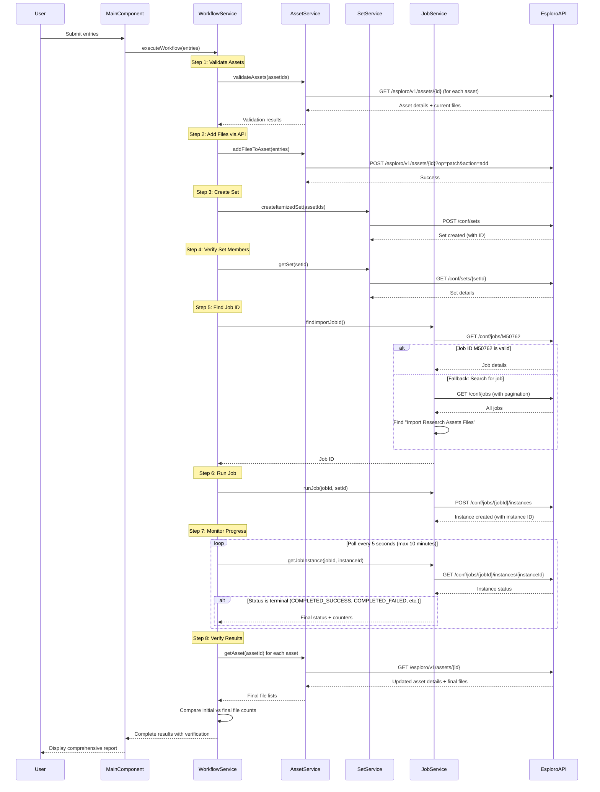
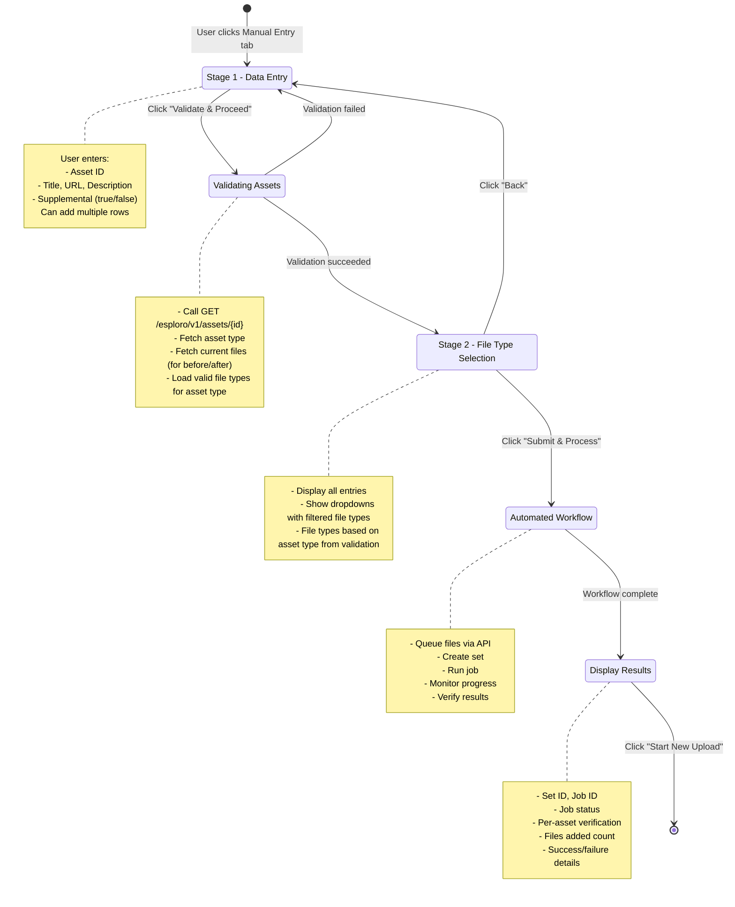

# Esploro Asset File Loader - Codebase Analysis

## Executive Summary

The **Esploro Asset File Loader** is an Angular-based cloud application designed to streamline the process of attaching external files to Esploro research assets with **full workflow automation**. It provides two interfaces: a multi-stage manual entry form and CSV upload, both featuring automated job orchestration.

### Key Purpose
- Add files to Esploro assets via manual entry or CSV upload
- **Automatically validate** assets before processing
- **Automatically create sets** for the assets being updated
- **Automatically run** the "Import Research Assets Files" job
- **Automatically monitor** job progress until completion
- **Verify results** by comparing before/after file lists
- Provide comprehensive success/failure reporting

### Architecture Highlights
- **Two-stage manual workflow**: Entry → Validation → File Type Selection → Automated Processing
- **Service-oriented design**: Separate services for Assets, Sets, Jobs, and Workflow orchestration
- **Observable-based**: RxJS for reactive async operations
- **Type-safe**: Full TypeScript interfaces for all API models

## Project Structure

```
esploro-csv-researcher-loader/
├── cloudapp/
│   └── src/
│       └── app/
│           ├── main/                    # Manual entry & CSV upload UI
│           ├── models/                  # TypeScript interfaces
│           ├── services/                # Business logic services
│           │   ├── asset.service.ts     # Asset API operations
│           │   ├── set.service.ts       # Set management
│           │   ├── job.service.ts       # Job execution & monitoring
│           │   └── workflow.service.ts  # Orchestration logic
│           ├── constants/               # Shared constants
│           └── settings/                # Configuration (legacy)
├── package.json                         # Dependencies and scripts
├── manifest.json                        # Cloud app configuration
└── README.md                           # User documentation
```

## Core Technologies & Dependencies

### Framework Stack
- **Angular 11.2.14** - Primary frontend framework
- **Angular Material** - UI component library (includes tabs, cards, forms)
- **RxJS 6.5.5** - Reactive programming for async operations

### Key Libraries
- **@exlibris/exl-cloudapp-angular-lib** - Exlibris cloud app framework
- **@ngx-translate/core** - Internationalization support

## Architecture Overview

### Component Architecture
The application uses a tabbed interface with two main workflows:

```
AppComponent (Root)
└── MainComponent (Tabbed Interface)
    ├── Manual Entry Tab
    │   ├── Stage 1: Multi-row Entry Form
    │   ├── Stage 2: File Type Selection
    │   └── Results Display
    └── CSV Upload Tab
        ├── Template Download
        ├── File Upload
        └── Processing
```

### Service Layer
The application uses a **service-oriented architecture** with clear separation of concerns:

- **AssetService** - Asset API operations (get asset, get file types, add files)
- **SetService** - Set management (create, add members, delete)
- **JobService** - Job operations (get details, find by name, run, monitor)
- **WorkflowService** - **Orchestrates the complete automated workflow**

### Data Flow

#### Automated Workflow (Both Manual and CSV)



#### Manual Entry UI Flow



## Core Components Deep Dive

### 1. MainComponent (`main/main.component.ts`)

**Primary Responsibilities:**
- Manage two-stage manual entry workflow
- Handle CSV file upload
- Coordinate with WorkflowService for automation
- Display results and verification

**Key Features:**
- **Multi-row entry**: Users can add files for multiple assets in one session
- **Stage-based validation**: Assets are validated before file type selection
- **Dynamic file types**: File type dropdown is filtered based on asset type
- **Automated workflow**: Integration with WorkflowService for end-to-end automation
- **Comprehensive reporting**: Display detailed results with per-asset verification

**Critical Properties:**
```typescript
currentStage: number;              // 1 or 2
manualForm: FormGroup;             // Stage 1 form
stage2Form: FormGroup;             // Stage 2 form
validatedEntries: FileEntry[];     // Entries after Stage 1
validatedAssets: AssetValidationResult[];  // Asset validation results
assetFileTypes: Map<string, CodeTableEntry[]>;  // File types per asset type
workflowResult: WorkflowResult;    // Final workflow results
```

**Critical Methods:**
```typescript
validateAndProceed()    // Validates assets and moves to Stage 2
submitWorkflow()        // Triggers automated workflow via WorkflowService
resetWorkflow()         // Resets to initial state
downloadTemplate()      // Generates CSV template
```

### 2. WorkflowService (`services/workflow.service.ts`)

**Purpose:** Orchestrates the complete automated workflow from file queuing to job verification

**Key Responsibilities:**
- Validate assets and fetch initial file lists
- Create itemized sets
- Run and monitor import jobs
- Verify results by comparing file lists before and after

**Critical Methods:**
```typescript
executeWorkflow(entries: FileEntry[]): Observable<WorkflowResult>
  // Main orchestration method - executes all 8 steps

validateAssets(assetIds: string[]): Observable<AssetValidationResult[]>
  // Step 1: Validate all assets and fetch initial state

pollJobStatus(jobId: string, instanceId: string): Observable<JobInstance>
  // Step 6: Poll job status every 5 seconds until completion

verifyResults(jobInstance, validatedAssets, expectedFiles, expectedAssets)
  // Step 7: Compare counters and re-fetch assets to verify file additions
```

**Workflow Steps:**
1. **Validate Assets** - Fetch each asset to get type and initial files
2. **Queue Files** - Add files via POST /esploro/v1/assets/{id}?op=patch&action=add
3. **Create Set** - POST /conf/sets with all asset IDs
4. **Verify Members** - GET /conf/sets/{setId} to confirm all assets added
5. **Find Job ID** - Try M50762, fallback to searching all jobs
6. **Run Job** - POST /conf/jobs/{jobId}/instances with set_id
7. **Monitor Progress** - Poll GET /conf/jobs/{jobId}/instances/{instanceId} every 5s
8. **Verify Results** - Re-fetch assets and compare file counts

### 3. AssetService (`services/asset.service.ts`)

**Purpose:** Handles all asset-related API operations

**Key Methods:**
```typescript
getAsset(assetId: string): Observable<Asset>
  // GET /esploro/v1/assets/{assetId}
  // Returns full asset including type and files array

addFilesToAsset(assetId: string, files: AssetFileLink[]): Observable<any>
  // POST /esploro/v1/assets/{assetId}?op=patch&action=add
  // Queues files for ingestion

getFileTypes(): Observable<CodeTableEntry[]>
  // GET /conf/code-tables/AssetFileType
  // Returns all file types

getAssetFileAndLinkTypes(): Observable<any[]>
  // GET /conf/mapping-tables/AssetFileAndLinkTypes
  // Returns mapping of asset types to valid file types

getValidFileTypesForAssetType(assetType: string): Observable<CodeTableEntry[]>
  // Filters AssetFileAndLinkTypes mapping for specific asset type
```

### 4. SetService (`services/set.service.ts`)

**Purpose:** Manages itemized sets for job execution

**Key Methods:**
```typescript
createItemizedSet(assetIds: string[], name?: string): Observable<ItemizedSet>
  // POST /conf/sets
  // Creates set with auto-generated name

addMembersToSet(setId: string, assetIds: string[]): Observable<any>
  // POST /conf/sets/{setId}?op=add_members
  // Adds assets to existing set

getSet(setId: string): Observable<ItemizedSet>
  // GET /conf/sets/{setId}
  // Fetches set details to verify members

deleteSet(setId: string): Observable<void>
  // DELETE /conf/sets/{setId}
  // Cleanup
```

### 5. JobService (`services/job.service.ts`)

**Purpose:** Handles job execution and monitoring

**Key Methods:**
```typescript
findImportJobId(): Observable<string>
  // Tries hardcoded M50762 first
  // Falls back to searching all jobs for "Import Research Assets Files"

getJobDetails(jobId: string): Observable<Job>
  // GET /conf/jobs/{jobId}

runJob(jobId: string, setId: string): Observable<JobInstance>
  // POST /conf/jobs/{jobId}/instances
  // Body: { set_id: setId }

getJobInstance(jobId: string, instanceId: string): Observable<JobInstance>
  // GET /conf/jobs/{jobId}/instances/{instanceId}
  // Used for polling

getAllJobs(): Observable<Job[]>
  // GET /conf/jobs with pagination handling
  // Fetches all jobs across multiple pages
```

**Job Search Logic:**
1. Try `GET /conf/jobs/M50762` and verify name
2. If failed, call `GET /conf/jobs?offset=0&limit=100`
3. Continue fetching pages until `total_record_count` is reached
4. Search for job matching "Import Research Assets Files" or similar names

## Data Models

### Asset Interfaces
```typescript
interface Asset {
  id: string;
  type?: { value: string; desc?: string };
  files?: AssetFile[];  // Current files on the asset
  [key: string]: any;
}

interface AssetFile {
  id?: string;
  name?: string;
  url?: string;
  type?: string;
}

interface AssetFileLink {
  title: string;
  url: string;
  description?: string;
  type: string;
  supplemental: boolean;
}
```

### Workflow Interfaces
```typescript
interface FileEntry {
  assetId: string;
  title: string;
  url: string;
  description?: string;
  supplemental: boolean;
  type?: string;  // Set in Stage 2
}

interface AssetValidationResult {
  assetId: string;
  exists: boolean;
  type?: string;          // Asset type (used for file type filtering)
  initialFiles?: any[];   // For before/after comparison
  error?: string;
}

interface WorkflowResult {
  success: boolean;
  setId?: string;
  jobId?: string;
  instanceId?: string;
  jobStatus?: string;
  counters?: { [key: string]: number };  // From job response
  filesProcessed?: number;
  assetsProcessed?: number;
  errors?: string[];
  assetVerifications?: AssetVerification[];
}

interface AssetVerification {
  assetId: string;
  initialFileCount: number;
  finalFileCount: number;
  filesAdded: number;
  success: boolean;
}
```

## APIs and Payloads

### 1. Get Asset Details
**Endpoint:** `GET /esploro/v1/assets/{assetId}`

**Purpose:** Fetch asset metadata including type and current files

**Response:**
```json
{
  "id": "12345678900001234",
  "type": {
    "value": "ARTICLE",
    "desc": "Article"
  },
  "files": [
    {
      "id": "file123",
      "name": "document.pdf",
      "url": "https://...",
      "type": "accepted"
    }
  ]
}
```

### 2. Add Files to Asset
**Endpoint:** `POST /esploro/v1/assets/{assetId}?op=patch&action=add`

**Purpose:** Queue files for ingestion (temporary links)

**Payload:**
```json
{
  "records": [
    {
      "temporary": {
        "linksToExtract": [
          {
            "link.title": "File Title",
            "link.url": "https://example.com/file.pdf",
            "link.description": "Optional description",
            "link.type": "accepted",
            "link.supplemental": "false"
          }
        ]
      }
    }
  ]
}
```

### 3. Create Itemized Set
**Endpoint:** `POST /conf/sets`

**Purpose:** Create a set containing the assets to be processed

**Payload:**
```json
{
  "name": "Asset File Load - 2025-01-05T12-30-00",
  "type": { "value": "ITEMIZED" },
  "content_type": { "value": "ASSET" },
  "description": "Auto-generated set for file ingestion. Contains 3 asset(s).",
  "private": false,
  "members": {
    "member": [
      { "id": "12345678900001234" },
      { "id": "12345678900001235" }
    ]
  }
}
```

**Response:**
```json
{
  "id": "12345678900001234",
  "name": "Asset File Load - 2025-01-05T12-30-00",
  ...
}
```

### 4. Get Job Details
**Endpoint:** `GET /conf/jobs/{jobId}`

**Purpose:** Verify job exists and get job name

**Response:**
```json
{
  "id": "M50762",
  "name": "Import Research Assets Files",
  "description": "Import files from temporary links"
}
```

### 5. Run Job
**Endpoint:** `POST /conf/jobs/{jobId}/instances`

**Purpose:** Execute the import job for a specific set

**Payload:**
```json
{
  "set_id": "12345678900001234"
}
```

**Response:**
```json
{
  "id": "78901234567890123",
  "status": {
    "value": "QUEUED"
  }
}
```

### 6. Get Job Instance Status
**Endpoint:** `GET /conf/jobs/{jobId}/instances/{instanceId}`

**Purpose:** Monitor job progress

**Response:**
```json
{
  "id": "78901234567890123",
  "status": {
    "value": "COMPLETED_SUCCESS"
  },
  "counter": [
    { "type": "file_uploaded", "value": 5 },
    { "type": "asset_succeeded", "value": 3 },
    { "type": "asset_failed", "value": 0 }
  ],
  "report": {
    "value": "..."
  }
}
```

**Status Values:**
- `QUEUED` - Job is queued
- `RUNNING` - Job is in progress
- `COMPLETED_SUCCESS` - Job completed successfully
- `COMPLETED_FAILED` - Job completed with errors
- `FAILED` - Job failed
- `ABORTED` - Job was aborted

### 7. Get Asset File and Link Types Mapping
**Endpoint:** `GET /conf/mapping-tables/AssetFileAndLinkTypes`

**Purpose:** Get valid file types for each asset type

**Response:**
```json
{
  "row": [
    {
      "asset_type": { "value": "ARTICLE" },
      "file_type": { "value": "accepted", "desc": "Accepted" }
    },
    {
      "asset_type": { "value": "ARTICLE" },
      "file_type": { "value": "submitted", "desc": "Submitted" }
    }
  ]
}
```

## Before/After Verification Strategy

The app uses a **before-and-after comparison** as the definitive method for confirming successful file ingestion:

1. **Before**: During asset validation (Step 1), the app fetches each asset and stores its current `files` array
2. **During**: Files are queued via the API and the job is executed
3. **After**: Once the job completes, the app re-fetches each asset
4. **Compare**: For each asset:
   - `initialFileCount` = files.length from Step 1
   - `finalFileCount` = files.length from Step 8
   - `filesAdded` = finalFileCount - initialFileCount
   - `success` = filesAdded > 0

This verification is more reliable than job counters alone, as it confirms the actual state change in Esploro.

## Error Handling

The application implements comprehensive error handling at multiple levels:

### Asset Validation Errors
- Asset not found → Reported in validation results
- Missing permissions → Validation fails with error message
- Network errors → Graceful fallback with user notification

### Set Creation Errors
- Permission denied → Workflow stops, error reported
- Invalid asset IDs → Detected during member verification
- Missing assets in set → Logged as warning

### Job Execution Errors
- Job not found → Fallback to job search
- Job ID M50762 invalid → Search all jobs
- Permission denied → Workflow fails with clear message
- Job timeout → Max polling time of 10 minutes

### Result Verification Errors
- Asset re-fetch fails → Marked as failed in verification
- File count mismatch → Reported in verification results
- Partial success → Detailed per-asset status provided

## Legacy Note

This codebase was previously a "Researcher Loader" application. It has been transformed into an "Asset File Loader" with automated job orchestration. Some legacy references may still exist in historical documentation.
Settings UI → Profile Creation → Field Mapping → Validation → Storage
```

## Key Business Logic

### 1. Profile Types
- **ADD**: Converts existing Esploro users to researchers
- **UPDATE**: Updates existing researcher records

### 2. Field Mapping Strategy
- Configurable field mappings through profiles
- Support for default values
- Flexible header naming conventions
- Multi-value field support (lists, affiliations)

### 3. Validation Layers
- **CSV Structure**: Header validation against profiles
- **Data Integrity**: Required field validation
- **API Constraints**: Esploro-specific business rules
- **Permission Checks**: Role-based access validation

### 4. Error Handling Strategy
- Row-level error tracking with line numbers
- Comprehensive error categorization
- Graceful degradation on partial failures
- Detailed logging for troubleshooting

## Performance Considerations

### 1. Parallel Processing
- Configurable parallel API calls (MAX_PARALLEL_CALLS = 5)
- Thread-safe primary ID generation handling
- Memory-efficient streaming for large files

### 2. Limits & Constraints
- Maximum 500 researchers per CSV (MAX_RESEARCHERS_IN_CSV)
- Chunked processing to prevent memory issues
- Progressive result reporting

## Security & Permissions

### Required Esploro Permissions
- `USER_MANAGER_VIEW` - Read user data
- `USER_MANAGER_UPDATE` - Modify user/researcher data

### Typical Roles
- `USER_ADMINISTRATOR`
- `USER_MANAGER_FULL`

## Configuration Management

### 1. Cloud App Manifest (`manifest.json`)
```json
{
    "id": "esploro-csv-researcher-loader",
    "title": "CSV Researcher Loader",
    "contentSecurity": {
        "sandbox": {
            "modals": true,
            "downloads": true
        }
    }
}
```

### 2. Application Settings
- Profile configurations stored via CloudAppSettingsService
- User preferences (selected profile, log visibility) via CloudAppStoreService
- Persistent configuration across sessions

## Critical Implementation Details

### 1. Data Merging Strategy
```typescript
// Deep merge existing researcher data with CSV updates
let new_researcher = deepMergeObjects(original, researcher);
```

### 2. CSV Parsing Configuration
```typescript
describe('MainComponent', () => {
  it('should create file group with all fields', () => {
    const group = component.createFileGroup();
    expect(group.get('title')).toBeTruthy();
    expect(group.get('url')).toBeTruthy();
    // ... etc
  });

  it('should validate URL format', () => {
    const urlControl = component.form.get('files.0.url');
    urlControl.setValue('invalid-url');
    expect(urlControl.hasError('pattern')).toBe(true);
  });
});
```

### 3. Async Processing Pattern
```typescript
from(researchers.map((researcher, index) => 
    this.processResearcherWithLogging(researcher, index)
)).pipe(
    mergeMap(observable => observable, maxParallelCalls),
    tap(result => resultsArray.push(result)),
    catchError(error => /* error handling */)
)
```

## Documentation Gaps & Improvement Areas

### Missing Documentation
1. **API Error Code Mapping** - No documentation of Esploro API error responses
2. **Field Mapping Examples** - Limited examples of complex field mappings
3. **Performance Tuning** - No guidance on optimal batch sizes
4. **Testing Strategy** - No unit tests visible in current structure

### Code Quality Observations
1. **Positive Aspects:**
   - Clear separation of concerns
   - Comprehensive error handling
   - Type safety with TypeScript interfaces
   - Reactive programming patterns

2. **Areas for Improvement:**
   - Large component methods could be refactored
   - Some magic numbers should be configurable
   - Error messages could be more user-friendly

## Usage Workflows

### 1. Initial Setup
1. Install cloud app in Esploro
2. Configure profiles in Settings
3. Map CSV headers to Esploro fields

### 2. Typical Processing Workflow
1. Select appropriate profile
2. Upload CSV file
3. Validate headers against profile
4. Confirm processing operation
5. Monitor progress and review results

### 3. Profile Management
1. Create new profile
2. Define field mappings
3. Set default values
4. Test with sample data
5. Save and activate profile

## Development Environment

### Build & Development
```bash
npm start              # Start development server
eca start             # Exlibris cloud app development
```

### Key Configuration Files
- `package.json` - Dependencies and scripts
- `angular.json` - Angular CLI configuration
- `tsconfig.json` - TypeScript configuration
- `.vscode/settings.json` - IDE configuration

## Questions for Further Clarification

1. **API Rate Limits** - What are Esploro's API rate limiting policies?
2. **Field Validation Rules** - Are there documented validation rules for each Esploro field?
3. **Rollback Strategy** - Is there a mechanism to undo bulk updates?
4. **Audit Logging** - Does the system maintain audit trails for compliance?
5. **Testing Data** - Are there sample CSV files and test profiles available?

This codebase represents a well-structured Angular application with clear business logic separation and comprehensive error handling, designed specifically for Exlibris Esploro integration.