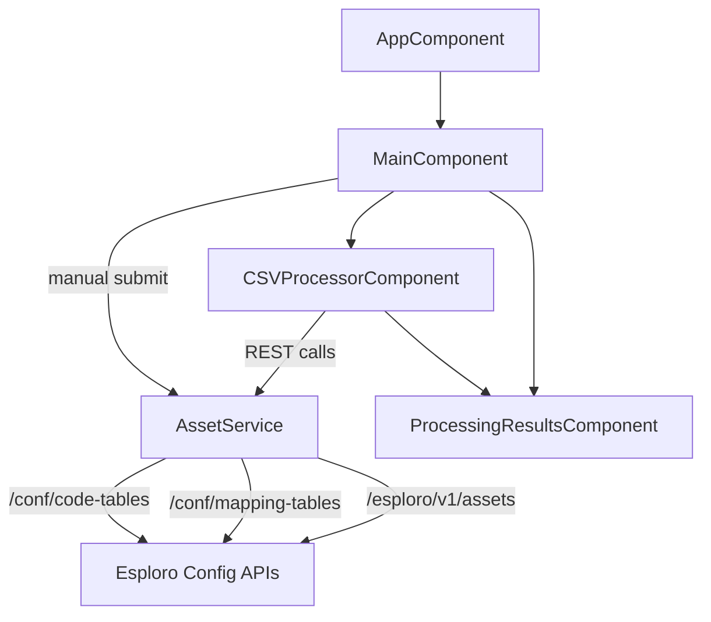
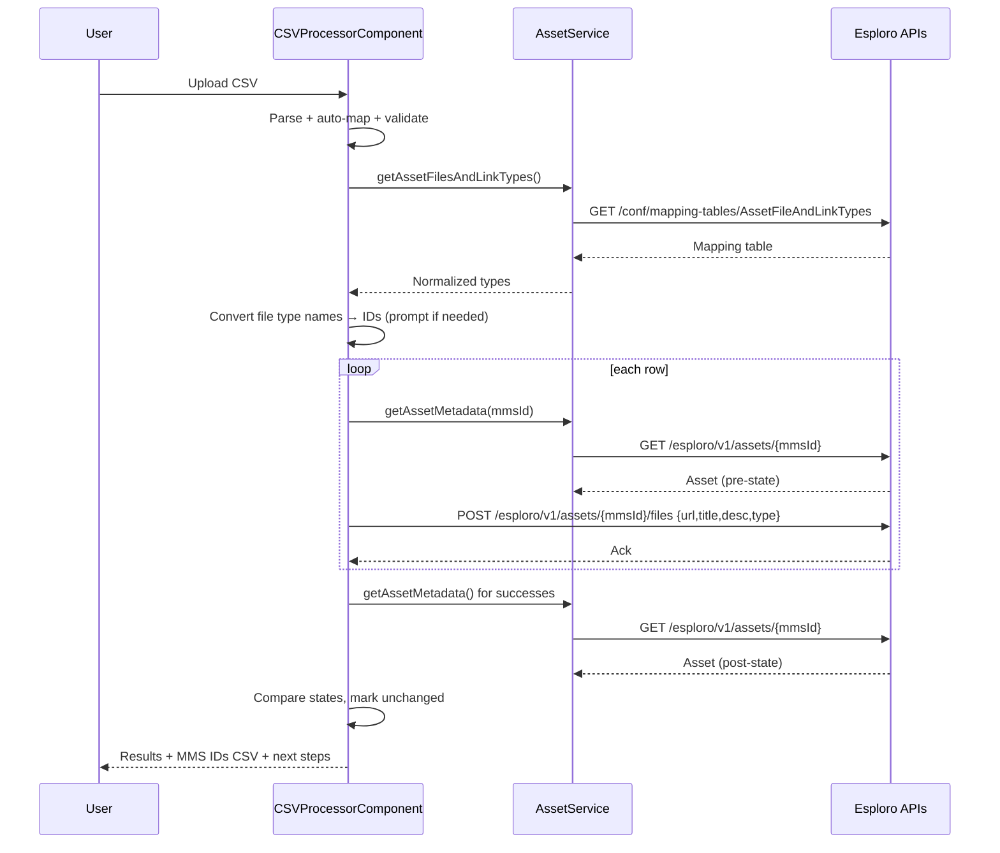

# Esploro CSV Asset Loader – Comprehensive Codebase Analysis (2025)

This document maps the structure, components, data flow, dependencies, and design of the Esploro CSV Asset Loader Cloud App so a new developer can get productive quickly and a reviewer can understand how the pieces fit together.

At a glance: An Angular 11 Cloud App for Esploro that lets users attach files/links to research assets either manually or in bulk via CSV, validates and normalizes file type categories using Esploro configuration mapping tables, and guides users to complete ingestion using Esploro’s “Import Research Assets Files” job.

---

## Project purpose and typical usage

- Purpose: Enrich existing Esploro research assets by adding files/links with proper metadata.
- Manual path: Enter one asset ID and one or more file records; app posts a “queue files” payload to the asset.
- CSV path: Upload a CSV with MMS IDs and file metadata, auto-map columns, validate/convert file type values to required IDs, process each row, and produce a “successful MMS IDs” CSV to help create a set and run the import job in Esploro.
- Typical workflow:
  1) Open app inside Esploro, 2) choose Manual Entry or CSV Upload, 3) submit, 4) create a set from the MMS IDs, 5) run the “Import Research Assets Files” job.

---

## Structure map (files, folders, entry points)

Top-level
- `manifest.json` – Cloud App manifest: pages, permissions, icon, title/description, and entity scope.
- `package.json` – Node dependencies and scripts; dev served via `eca start`.
- `settings.json` – App settings template (if used with Cloud Apps settings service).
- `README.md` – End-user and developer overview.
- `documentation/` – Rich docs suite, examples, diagrams, API references.

Angular app (Cloud App)
- `cloudapp/src/app/app.module.ts` – Root Angular module; declares components and imports Cloud Apps libs and i18n.
- `cloudapp/src/app/app-routing.module.ts` – Routes; root route renders `MainComponent`.
- `cloudapp/src/app/app.component.ts` – Root shell with alert outlet + router outlet.
- `cloudapp/src/app/main/` – Manual entry form UI and CSV tab container.
  - `main.component.ts|html|scss` – Orchestrates manual form and hosts CSV components and results.
- `cloudapp/src/app/components/`
  - `csv-processor/…` – CSV upload, mapping, validation, conversion, batch processing.
  - `processing-results/…` – Summary table, MMS ID download, deep links back to Esploro.
- `cloudapp/src/app/services/asset.service.ts` – Esploro REST calls and mapping-table helpers.
- `cloudapp/src/app/models/` – Shared interfaces: `asset.ts`, `types.ts`.
- `cloudapp/src/app/constants/file-types.ts` – Fallback file types for resilience.
- `cloudapp/src/app/utilities.ts` – Misc. helpers.
- `cloudapp/src/i18n/en.json` – All user-facing strings with ICU message format.
- `cloudapp/src/assets/researcherLoader.png` – App icon.

Languages and frameworks
- Language: TypeScript (Angular 11)
- UI: Angular Material 11
- Esploro integration: Ex Libris Cloud Apps SDK (`@exlibris/exl-cloudapp-angular-lib`)

Main entry points
- Cloud App loads `/#/` which routes to `MainComponent` (`app-routing.module.ts`).
- `MainComponent` renders tabs for Manual Entry and CSV Upload and wires results view.

---

## Core components and relationships

- AppComponent (root shell)
  - Displays `<cloudapp-alert>` and `<router-outlet>`; no logic beyond app initialization.
- MainComponent (feature container)
  - Holds reactive form for single-asset manual submissions.
  - Loads file type code table and the AssetFileAndLinkTypes mapping table.
  - Detects asset type by MMS ID to filter compatible file/link categories.
  - Hosts CSVProcessorComponent and ProcessingResultsComponent.
- CSVProcessorComponent (bulk CSV engine)
  - CSV upload, parsing (RFC 4180 style), column auto-mapping, mapping validation.
  - File type value validation against mapping table; fuzzy match to convert names to required IDs.
  - Caches “before” asset file state, calls APIs per row, fetches “after” state, flags unchanged assets.
  - Emits processed rows and generates a “successful MMS IDs” CSV for downstream Esploro steps.
- ProcessingResultsComponent (outcome UI)
  - Renders success/error/unchanged counts and per-row status.
  - Provides deep links to Esploro Viewer, Advanced Search, Jobs.
- AssetService (integration/service layer)
  - Adds files via “queue links to extract” payload to `/esploro/v1/assets/{id}?op=patch&action=add`.
  - Retrieves file type code table and mapping table (AssetFileAndLinkTypes) from `/conf` APIs.
  - Retrieves asset metadata to resolve asset type and compare files before/after.
- AppService (bootstrap helper)
  - Placeholder for Cloud App InitService usage.

Relationship diagram



---

## Data flow (end to end)

Manual entry path
1) User enters Asset ID and one or more files (title, url, description, type id, supplemental).
2) MainComponent builds `temporary.linksToExtract` payload and posts to:
   `POST /esploro/v1/assets/{assetId}?op=patch&action=add`.
3) API acknowledges; files are queued. User proceeds to create a set and run the import job.

CSV path
1) Upload CSV (<=10 MB). CSVProcessor parses headers/rows with quote/escape handling.
2) Auto-suggest column mapping for mmsId, remoteUrl, fileTitle, fileDescription, fileType; validate duplicates/required fields.
3) Validate fileType values:
   - If values are IDs (exact match against mapping table ids) → OK.
   - Else try exact/fuzzy name match against mapping table target_code → convert to IDs.
   - If any still unmapped → prompt for manual selection per unique value.
4) Optionally cache pre-state for each unique MMS ID by calling `GET /esploro/v1/assets/{mmsId}`.
5) For each row: validate asset exists; if URL present, call `POST /esploro/v1/assets/{mmsId}/files` with `{ url, title, description, type }`.
6) Fetch post-state and compare: if file counts unchanged and the URL isn’t present, flag as “unchanged”.
7) Emit results and generate a MMS ID CSV for successful rows; show instructions to create a Set and run the job.

Data contracts (simplified)
- AssetFileLink (manual): { title, url, description?, type, supplemental }
- ProcessedAsset (csv): { mmsId, remoteUrl?, fileTitle?, fileDescription?, fileType?, status, errorMessage?, wasUnchanged? }

---

## External dependencies and roles

- Angular 11 and Angular Material 11 – UI framework and components.
- RxJS 6 – Observables, operators (`finalize`, `catchError`, etc.).
- `@exlibris/exl-cloudapp-angular-lib` – Cloud Apps runtime services:
  - `CloudAppRestService` for proxied REST calls inside Esploro context.
  - `AlertService` to surface success/info/warn/error banners.
  - `InitService`, `CloudAppEventsService` for init and page info.
- `@ngx-translate/core` + `ngx-translate-parser-plural-select` – i18n with ICU.

---

## Coding patterns and practices

- Angular component/service separation; single-responsibility components.
- Reactive forms for manual entry with validators and pristine/touched management.
- Observable pipelines with `finalize` for consistent loading flags; `catchError` to avoid stream failures.
- Progressive enhancement: fallback code-table values when `/conf` APIs aren’t reachable.
- Config normalization: robust parsing of `/conf` API responses that can vary in shape.
- Defensive CSV parser: handles quotes, commas, and empty lines; reports per-row issues.
- Asset-type–aware filtering of file categories using mapping table and asset metadata.
- Minimal rate-limiting (100 ms delay between CSV rows) to reduce throttling risk.

---

## Critical logic hotspots (security/performance/behavior)

1) File type validation and conversion
   - The Esploro “AssetFileAndLinkTypes” mapping table requires ID values in API calls. Users often provide labels/names in CSV. The component auto-matches names→IDs and prompts for manual mapping if needed. This prevents subtle API failures.

2) Pre/post asset state comparison
   - Caches existing files and compares after processing to flag “unchanged” assets—useful when URLs are duplicates or policies prevent attachment. This improves operator awareness.

3) URL validation and trust boundaries
   - Manual form enforces `^https?://` pattern; CSV path relies on mapping and downstream API errors. Consider adding stricter URL checks and optional allowlists.

4) Error handling and user feedback
   - Manual path maps HTTP status codes to friendly messages (0/400/401-403). CSV path surfaces per-row failures. AlertService ensures visibility.

5) Performance and throttling
   - Sequential CSV processing with a small delay; could be extended with concurrency + exponential backoff where safe, but beware of tenant rate limits.

6) Config API variability
   - Code handles multiple shapes of code-table and mapping-table responses. This resilience is critical for compatibility across deployments.

---

## APIs and payloads in use

- Queue links to extract (manual)
  - `POST /esploro/v1/assets/{assetId}?op=patch&action=add`
  - Payload: `{ records: [{ temporary: { linksToExtract: [{ 'link.title', 'link.url', 'link.description'?, 'link.type', 'link.supplemental' }] } }] }`

- Add file (CSV per-row path)
  - `POST /esploro/v1/assets/{mmsId}/files`
  - Body: `{ url, title, description, type }`

- Read asset metadata
  - `GET /esploro/v1/assets/{mmsId}` → used for type, title, and file list.

- Configuration
  - `GET /conf/code-tables/AssetFileType?view=brief` → file type code table.
  - `GET /conf/mapping-tables/AssetFileAndLinkTypes` → mapping table with IDs/labels/applicability.

---

## Visual data flow (CSV path)



---

## Configuration files and significance

- `manifest.json`
  - App identity, pages (`/#/main`, `/#/settings`), icon, and entity scope `RESEARCH_ASSET`.
  - Enables fullscreen and relevant sandbox permissions.
- `package.json`
  - Angular 11, Material 11, Cloud Apps libraries, i18n libs.
  - Script `start: eca start` uses Ex Libris Cloud App CLI tooling for dev serving.
- `settings.json`
  - Template for persisted app settings if needed (current version uses minimal settings; CSV and mapping are in-app).

---

## Notable implementation details

- i18n: Centralized strings in `cloudapp/src/i18n/en.json` with rich copy for CSV workflow, conversion dialogs, and instructions.
- UI: Angular Material with an enhanced module wrapper; consistent outline appearance for form fields.
- Utilities: Generic helpers for chunking, downloads, deep merges; can be leveraged for future features (e.g., batched requests).

---

## Gaps, risks, and questions

Documentation gaps
- Some legacy docs still reference the old “researcher loader.” The code now supports CSV-based asset file processing—ensure cross-doc consistency (README mostly aligned; verify all references).
- `settings/` feature is minimal; `esploro-fields.ts` is empty. Either remove or flesh out usage.

Testing/quality
- No unit tests present. Consider adding tests for:
  - CSV parsing edge cases (quotes, escapes, malformed rows).
  - Mapping-table normalization across response shapes.
  - File type matching (exact/fuzzy/manual) with snapshots.
  - Pre/post asset comparison logic.

Security
- Strengthen URL validation beyond `^https?://`; optionally support allowlists or HEAD checks.
- Confirm Cloud App permissions are the minimum required; validate `entities` is correct for your tenancy.

Performance
- Consider bounded concurrency with retry/backoff for large CSVs; monitor tenant rate limits.

Open questions to clarify
- Should CSV processing also support the manual “queue links to extract” endpoint for parity with manual path?
- Do we need institutional overrides for mapping-table names or alternative code tables?
- Any need to persist user-defined column mappings or conversions between sessions?

---

## Onboarding quick-start for developers

1) Install dependencies and start dev server
   - `npm install`
   - `npm start` (served via Cloud Apps dev tooling)
2) Load app in Esploro Developer Mode and test both Manual and CSV flows.
3) Key files to read first
   - `main.component.ts` – feature container and manual path
   - `services/asset.service.ts` – API contracts and helpers
   - `components/csv-processor/*` – CSV path end-to-end
   - `i18n/en.json` – feature copy and user flows

---

## Requirements coverage summary

- Structure map: Done (folders, languages, entry points, configs)
- Core components: Done (list + relationships)
- Data flow: Done (manual and CSV paths + sequence diagram)
- Dependencies: Done (frameworks and roles)
- Patterns/practices: Done
- Critical logic: Done (validation, comparison, errors, throttling)
- Project purpose & usage: Done
- Documentation gaps: Done, plus open questions
- Visual aids: Done (mermaid diagrams)

Last updated: 2025-10-05

│   ├── angular.json                    # Angular configuration
│   ├── tsconfig.json                   # TypeScript config
│   └── package.json                    # Frontend dependencies
│
├── documentation/                       # Comprehensive documentation
│   ├── CLEANUP_SUMMARY.md              # Legacy code removal history
│   ├── DEVELOPER_QUICK_REFERENCE.md    # Quick start guide
│   ├── JOB_SUBMISSION_ENHANCEMENT.md   # Future enhancement proposals
│   ├── VISUAL_DIAGRAMS.md              # Architecture diagrams
│   ├── LEGACY_CSV_LOADER_EXPLANATION.md # Old CSV loader docs
│   └── Expanded_Esploro_Schema.md      # Database schema reference
│
├── manifest.json                        # Cloud App manifest ⭐
├── package.json                         # Root package file
├── README.md                            # User-facing documentation
└── settings.json                        # App settings template

⭐ = Core files for understanding the application
```

### Key Directory Purposes

- **`cloudapp/src/app/main/`**: The heart of the application - contains the file upload form
- **`cloudapp/src/app/services/`**: API integration with Esploro
- **`cloudapp/src/app/models/`**: TypeScript type definitions
- **`documentation/`**: Comprehensive developer and architectural documentation
- **Root files**: Configuration, manifest, deployment settings

---

## Technology Stack

### Frontend Framework
- **Angular 11.2.14** - Core framework
  - Component-based architecture
  - Reactive forms for data binding
  - Dependency injection
  - RxJS for async operations

### UI Components
- **Angular Material 11.2.12** - Material Design components
  - `mat-form-field` - Form inputs
  - `mat-select` - Dropdowns
  - `mat-checkbox` - Checkboxes
  - `mat-card` - File group containers
  - `mat-progress-bar` - Loading indicators
  - `mat-icon` - Icons

### Key Libraries

#### Ex Libris Cloud Apps SDK
- **@exlibris/exl-cloudapp-angular-lib** (v1.4.7)
  - `CloudAppRestService` - API calls with built-in authentication
  - `AlertService` - User notifications
  - Framework integration and routing

#### Reactive Programming
- **RxJS 6.5.5**
  - `Observable` - Async data streams
  - `map()`, `catchError()`, `finalize()` - Operators
  - `switchMap()` - Chaining API calls (future enhancement)

#### Angular Ecosystem
- **@angular/forms** - Reactive forms
- **@angular/router** - Navigation (minimal usage)
- **@angular/common/http** - HTTP client (wrapped by SDK)

### Build Tools
- **Angular CLI** - Build and dev server
- **TypeScript 4.1.5** - Type safety
- **Webpack** (bundled with Angular) - Module bundling

### Development Tools
- **Node.js 20+** - Runtime
- **npm 10+** - Package management

---

## Core Architecture

### Architectural Pattern: Component-Service Architecture

```
┌──────────────────────────────────────────────────────────────┐
│                    PRESENTATION LAYER                         │
│                                                                │
│  ┌────────────────────────────────────────────────────────┐  │
│  │           MainComponent (main.component.ts)            │  │
│  │                                                         │  │
│  │  - Reactive Form (FormGroup + FormArray)               │  │
│  │  - User interaction handlers                           │  │
│  │  - Validation logic                                    │  │
│  │  - UI state management                                 │  │
│  └─────────────────┬──────────────────────────────────────┘  │
│                    │                                          │
└────────────────────┼──────────────────────────────────────────┘
                     │ Dependency Injection
                     ▼
┌──────────────────────────────────────────────────────────────┐
│                     SERVICE LAYER                             │
│                                                                │
│  ┌────────────────────────────────────────────────────────┐  │
│  │           AssetService (asset.service.ts)              │  │
│  │                                                         │  │
│  │  - API integration                                     │  │
│  │  - Data transformation (UI ↔ API format)               │  │
│  │  - HTTP request construction                           │  │
│  │  - Response parsing                                    │  │
│  └─────────────────┬──────────────────────────────────────┘  │
│                    │                                          │
└────────────────────┼──────────────────────────────────────────┘
                     │ Uses
                     ▼
┌──────────────────────────────────────────────────────────────┐
│                    INTEGRATION LAYER                          │
│                                                                │
│  ┌────────────────────────────────────────────────────────┐  │
│  │      CloudAppRestService (Ex Libris SDK)               │  │
│  │                                                         │  │
│  │  - Authentication                                      │  │
│  │  - Base URL configuration                              │  │
│  │  - Request/response interception                       │  │
│  └─────────────────┬──────────────────────────────────────┘  │
│                    │                                          │
└────────────────────┼──────────────────────────────────────────┘
                     │ HTTP Calls
                     ▼
┌──────────────────────────────────────────────────────────────┐
│                      ESPLORO APIs                             │
│                                                                │
│  - POST /esploro/v1/assets/{id}?op=patch&action=add          │
│  - GET  /conf/code-tables/AssetFileType                       │
└──────────────────────────────────────────────────────────────┘
```

### Design Patterns Used

1. **Dependency Injection** (Angular core)
   - Services injected into components
   - Singleton service instances
   - Testability through mocking

2. **Observer Pattern** (RxJS)
   - Async operations via Observables
   - Subscribe to API responses
   - Unsubscribe on component destroy

3. **Reactive Forms Pattern**
   - Form state managed reactively
   - Validation rules declarative
   - Two-way data binding

4. **Service Layer Pattern**
   - Business logic separated from UI
   - API calls centralized in service
   - Reusable service methods

---

## Component Analysis

### MainComponent (`cloudapp/src/app/main/main.component.ts`)

**Purpose**: Primary user interface for file attachment workflow

#### Component Properties

```typescript
export class MainComponent implements OnInit {
  // Form instance
  form: FormGroup;
  
  // File type options loaded from API
  fileTypes: CodeTableEntry[] = [];
  
  // Loading state for file types
  loadingFileTypes = false;
  
  // Submission in progress
  submitting = false;
  
  // Result of last submission
  submissionResult: { 
    type: 'success' | 'error'; 
    message: string 
  } | null = null;
  
  // Fallback file types if API fails
  private readonly fallbackFileTypes: CodeTableEntry[] = [
    { value: 'accepted', description: 'Accepted version' },
    { value: 'submitted', description: 'Submitted version' },
    { value: 'supplementary', description: 'Supplementary material' },
    { value: 'administrative', description: 'Administrative' }
  ];
}
```

#### Component Lifecycle

```
Constructor
  ├─► Inject dependencies (FormBuilder, AssetService, AlertService)
  └─► Initialize form structure
      ├─► assetId: FormControl (required)
      └─► files: FormArray (dynamic)

ngOnInit()
  └─► Load file types from API
      ├─► Set loadingFileTypes = true
      ├─► Call assetService.getFileTypes()
      └─► Handle response
          ├─► Success: populate fileTypes array
          └─► Error: use fallback types

User Interaction
  ├─► User fills form
  ├─► User clicks "Add another file" → addFile()
  ├─► User clicks remove icon → removeFile(index)
  └─► User clicks "Submit files" → submit()
      ├─► Validate form
      ├─► Build payload
      ├─► Call assetService.addFilesToAsset()
      └─► Handle response
          ├─► Success: show alert, reset files
          └─► Error: show alert, keep form

ngOnDestroy() (implicit)
  └─► Subscriptions cleaned up by finalize()
```

#### Key Methods

##### `submit(): void`
**Purpose**: Handle form submission

**Logic Flow**:
1. Check form validity
2. Extract asset ID and file data
3. Build AssetFileLink[] payload
4. Set `submitting = true`
5. Call `assetService.addFilesToAsset()`
6. Subscribe to Observable
7. On success: show alert, update result, reset files
8. On error: show alert, update result, keep form
9. Finally: set `submitting = false`

##### `addFile(): void`
**Purpose**: Add another file group to the form

**Implementation**:
```typescript
addFile(): void {
  this.files.push(this.createFileGroup());
}
```

##### `removeFile(index: number): void`
**Purpose**: Remove a file group from the form

**Safety Check**: Prevents removing the last file group

```typescript
removeFile(index: number): void {
  if (this.files.length === 1) {
    return; // Always keep at least one file group
  }
  this.files.removeAt(index);
}
```

##### `loadFileTypes(): void` (private)
**Purpose**: Fetch file type options from Esploro

**Error Handling**: Falls back to hardcoded types on failure

##### `resetFiles(): void` (private)
**Purpose**: Reset file form groups after successful submission

**Behavior**: 
- Removes all file groups
- Adds one empty file group
- **Retains** the asset ID for convenience
- Marks form as pristine

##### `buildFilePayload(): AssetFileLink[]` (private)
**Purpose**: Transform form data to API format

**Transformation**:
- Extracts values from FormArray
- Maps to AssetFileLink interface
- Handles optional description field
- Converts supplemental to boolean

##### `createFileGroup(): FormGroup` (private)
**Purpose**: Factory method for file form groups

**Structure**:
```typescript
{
  title: ['', Validators.required],
  url: ['', [Validators.required, Validators.pattern(/^https?:\/\//i)]],
  description: [''],
  type: ['', Validators.required],
  supplemental: [false]
}
```

#### Template Integration

**File**: `cloudapp/src/app/main/main.component.html`

**Structure**:
```html
<form [formGroup]="form" (ngSubmit)="submit()">
  <!-- Asset ID input -->
  <mat-form-field>
    <input formControlName="assetId">
  </mat-form-field>
  
  <!-- File type hint section -->
  <section *ngIf="fileTypes.length">
    <!-- Display available file types -->
  </section>
  
  <!-- Dynamic file groups -->
  <section formArrayName="files">
    <mat-card *ngFor="let fileGroup of files.controls; let i = index">
      <!-- File fields for each group -->
    </mat-card>
  </section>
  
  <!-- Add file button -->
  <button type="button" (click)="addFile()">Add another file</button>
  
  <!-- Submit button -->
  <button type="submit" [disabled]="submitting">Submit files</button>
  
  <!-- Progress bar -->
  <mat-progress-bar *ngIf="submitting"></mat-progress-bar>
  
  <!-- Result message -->
  <div *ngIf="submissionResult">{{ submissionResult.message }}</div>
</form>
```

#### Styling

**File**: `cloudapp/src/app/main/main.component.scss`

**Key Styles** (typical):
- Form layout and spacing
- Card styling for file groups
- Button positioning
- Result message colors (success/error)
- Responsive design

---

## Service Layer

### AssetService (`cloudapp/src/app/services/asset.service.ts`)

**Purpose**: Centralized API integration for asset-related operations

#### Service Structure

```typescript
@Injectable({
  providedIn: 'root' // Singleton service
})
export class AssetService {
  constructor(
    private restService: CloudAppRestService
  ) { }
  
  // Public API methods
  addFilesToAsset(assetId: string, files: AssetFileLink[]): Observable<any>
  getFileTypes(): Observable<CodeTableEntry[]>
}
```

#### Method: `addFilesToAsset()`

**Signature**:
```typescript
addFilesToAsset(assetId: string, files: AssetFileLink[]): Observable<any>
```

**Purpose**: Queue external files for attachment to an asset

**Input**:
- `assetId`: Target asset identifier (e.g., "12345678900001234")
- `files`: Array of file metadata

**Process**:
1. Transform `AssetFileLink[]` to Esploro API format
2. Build payload with `temporary.linksToExtract` structure
3. Construct HTTP POST request
4. Return Observable

**API Call**:
```http
POST /esploro/v1/assets/{assetId}?op=patch&action=add
Content-Type: application/json

{
  "records": [
    {
      "temporary": {
        "linksToExtract": [
          {
            "link.title": "File Title",
            "link.url": "https://example.com/file.pdf",
            "link.description": "Optional description",
            "link.type": "accepted",
            "link.supplemental": "false"
          }
        ]
      }
    }
  ]
}
```

**Data Transformation**:
```typescript
// Input: AssetFileLink
{
  title: "My Document",
  url: "https://example.com/doc.pdf",
  description: "Research findings",
  type: "accepted",
  supplemental: false
}

// Output: API format
{
  "link.title": "My Document",
  "link.url": "https://example.com/doc.pdf",
  "link.description": "Research findings",
  "link.type": "accepted",
  "link.supplemental": "false" // Note: string, not boolean
}
```

**Key Implementation Detail**: The `supplemental` field is converted to a string (`"true"` or `"false"`) because the Esploro API expects string values for this field.

#### Method: `getFileTypes()`

**Signature**:
```typescript
getFileTypes(): Observable<CodeTableEntry[]>
```

**Purpose**: Fetch available file type codes from Esploro configuration

**API Call**:
```http
GET /conf/code-tables/AssetFileType?view=brief
```

**Response Parsing**:
The Esploro API can return code tables in various formats:

```typescript
// Format 1: Nested structure
{
  "code_table": {
    "codes": {
      "code": [ ... ]
    }
  }
}

// Format 2: Direct codes
{
  "code_table": {
    "code": [ ... ]
  }
}

// Format 3: Root array
{
  "code_table": [ ... ]
}
```

**Normalization Logic**:
```typescript
.pipe(
  map((response: any) => {
    // Try to extract codes array
    const codes = response?.code_table?.codes?.code
      ?? response?.code_table?.code
      ?? response?.code_table
      ?? [];

    // Ensure it's an array
    const normalized = Array.isArray(codes) ? codes : [codes];

    // Map to CodeTableEntry format
    return normalized
      .filter(Boolean) // Remove null/undefined
      .map((code: any) => ({
        value: code?.value ?? code?.code ?? '',
        description: code?.description ?? code?.desc ?? code?.value ?? ''
      }))
      .filter(entry => !!entry.value); // Remove entries without values
  })
)
```

**Output**: `CodeTableEntry[]`
```typescript
[
  { value: "accepted", description: "Accepted version" },
  { value: "submitted", description: "Submitted version" },
  { value: "supplementary", description: "Supplementary material" },
  { value: "administrative", description: "Administrative" }
]
```

---

## Data Models

### AssetFileLink (`cloudapp/src/app/models/asset.ts`)

**Purpose**: Represents file metadata for attachment

```typescript
export interface AssetFileLink {
  title: string;          // Display name in Esploro UI
  url: string;            // HTTP(S) URL where file can be downloaded
  description?: string;   // Optional description shown to users
  type: string;           // File type code from AssetFileType table
  supplemental: boolean;  // Is this a supplemental/additional file?
}
```

**Field Details**:

- **title**: Required. The name shown in Esploro's file list. Example: "Supplementary Data Table S1"
- **url**: Required. Must be a valid HTTP or HTTPS URL accessible to Esploro servers. Example: "https://repository.example.edu/files/dataset.csv"
- **description**: Optional. Additional context for users. Example: "Raw experimental data in CSV format"
- **type**: Required. Must match a code from the AssetFileType code table. Example: "supplementary"
- **supplemental**: Required (default: false). Indicates if this is additional material rather than the primary file

**Usage Example**:
```typescript
const file: AssetFileLink = {
  title: "Research Dataset",
  url: "https://data.example.edu/dataset.zip",
  description: "Complete experimental dataset with README",
  type: "supplementary",
  supplemental: true
};
```

### CodeTableEntry (`cloudapp/src/app/services/asset.service.ts`)

**Purpose**: Represents a code table entry from Esploro configuration

```typescript
export interface CodeTableEntry {
  value: string;          // Code value (e.g., "accepted")
  description?: string;   // Human-readable description
}
```

**Usage**: Populates dropdown menus and validates file types

**Example**:
```typescript
const fileType: CodeTableEntry = {
  value: "accepted",
  description: "Accepted version"
};
```

---

## Data Flow

### Complete File Attachment Workflow

```
┌─────────────┐
│    USER     │
│  (Browser)  │
└──────┬──────┘
       │
       │ 1. Opens Cloud App in Esploro
       ▼
┌──────────────────────────────────────┐
│     MainComponent Initializes        │
│                                      │
│  ngOnInit() called                   │
│  └─► loadFileTypes()                 │
│      └─► AssetService.getFileTypes() │
└──────────┬───────────────────────────┘
           │
           │ 2. API call to fetch file types
           ▼
┌────────────────────────────────────────────┐
│  GET /conf/code-tables/AssetFileType       │
│                                            │
│  Response: [ {value, description}, ... ]   │
└──────────┬─────────────────────────────────┘
           │
           │ 3. File types loaded (or fallback used)
           ▼
┌──────────────────────────────────────┐
│     Form Ready for User Input        │
│                                      │
│  - Asset ID field (empty)            │
│  - File #1 group (empty)             │
│  - File type dropdown (populated)    │
└──────────┬───────────────────────────┘
           │
           │ 4. User enters data
           │    - Asset ID: "12345678900001234"
           │    - File 1: title, URL, type, etc.
           │    - File 2: (optional) add another
           ▼
┌──────────────────────────────────────┐
│     User Clicks "Submit files"       │
│                                      │
│  submit() method called              │
└──────────┬───────────────────────────┘
           │
           │ 5. Form validation
           ├─► If invalid: Show errors, STOP
           │
           │ 6. If valid: Build payload
           ▼
┌────────────────────────────────────────────────┐
│  buildFilePayload()                            │
│                                                │
│  Input (form values):                          │
│    files: [                                    │
│      {                                         │
│        title: "My File",                       │
│        url: "https://example.com/file.pdf",    │
│        description: "Test",                    │
│        type: "accepted",                       │
│        supplemental: false                     │
│      }                                         │
│    ]                                           │
│                                                │
│  Output (AssetFileLink[]):                     │
│    [                                           │
│      {                                         │
│        title: "My File",                       │
│        url: "https://example.com/file.pdf",    │
│        description: "Test",                    │
│        type: "accepted",                       │
│        supplemental: false                     │
│      }                                         │
│    ]                                           │
└──────────┬─────────────────────────────────────┘
           │
           │ 7. Call service
           ▼
┌────────────────────────────────────────────────┐
│  AssetService.addFilesToAsset(assetId, files)  │
│                                                │
│  Transforms to API payload:                    │
│    {                                           │
│      records: [{                               │
│        temporary: {                            │
│          linksToExtract: [                     │
│            {                                   │
│              "link.title": "My File",          │
│              "link.url": "https://...",        │
│              "link.description": "Test",       │
│              "link.type": "accepted",          │
│              "link.supplemental": "false"      │
│            }                                   │
│          ]                                     │
│        }                                       │
│      }]                                        │
│    }                                           │
└──────────┬─────────────────────────────────────┘
           │
           │ 8. HTTP POST
           ▼
┌───────────────────────────────────────────────────┐
│  Esploro API                                      │
│  POST /esploro/v1/assets/12345678900001234        │
│       ?op=patch&action=add                        │
│                                                   │
│  Esploro processes request:                       │
│  ├─► Validates asset exists                      │
│  ├─► Validates user permissions                  │
│  ├─► Validates file metadata                     │
│  └─► Stores in temporary.linksToExtract          │
└──────────┬────────────────────────────────────────┘
           │
           ├───── Success ─────┐
           │                   │
           │                   ▼
           │         ┌─────────────────────────────┐
           │         │  HTTP 200 OK                │
           │         │  { ... asset metadata ... } │
           │         └──────────┬──────────────────┘
           │                    │
           │                    │ 9. Return to component
           │                    ▼
           │         ┌─────────────────────────────────────┐
           │         │  MainComponent.subscribe.next()     │
           │         │                                     │
           │         │  - AlertService.success(message)    │
           │         │  - submissionResult = success       │
           │         │  - resetFiles() called              │
           │         │  - Form cleared (except asset ID)   │
           │         └─────────────────────────────────────┘
           │
           └───── Error ───────┐
                               │
                               ▼
                     ┌─────────────────────────────┐
                     │  HTTP 4xx/5xx Error         │
                     │  { error: { message } }     │
                     └──────────┬──────────────────┘
                                │
                                │ 10. Return to component
                                ▼
                     ┌─────────────────────────────────────┐
                     │  MainComponent.subscribe.error()    │
                     │                                     │
                     │  - AlertService.error(message)      │
                     │  - submissionResult = error         │
                     │  - Form data retained               │
                     └─────────────────────────────────────┘


Post-Submission (Manual Steps):
───────────────────────────────
┌─────────────────────────────────────────────────────┐
│  User must manually in Esploro:                     │
│                                                     │
│  1. Go to "Manage Sets"                             │
│  2. Create new itemized set                         │
│  3. Add the updated asset(s) to the set             │
│  4. Go to "Admin" > "Manage Jobs"                   │
│  5. Run "Load files" job                            │
│  6. Select the set created in step 2                │
│  7. Submit job                                      │
│  8. Monitor job completion                          │
│  9. Verify files attached to asset                  │
│                                                     │
│  ⚠️ This manual process could be automated         │
│     (see JOB_SUBMISSION_ENHANCEMENT.md)             │
└─────────────────────────────────────────────────────┘
```

---

## API Integration

### Esploro Assets API

#### Endpoint: Add Files to Asset

**URL**: `/esploro/v1/assets/{assetId}?op=patch&action=add`

**Method**: POST

**Purpose**: Queue external files for download and attachment

**Authentication**: Handled by CloudAppRestService (automatic)

**Headers**:
```http
Content-Type: application/json
Accept: application/json
```

**Request Body Schema**:
```json
{
  "records": [
    {
      "temporary": {
        "linksToExtract": [
          {
            "link.title": "string (required)",
            "link.url": "string (required, HTTP/HTTPS URL)",
            "link.description": "string (optional)",
            "link.type": "string (required, code table value)",
            "link.supplemental": "string ('true' or 'false')"
          }
        ]
      }
    }
  ]
}
```

**Success Response**:
```json
{
  "id": "12345678900001234",
  "title": "Asset Title",
  ... other asset fields ...
}
```

**Error Responses**:

- **404 Not Found**: Asset ID doesn't exist
  ```json
  {
    "errorList": {
      "error": [{
        "errorCode": "ASSET_NOT_FOUND",
        "errorMessage": "Asset with ID 12345678900001234 not found"
      }]
    }
  }
  ```

- **403 Forbidden**: User lacks permissions
  ```json
  {
    "errorList": {
      "error": [{
        "errorCode": "INSUFFICIENT_PERMISSIONS",
        "errorMessage": "User does not have permission to modify asset"
      }]
    }
  }
  ```

- **400 Bad Request**: Invalid data
  ```json
  {
    "errorList": {
      "error": [{
        "errorCode": "INVALID_LINK_URL",
        "errorMessage": "Link URL must be a valid HTTP or HTTPS URL"
      }]
    }
  }
  ```

### Alma Configuration API

#### Endpoint: Get Code Table

**URL**: `/conf/code-tables/{codeTableName}?view=brief`

**Method**: GET

**Used For**: `AssetFileType` code table

**Response Format** (varies):
```json
{
  "code_table": {
    "name": "AssetFileType",
    "codes": {
      "code": [
        {
          "value": "accepted",
          "description": "Accepted version",
          "enabled": "true"
        },
        {
          "value": "submitted",
          "description": "Submitted version",
          "enabled": "true"
        }
      ]
    }
  }
}
```

**Note**: Response structure can vary. AssetService normalizes all formats.

---

## Form Management

### Reactive Forms Architecture

The application uses Angular's Reactive Forms for powerful form handling:

```typescript
// Form Structure
FormGroup: form
├── assetId: FormControl<string>
└── files: FormArray
    ├── [0]: FormGroup
    │   ├── title: FormControl<string>
    │   ├── url: FormControl<string>
    │   ├── description: FormControl<string>
    │   ├── type: FormControl<string>
    │   └── supplemental: FormControl<boolean>
    ├── [1]: FormGroup (if added)
    │   └── ... same structure ...
    └── [N]: FormGroup (dynamically added)
```

### Form Initialization

**In Constructor**:
```typescript
this.form = this.fb.group({
  assetId: ['', Validators.required],
  files: this.fb.array([this.createFileGroup()])
});
```

**Factory Method for File Groups**:
```typescript
private createFileGroup(): FormGroup {
  return this.fb.group({
    title: ['', Validators.required],
    url: ['', [
      Validators.required, 
      Validators.pattern(/^https?:\/\//i)
    ]],
    description: [''],  // Optional, no validators
    type: ['', Validators.required],
    supplemental: [false]  // Default value
  });
}
```

### Form Validation

#### Built-in Validators

- **Validators.required**: Field must have a value
  - Applied to: `assetId`, `title`, `url`, `type`

- **Validators.pattern()**: Field must match regex
  - Applied to: `url` (must start with `http://` or `https://`)

#### Validation States

```typescript
// Check if form is valid
if (this.form.invalid) {
  this.form.markAllAsTouched(); // Show all validation errors
  return; // Prevent submission
}

// Check individual field
const assetIdControl = this.form.get('assetId');
if (assetIdControl?.hasError('required')) {
  // Show error message
}
```

#### Error Messages in Template

```html
<mat-form-field>
  <input matInput formControlName="url">
  <mat-error *ngIf="control.hasError('required')">
    File URL is required.
  </mat-error>
  <mat-error *ngIf="control.hasError('pattern')">
    Enter a valid http(s) URL.
  </mat-error>
</mat-form-field>
```

### Dynamic Form Array

#### Adding a File Group

```typescript
addFile(): void {
  this.files.push(this.createFileGroup());
}
```

**Template**:
```html
<button mat-stroked-button type="button" (click)="addFile()">
  <mat-icon>add</mat-icon>
  <span>Add another file</span>
</button>
```

#### Removing a File Group

```typescript
removeFile(index: number): void {
  if (this.files.length === 1) {
    return; // Always keep at least one file
  }
  this.files.removeAt(index);
}
```

**Template**:
```html
<button mat-icon-button type="button" 
        (click)="removeFile(i)" 
        *ngIf="files.length > 1">
  <mat-icon>delete</mat-icon>
</button>
```

### Form State Management

#### Pristine vs. Dirty

- **Pristine**: User hasn't changed any values
- **Dirty**: User has modified at least one value

```typescript
// After form reset
this.form.markAsPristine();  // Mark as unchanged
this.form.markAsUntouched(); // Mark as not interacted with
```

#### Touched vs. Untouched

- **Untouched**: User hasn't focused any field
- **Touched**: User has focused at least one field

```typescript
// Before showing errors
if (control.touched && control.invalid) {
  // Show error
}
```

---

## Validation Strategy

### Multi-Layer Validation

```
┌─────────────────────────────────────┐
│     LAYER 1: CLIENT-SIDE            │
│     (Immediate Feedback)            │
│                                     │
│  ✓ Required fields                  │
│  ✓ URL format (HTTP/HTTPS)          │
│  ✓ Form structure                   │
│                                     │
│  Prevents: Invalid submissions      │
└──────────┬──────────────────────────┘
           │
           ▼
┌─────────────────────────────────────┐
│     LAYER 2: SERVICE LAYER          │
│     (Pre-API Validation)            │
│                                     │
│  ✓ Payload transformation           │
│  ✓ Data type conversions            │
│  ✓ Optional field handling          │
│                                     │
│  Prevents: Malformed API requests   │
└──────────┬──────────────────────────┘
           │
           ▼
┌─────────────────────────────────────┐
│     LAYER 3: API VALIDATION         │
│     (Server-Side Rules)             │
│                                     │
│  ✓ Asset exists                     │
│  ✓ User has permissions             │
│  ✓ File type code is valid          │
│  ✓ URLs are accessible              │
│                                     │
│  Prevents: Business rule violations │
└─────────────────────────────────────┘
```

### Validation Rules Detail

#### Asset ID
- **Required**: Yes
- **Format**: Numeric string
- **Example**: "12345678900001234"
- **Validation**: Built-in `required` validator

#### File Title
- **Required**: Yes
- **Format**: Any non-empty string
- **Max Length**: Not enforced (Esploro may have limits)
- **Example**: "Supplementary Table S1"

#### File URL
- **Required**: Yes
- **Format**: Must start with `http://` or `https://`
- **Validation**: `Validators.pattern(/^https?:\/\//i)`
- **Example**: "https://example.com/file.pdf"
- **Note**: URL must be accessible to Esploro servers

#### File Description
- **Required**: No
- **Format**: Any string
- **Default**: Empty string (omitted from API payload)

#### File Type
- **Required**: Yes
- **Format**: Must match a code from `AssetFileType` table
- **Validation**: Required + dynamic dropdown
- **Example**: "accepted", "submitted", "supplementary"

#### Supplemental
- **Required**: No (has default)
- **Format**: Boolean (converted to string for API)
- **Default**: `false`
- **Example**: `true` → `"true"` in API

---

## Error Handling

### Error Handling Strategy

```
Error Sources:
├── Form Validation Errors (Client-side)
│   └── Handled by: Angular Forms + mat-error
│
├── File Type Loading Errors (API)
│   └── Handled by: Fallback to hardcoded types
│
└── File Submission Errors (API)
    └── Handled by: subscribe.error() + AlertService
```

### Error Categories

#### 1. Form Validation Errors

**When**: User submits with invalid data

**Handling**:
```typescript
if (this.form.invalid) {
  this.form.markAllAsTouched(); // Show all errors
  return; // Don't submit
}
```

**Display**: Inline error messages under each field

**Example**:
```html
<mat-error>File URL is required.</mat-error>
<mat-error>Enter a valid http(s) URL.</mat-error>
```

#### 2. API Errors - File Types

**When**: `getFileTypes()` fails

**Handling**:
```typescript
this.assetService.getFileTypes()
  .subscribe({
    next: (types) => { ... },
    error: () => {
      // Use fallback types
      this.fileTypes = this.fallbackFileTypes;
    }
  });
```

**User Experience**: Seamless - user sees hardcoded file types

**Logging**: Silent (could be enhanced)

#### 3. API Errors - File Submission

**When**: `addFilesToAsset()` fails

**Common Errors**:

- **Asset Not Found (404)**
  - Message: "Asset with ID {id} not found"
  - Cause: Invalid or non-existent asset ID
  - Recovery: User re-checks asset ID

- **Permission Denied (403)**
  - Message: "You don't have permission to modify this asset"
  - Cause: User lacks "modify research assets" permission
  - Recovery: Contact administrator for permissions

- **Bad Request (400)**
  - Message: "Invalid file data. Check URLs and formats."
  - Cause: Invalid URL, file type, or payload structure
  - Recovery: User reviews and corrects data

- **Server Error (500)**
  - Message: "Server error. Please try again later."
  - Cause: Esploro internal error
  - Recovery: Retry later or contact support

**Handling**:
```typescript
this.assetService.addFilesToAsset(assetId, files)
  .subscribe({
    next: (response) => {
      this.alert.success('Success!');
      this.submissionResult = { type: 'success', message: '...' };
    },
    error: (error) => {
      const message = error?.message || 'Unknown error';
      this.alert.error(message);
      this.submissionResult = { type: 'error', message };
    }
  });
```

**Display**: 
1. Alert banner at top of page (via `AlertService`)
2. Result message in form (via `submissionResult`)

### Error Recovery

#### Form Errors
- **Action**: Fix invalid fields
- **Guidance**: Red error messages under each field
- **State**: Form data preserved

#### API Errors
- **Action**: Review error message and correct
- **Guidance**: Error message displayed via alert
- **State**: Form data preserved (except on success)

#### File Type Loading Failure
- **Action**: None required
- **Guidance**: None shown to user
- **State**: Fallback types used automatically

---

## User Experience

### User Journey

```
1. App Load
   ├─► Shows form with loading spinner for file types
   └─► File types load (or fallback)
   
2. Data Entry
   ├─► User enters asset ID
   ├─► User fills file #1 details
   ├─► (Optional) User clicks "Add another file"
   │   └─► New file group appears
   └─► User fills additional files
   
3. Submission
   ├─► User clicks "Submit files"
   ├─► Progress bar appears
   ├─► Submit button disabled
   └─► Form becomes read-only
   
4. Response
   ├─► Success:
   │   ├─► Green success banner
   │   ├─► Success message in form
   │   ├─► Files cleared (asset ID kept)
   │   └─► Ready for next batch
   │
   └─► Error:
       ├─► Red error banner
       ├─► Error message in form
       ├─► Form data preserved
       └─► User can correct and retry
```

### UX Best Practices Implemented

1. **Progressive Enhancement**
   - Form works even if file types fail to load
   - Fallback types ensure functionality

2. **Immediate Feedback**
   - Validation errors shown on blur/submit
   - Loading states clearly indicated
   - Success/error messages prominent

3. **Error Recovery**
   - Form data preserved on error
   - Clear error messages with guidance
   - Easy to correct and retry

4. **Efficiency**
   - Asset ID retained after submission
   - Multiple files in one operation
   - Quick "add another file" action

5. **Accessibility**
   - Material Design components (ARIA support)
   - Keyboard navigation
   - Screen reader friendly

---

## Configuration

### Application Manifest

**File**: `manifest.json`

**Purpose**: Defines the Cloud App for Esploro

```json
{
  "id": "esploro-csv-asset-loader",
  "title": "CSV Asset Loader",
  "subtitle": "Cloud app to update research asset data fields in Esploro",
  "author": "Exlibris",
  "description": "This cloud app can be used to create and update research assets in Esploro with data provided by uploading a CSV file. This is a Beta version.",
  "pages": {
    "settings": "/#/settings",
    "help": "https://knowledge.exlibrisgroup.com/Esploro/Product_Documentation/Esploro_Online_Help_(English)/Working_with_the_Esploro_Research_Hub/040_Working_with_Assets"
  },
  "contentSecurity": {
    "sandbox": {
      "modals": true,
      "downloads": true
    }
  },
  "icon": {
    "type": "url",
    "value": "/assets/researcherLoader.png"
  },
  "fullscreen": {
    "allow": true,
    "open": false
  }
}
```

**Note**: The manifest references "CSV" and "create and update", which are legacy descriptions. The current app only attaches files, not CSV-based bulk operations.

### Settings Configuration

**File**: `settings.json`

**Purpose**: Template for app settings (currently minimal usage)

**Current Usage**: The settings component exists but is not actively used in the file upload workflow.

### Code Table Configuration

**File Type Code Table**: `AssetFileType`

**Location**: Esploro Configuration → Repository → Asset Details → File and Link Types

**Example Codes**:
- `accepted` - Accepted version
- `submitted` - Submitted version
- `supplementary` - Supplementary material
- `administrative` - Administrative
- `published` - Published version

**Customization**: Administrators can add/modify file types in Esploro, which automatically appear in the app.

---

## Deployment

### Development Deployment

```bash
# Install dependencies
npm install

# Start development server
npm start

# App available at http://localhost:4200
```

**Loading in Esploro**:
1. Open Esploro
2. Enable Cloud Apps Developer Mode
3. Add app from `http://localhost:4200`

### Production Deployment

**Build** (if build scripts configured):
```bash
npm run build
```

**Package**:
1. Include `manifest.json`
2. Include compiled Angular app
3. Include assets (icons, images)

**Deploy**:
1. Upload to Ex Libris Developer Network, or
2. Deploy to institution's Cloud Apps repository

**Permissions Required**:
- View research assets
- Modify research assets

### Deployment Checklist

- [ ] Update `manifest.json` with correct URLs
- [ ] Update `package.json` version
- [ ] Test in development environment
- [ ] Build for production
- [ ] Package app files
- [ ] Upload to deployment target
- [ ] Test in Esploro production
- [ ] Verify permissions
- [ ] Document for users

---

## Testing Approach

### Manual Testing

**Test Scenarios**:

1. **Single File Upload**
   - Enter valid asset ID
   - Fill one file with all fields
   - Submit
   - Expected: Success message, file queued

2. **Multiple Files Upload**
   - Enter valid asset ID
   - Add 3 file groups
   - Fill all with valid data
   - Submit
   - Expected: Success message, all files queued

3. **Invalid Asset ID**
   - Enter non-existent asset ID
   - Fill file data
   - Submit
   - Expected: Error message "Asset not found"

4. **Invalid URL Format**
   - Enter valid asset ID
   - Enter URL without http:// prefix
   - Submit
   - Expected: Validation error "Enter a valid http(s) URL"

5. **Missing Required Fields**
   - Leave title blank
   - Submit
   - Expected: Validation error "File name is required"

6. **File Types Loading**
   - Open app
   - Observe file type dropdown
   - Expected: Types loaded from API or fallback shown

7. **Form Reset After Success**
   - Submit files successfully
   - Observe form state
   - Expected: Files cleared, asset ID retained

### Unit Testing (If Implemented)

**Component Tests**:
```typescript
describe('MainComponent', () => {
  it('should create file group with all fields', () => {
    const group = component.createFileGroup();
    expect(group.get('title')).toBeTruthy();
    expect(group.get('url')).toBeTruthy();
    // ... etc
  });

  it('should validate URL format', () => {
    const urlControl = component.form.get('files.0.url');
    urlControl.setValue('invalid-url');
    expect(urlControl.hasError('pattern')).toBe(true);
  });
});
```

**Service Tests**:
```typescript
describe('AssetService', () => {
  it('should transform AssetFileLink to API format', () => {
    // Test payload transformation
  });

  it('should handle file type API errors gracefully', () => {
    // Test error handling
  });
});
```

---

## Future Enhancements

### Proposed Enhancement: Automated Job Submission

**See**: `documentation/JOB_SUBMISSION_ENHANCEMENT.md`

**Summary**: Automate the creation of itemized sets and submission of "Load files" jobs, eliminating manual steps.

**Benefits**:
- Reduced user effort (7 steps → 1 step)
- Faster workflow
- Automatic job monitoring
- Better user experience

**Challenges**:
- Requires additional permissions (Configuration API)
- Complexity in job parameter management
- Polling for job status

**Implementation Phases**:
1. Set creation
2. Job submission
3. Job monitoring
4. Enhanced UX

### Other Potential Enhancements

1. **Batch Asset Processing**
   - Upload CSV with asset IDs and file URLs
   - Process multiple assets at once
   - Requires CSV parsing library

2. **File URL Validation**
   - Pre-check URLs before submission
   - Warn if URL is inaccessible
   - Requires backend proxy or CORS handling

3. **Job History**
   - Track previous submissions
   - Re-submit failed operations
   - Requires local storage or backend

4. **Advanced Permissions Handling**
   - Check user permissions before showing form
   - Disable features based on roles
   - Better error messages

5. **Internationalization**
   - Multi-language support
   - Already has i18n infrastructure
   - Needs translations

---

## Developer Onboarding

### Getting Started (Quick)

1. **Clone repository**
   ```bash
   git clone https://github.com/Testing-Environment/esploro-csv-researcher-loader.git
   cd esploro-csv-researcher-loader
   ```

2. **Install dependencies**
   ```bash
   npm install
   ```

3. **Start development server**
   ```bash
   npm start
   ```

4. **Open in Esploro**
   - Enable Developer Mode in Cloud Apps
   - Add app from `http://localhost:4200`

### Key Files to Understand

**Must Read**:
1. `cloudapp/src/app/main/main.component.ts` - Main logic
2. `cloudapp/src/app/services/asset.service.ts` - API integration
3. `cloudapp/src/app/models/asset.ts` - Data models
4. `README.md` - User documentation

**Helpful**:
5. `documentation/DEVELOPER_QUICK_REFERENCE.md` - Developer guide
6. `documentation/VISUAL_DIAGRAMS.md` - Architecture diagrams
7. `documentation/JOB_SUBMISSION_ENHANCEMENT.md` - Future features

### Common Development Tasks

**Add a new form field**:
1. Update `createFileGroup()` in `main.component.ts`
2. Add FormControl with validators
3. Update template with mat-form-field
4. Update `buildFilePayload()` to include field
5. Update `AssetFileLink` interface if needed

**Change API endpoint**:
1. Update URL in `asset.service.ts`
2. Update payload transformation if needed
3. Test with Esploro API documentation

**Add new file type**:
1. Configure in Esploro (Configuration → Code Tables)
2. App automatically picks it up via `getFileTypes()`

**Debug API calls**:
1. Check browser Network tab
2. Review request/response
3. Check Esploro API logs
4. Verify authentication headers

### Coding Standards

- **TypeScript**: Strict typing, avoid `any`
- **Components**: Single responsibility
- **Services**: Centralized API calls
- **Forms**: Reactive forms pattern
- **Observables**: Always unsubscribe or use `finalize()`
- **Error Handling**: User-friendly messages

### Helpful Resources

- [Angular Documentation](https://angular.io/docs)
- [Angular Material](https://material.angular.io/)
- [RxJS Documentation](https://rxjs.dev/)
- [Esploro API Docs](https://developers.exlibrisgroup.com/alma/apis/)
- [Cloud Apps Framework](https://developers.exlibrisgroup.com/cloudapps/)

---

## Appendix

### Glossary

- **Asset**: Research output in Esploro (article, dataset, etc.)
- **Cloud App**: Angular application running in Esploro UI
- **Code Table**: Configuration table in Esploro (e.g., file types)
- **FormArray**: Angular form control for dynamic lists
- **FormGroup**: Angular form control for grouped fields
- **Observable**: RxJS async data stream
- **Reactive Forms**: Angular form management approach
- **temporary.linksToExtract**: Esploro API field for queued file downloads

### Acronyms

- **API**: Application Programming Interface
- **CSV**: Comma-Separated Values
- **HTTP**: Hypertext Transfer Protocol
- **HTTPS**: HTTP Secure
- **RxJS**: Reactive Extensions for JavaScript
- **SDK**: Software Development Kit
- **UI**: User Interface
- **URL**: Uniform Resource Locator

### File Reference

| File | Purpose | Lines | Complexity |
|------|---------|-------|------------|
| `main.component.ts` | Main UI logic | ~143 | Medium |
| `asset.service.ts` | API integration | ~74 | Low |
| `main.component.html` | UI template | ~82 | Low |
| `asset.ts` | Data models | ~7 | Low |
| `manifest.json` | App config | ~25 | Low |

### Version History

- **Current Version**: File uploader for assets
- **Previous Version**: CSV-based researcher loader (removed)
- **Repository Name**: `esploro-csv-researcher-loader` (legacy name)

---

## Conclusion

The Esploro Asset File Loader is a focused, well-architected Angular application that solves a specific problem: efficiently attaching external files to research assets. Its clean separation of concerns, robust error handling, and user-friendly interface make it a valuable tool for Esploro administrators and researchers.

While it has evolved from a more complex CSV-based researcher loader, the current implementation prioritizes simplicity and reliability. Future enhancements, particularly automated job submission, could further streamline the workflow.

For developers new to this codebase, start with the `MainComponent` and `AssetService` to understand the core functionality, then explore the comprehensive documentation in the `documentation/` folder for deeper architectural insights.

---

**Document Version**: 1.0  
**Last Updated**: January 2025  
**Maintained By**: Development Team  
**Related Docs**: See `documentation/` folder for additional resources
