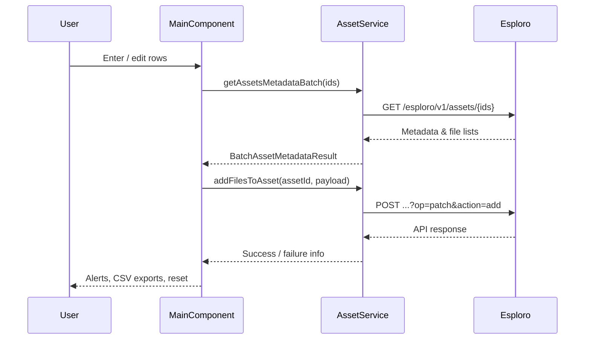

# Esploro CSV Asset Loader – Engineering Field Guide

Updated: 2025-10-07

This field guide orients new developers, reviewers, and maintainers to the Esploro CSV Asset Loader Cloud App. It assembles the current repository layout, highlights the moving pieces inside the Angular application, traces end-to-end data flow for manual and CSV-led file ingestion, and records the external dependencies, conventions, and risk areas that matter most in day-to-day work.

---

## Project synopsis & typical usage

- **Purpose**: Help Esploro operators attach external files or links to existing research assets either manually or in bulk via CSV, while staying within the Cloud Apps sandbox.
- **Personas**: Repository librarians, research office staff, or integration specialists who curate Esploro metadata and supporting files.
- **Primary flows**:
  1. **Manual entry** – operators key in one or more asset/file rows, optionally enforce file-type selections, and the app queues the uploads with Esploro’s `temporary.linksToExtract` payload.
  2. **CSV ingestion** – users upload a template spreadsheet, map columns, reconcile file-type values, and run a batch process that validates each asset and queues the same API calls.
- **Follow-up**: After the app queues files, operators download the generated MMS ID list, create a set in Esploro, and run the “Import Research Assets Files” job.

---

## Repository structure at a glance

```text
esploro-csv-researcher-loader/
├── cloudapp/                 # Angular 11 Cloud App source
│   ├── src/app/
│   │   ├── app.module.ts     # Root module wiring Angular + Cloud Apps SDK
│   │   ├── app.component.ts  # Shell: alert outlet + router outlet
│   │   ├── app.service.ts    # Holds InitService injection
│   │   ├── enhanced-material.module.ts
│   │   ├── main/             # Manual + CSV tab host with reactive forms
│   │   ├── components/
│   │   │   ├── csv-processor/        # CSV upload, mapping, batch engine
│   │   │   └── processing-results/   # Post-processing summary + quick links
│   │   ├── models/           # Asset/file domain contracts
│   │   ├── services/         # AssetService: Esploro REST integration
│   │   ├── constants/        # Legacy stubs (file-types.ts is empty)
│   │   ├── utilities/        # RxJS polyfills + shared helpers
│   │   └── settings/         # UI scaffolding for saved profiles (mostly stub)
│   ├── src/assets/           # Cloud App icon & static resources
│   ├── src/i18n/en.json      # All UI copy (ngx-translate)
│   └── main.scss             # Global styling entry point
├── documentation/            # Detailed functional & historical docs
├── manifest.json             # Cloud App manifest (pages, scope, icon)
├── config.json               # Local dev CLI configuration
├── package.json              # npm scripts + dependencies (Angular 11)
├── verify-sustainability.sh  # Doc conformance checks used internally
├── README.md                 # High-level feature overview
├── FINAL_STATUS_REPORT.md, SUSTAINABILITY_SUMMARY.md, etc.  # Tracking docs
└── explaination.md           # (This) comprehensive engineering map
```

**Languages & tooling**: TypeScript, HTML, SCSS, JSON, Bash. Development relies on the Ex Libris Cloud Apps CLI (`eca start` via `npm start`).

---

## Application architecture

### Core runtime

- `AppModule` imports Angular Material, the Cloud App Alert module, translation services (with ICU parser support), and wires up the root declarations (`AppComponent`, `MainComponent`, `CSVProcessorComponent`, `ProcessingResultsComponent`).
- `AppComponent` is intentionally thin: it renders the Cloud Apps alert outlet + router outlet and injects `InitService` via `AppService` to ensure the app bootstraps inside the sandbox.
- Routing (`app-routing.module.ts`) points root `/` and `/main` to `MainComponent`, with a placeholder `/settings` route for the future profile editor.

### Feature layers

- **`MainComponent`** (≈1,200 LOC) orchestrates the entire manual entry journey and hosts the CSV processor tab. It builds a sophisticated reactive form with row-level validation state, duplicate detection, staged workflows, export capabilities, and integration with `AssetService`.
- **`CSVProcessorComponent`** handles upload/mapping/validation of CSV files, sequentially processes assets using the Ex Libris REST API, and emits both detailed results and an MMS ID download link.
- **`ProcessingResultsComponent`** renders post-run metrics, exposes Esploro quick links (viewer, advanced search, jobs), and surfaces the unchanged-assets list based on metadata comparisons.
- **Settings area (`settings/`)** currently exports empty modules. The scaffolding hints at a future profiles feature (field groupings, add/update flows) but no logic is in place.

### Services & integration helpers

- **`AssetService`** centralizes REST calls through `CloudAppRestService`:
  - `addFilesToAsset()` posts `temporary.linksToExtract` payloads to `POST /esploro/v1/assets/{assetId}?op=patch&action=add`.
  - `getAssetFilesAndLinkTypes()` reads the `AssetFileAndLinkTypes` mapping table from `/conf/mapping-tables/AssetFileAndLinkTypes`.
  - `getAssetMetadata()` and `getAssetsMetadataBatch()` normalize Esploro’s varied payloads and return consolidated metadata (type, title, files) for validation, diffing, and filtering.
  - `filterFileTypesByAssetType()` reduces the mapping table to values compatible with a given asset type by inspecting `SOURCE_CODE_1` (applicability) and `SOURCE_CODE_2` (comma-separated asset types).

### Supporting modules

- `models/` define the TypeScript interfaces shared across components (`AssetFileLink`, `ProcessedAsset`, `AssetMetadata`, etc.).
- `utilities/rxjs-helpers.ts` polyfills `firstValueFrom`/`lastValueFrom` for RxJS 6 (Angular 11 ships with RxJS 6.5).
- `utilities.ts` offers array/object helpers, CSV download utilities, and misc. shared utilities (many of which remain legacy holdovers from earlier versions).
- `i18n/en.json` contains the translation catalog used by `ngx-translate`. The manual workflow references additional keys that are not yet populated (see **Documentation gaps**).

---

## Domain models & state tracking

| Interface / helper | Located in | Purpose |
| --- | --- | --- |
| `AssetFileLink` | `models/asset.ts` | Serialized representation of a file/link entry when posting to Esploro |
| `ProcessedAsset` | `models/types.ts` | In-memory record used during CSV processing (status, errors, unchanged flag) |
| `AssetMetadata`, `AssetFile` | `models/types.ts` | Normalized snapshot of Esploro asset metadata (used for validation + diffing) |
| `AssetFileAndLinkType`, `FileType` | `models/types.ts` | Mapping table entry and simplified hint used in UI dropdowns |
| `CachedAssetState` | `models/types.ts` | Before/after cache enabling unchanged asset detection |
| `FileTypeConversion`, `FileTypeValidationState` | `models/types.ts` | Tracks CSV file-type reconciliation state |
| `RowValidationState` (enum-like) | `MainComponent` | Stored in `WeakMap<FormGroup, state>` to style rows and drive exports |

`MainComponent` holds multiple `Map`/`Set` collections (`assetMetadataMap`, `diffingList`, `retryAssetIds`, `duplicateEntryMap`, `entrySubscriptions`) that keep manual-entry state consistent as the user edits rows.

---

## Manual entry workflow

1. **Stage 1 (details)**
   - Reactive form array (`entries`) accepts multiple rows with togglable optional fields.
   - On validation trigger, `getAssetsMetadataBatch()` validates unique asset IDs, caches metadata, and flags invalid rows. Duplicate URL + asset ID pairs are detected via `detectDuplicateAssetUrlPairs()` and surfaced with tooltips.
   - Row state is stored in a `WeakMap` and reflected via chips, icons, and CSS classes. Deleted rows move to a managed recycle bin with export options.
2. **Stage 2 (optional)**
   - When the user chooses to specify file types, `MainComponent` enables required validators, filters available mapping-table options by asset type, and pre-selects defaults where possible.
3. **Submission**
   - `buildSubmissionPayload()` groups rows by asset ID and ensures required fields exist (asset ID, URL, type).
   - The component sequentially awaits `addFilesToAsset()` responses (`concatMap` + `lastValueFrom`) to avoid API throttling and surfaces success/error alerts.
   - On success, optional exports run (`validated-entries.csv`, `invalid-entries.csv`, `deleted-entries.csv`) before the form resets to a single empty row.



### Key safeguards

- URLs are validated with a regex and trimmed; asset IDs are trimmed on every change.
- Duplicate detection sets custom control errors on both fields so Angular shows inline messages.
- `retryAssetIds` holds unresolved IDs to re-validate after user edits.
- Default file types fall back to the first applicable mapping-table entry; submission is blocked if any type cannot be resolved.

---

## CSV ingestion workflow

```mermaid
flowchart LR
  Upload[Upload CSV] --> Parse[Parse with PapaParse]
  Parse --> AutoMap[Auto-map headers + build ColumnMapping]
  AutoMap --> HeaderValidation[Validate required columns + duplicates]
  HeaderValidation --> ValueValidation[Ensure MMS ID / URL values exist]
  ValueValidation --> FileTypeCheck[Validate & convert file-type values]
  FileTypeCheck --> Transform[Transform to ProcessedAsset array]
  Transform --> CacheState[Cache pre-import metadata]
  CacheState --> ProcessLoop[Sequential processAssets()]
  ProcessLoop --> Compare[Compare before/after file lists]
  Compare --> Emit[Emit results + MMS ID download]
  Emit --> MainComponent
```

### Detailed behaviour

- **Parsing & mapping**: PapaParse runs in worker mode to keep the UI responsive. `suggestFieldMapping()` heuristically maps headers based on name patterns + sample values.
- **Validation gates**:
  - Required columns: exactly one `mmsId` and one `remoteUrl` mapping must exist; duplicates cause blocking errors.
  - Required values: missing MMS IDs or URLs are reported with row numbers; users must fix the CSV before proceeding.
  - File types: `validateFileTypes()` cross-references mapping-table IDs and target codes. Fuzzy matches auto-convert near misses; anything unresolved triggers a conversion dialog where users manually select the mapping-table ID.
- **Processing loop**:
  - Sequentially calls `validateAsset()` (`GET /esploro/v1/assets/{id}`) and, if successful, `processAssetFile()` (`POST /esploro/v1/assets/{id}/files`) per row.
  - `cacheAssetStates()` captures pre-import file lists; `compareAssetStates()` fetches post-import metadata and marks assets as `unchanged` if file counts and URLs remain the same.
  - A short `delay(100ms)` avoids hammering the API.
- **Outputs**: Emits processed rows (`ProcessedAsset[]`) to `MainComponent`, which pipes them into `ProcessingResultsComponent`, and creates a blob-backed MMS ID CSV download link.

---

## API integration contract

| Operation | Endpoint | Usage notes |
| --- | --- | --- |
| Validate assets (manual) | `GET /esploro/v1/assets/{id1,id2,...}` | Batch fetch (10 IDs per chunk) to validate existence & gather metadata |
| Validate asset (CSV) | `GET /esploro/v1/assets/{id}` | Called per row during CSV processing |
| Queue file attachments | `POST /esploro/v1/assets/{assetId}?op=patch&action=add` | Uses `temporary.linksToExtract` payload; per-asset grouping handled in `MainComponent` |
| Direct file import (CSV) | `POST /esploro/v1/assets/{assetId}/files` | Called for each CSV row when the asset is valid |
| Mapping table lookup | `GET /conf/mapping-tables/AssetFileAndLinkTypes` | Provides ID + target_code combos and applicability (source codes) |

Errors from Cloud Apps REST calls are normalized and surfaced via `AlertService`. Manual flow halts on the first failed asset submission; CSV flow records `status: 'error'` per row and continues.

---

## External dependencies & tooling

| Dependency | Purpose in app |
| --- | --- |
| Angular 11 + Angular Material 11 | Component framework, UI primitives, reactive forms |
| `@exlibris/exl-cloudapp-angular-lib` / `@exlibris/exl-cloudapp-base` | Cloud Apps SDK components (alerts, shell integration, REST client) |
| `@ngx-translate/core` + `ngx-translate-parser-plural-select` | Runtime translation with ICU pluralization |
| `papaparse` | Streaming CSV parser with worker support |
| `rxjs` 6.5 | Reactive programming; custom polyfills bridge to RxJS 7-style APIs |
| `zone.js` | Angular change detection |
| Dev tooling (`@angular/cli`, Karma/Jasmine, TypeScript 4.1) | Standard Angular build/test stack (tests not currently authored) |

Local development relies on the Ex Libris Cloud App CLI (`eca start` via `npm start`). `config.json` defines the target Esploro sandbox URL and CLI port.

---

## Coding patterns & architecture notes

- **Reactive forms**: `MainComponent` creates nested `FormGroup` instances, using `FormArray`, per-field validators, and dynamic validator toggling during stage transitions.
- **State tracking**: `Map`/`Set` collections (`duplicateEntryMap`, `retryAssetIds`) and `WeakMap` row metadata ensure derived state survives form reordering and cleanly garbage collects.
- **Observables to promises**: Long-running sequences convert Observables with custom `lastValueFrom`/`firstValueFrom` helpers, allowing `async/await` semantics while maintaining RxJS pipelines for mapping and error handling.
- **Internationalisation**: Every visible string runs through `ngx-translate`. Keys follow a namespaced convention (`ManualEntry`, `CSV`, `Results`). Some UI additions reference keys not yet defined (see below).
- **UX safeguards**: Manual flow sorts invalid/duplicate rows to the top, surfaces inline hints, and preserves deleted rows for export. CSV flow surfaces counts, progress, and before/after comparisons to flag rows that may have been ignored by Esploro.
- **Performance**: API interactions are serialized deliberately to respect rate limits. Asset metadata fetches are chunked (default 10 IDs) per batch request.

---

## Critical logic & risk areas

1. **Asset validation cascade (`validateStageOneEntries`)**
   - Complex interplay between trimming inputs, marking errors, reordering rows, and updating state maps. Regression risk is high if form structure changes.
2. **Duplicate tracking**
   - `duplicateEntryMap` sets custom control errors on both `assetId` and `url`. Any refactor must retain this to avoid silent duplicate submissions.
3. **Default file-type assignment**
   - `assignDefaultType()` picks the first compatible mapping-table entry. If the mapping table is empty or asset type filtering removes all entries, submissions are blocked.
4. **CSV file-type conversion dialog**
   - Relies on fuzzy matching heuristics. Manual mapping scenario requires user intervention; missing ID assignments would silently post invalid types.
5. **Unchanged asset detection**
   - Depends on fetching metadata twice and comparing file counts + URLs. If Esploro’s payload structure changes, the detection may produce false positives or miss duplicates.
6. **Error handling**
   - Manual flow throws on first API failure; CSV flow continues. Aligning behaviours might be desirable to avoid partial successes without user awareness.
7. **Missing automated tests**
   - No unit or integration tests exist. Extensive logic is manually verified; introducing tests would reduce regression risk.

---

## Configuration & environment

- `manifest.json` registers the Cloud App under ID `esploro-csv-asset-loader`, exposes `main`, `settings`, and a help link, and restricts to the `RESEARCH_ASSET` entity.
- `config.json` feeds the local Cloud App CLI (target sandbox, default port 1088).
- `settings.json` (VS Code) hides generated folders and points the TypeScript server at the project-local compiler.
- `verify-sustainability.sh` runs repository documentation checks for long-term maintenance (not part of runtime).
- The app relies on Ex Libris Cloud Apps hosting—no backend/server code is present in this repo.

---

## Documentation coverage & gaps

| Area | Status |
| --- | --- |
| README | Accurate high-level intro + user workflow summary. |
| `documentation/` | Rich collection: API references, schema diagrams, migration notes, status reports (worth skimming per topic). |
| `explaination.md` | Now serves as the comprehensive technical map. |
| Inline comments | Sparse inside `MainComponent` and `CSVProcessorComponent`; most logic is self-documenting but dense. |
| i18n catalogue | Several keys referenced in templates (`Main.Title`, `ManualEntry.Toggles.FileTypeField`, `ManualEntry.Messages.FileTypeToggleOnCalloutTitle`, etc.) are missing from `en.json`; UI currently shows raw keys. |
| Testing docs | None; there are no Jest/Karma specs or guidance on manual regression checks. |
| Settings feature | Documentation hints at profile management, but the code is stubbed. Align docs when feature lands or trim dead references. |

---

## Open questions & suggested follow-ups

1. **Internationalisation cleanup** – Populate the missing translation keys or adjust templates to existing keys to avoid leaking raw identifiers in the UI.
2. **Automated testing** – Introduce targeted Jest/Karma unit tests for `MainComponent` validation helpers and `CSVProcessorComponent` pipelines; consider contract tests for `AssetService`.
3. **Settings/profile roadmap** – Flesh out or remove the dormant `settings` module and related documentation to avoid confusion.
4. **Error handling consistency** – Decide whether manual and CSV flows should share retry strategies and partial-success reporting.
5. **Performance tuning** – Monitor CSV runs with thousands of rows; consider batching in the CSV workflow similar to manual grouping if throughput becomes an issue.
6. **Legacy utilities audit** – `utilities.ts` contains helpers (e.g., `mapObject`, `deepMergeObjects`) that are no longer referenced; removing dead code will reduce maintenance overhead.

With this map, contributors can navigate the codebase confidently, understand how data flows from the UI to Esploro APIs, and identify the hotspots worth guarding as the product evolves.
