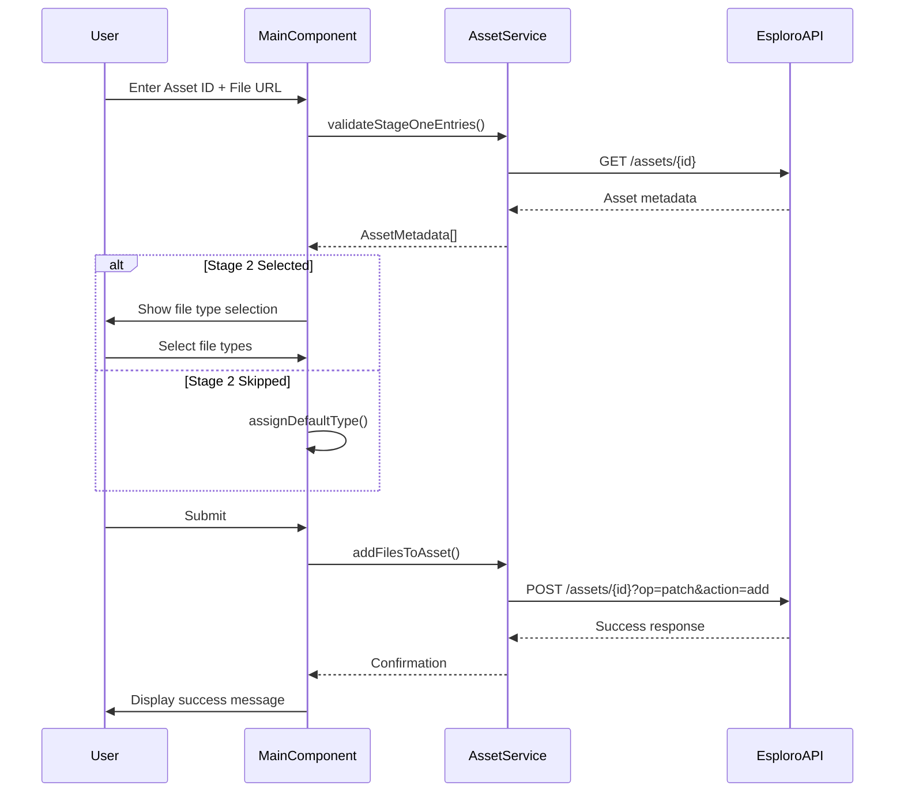
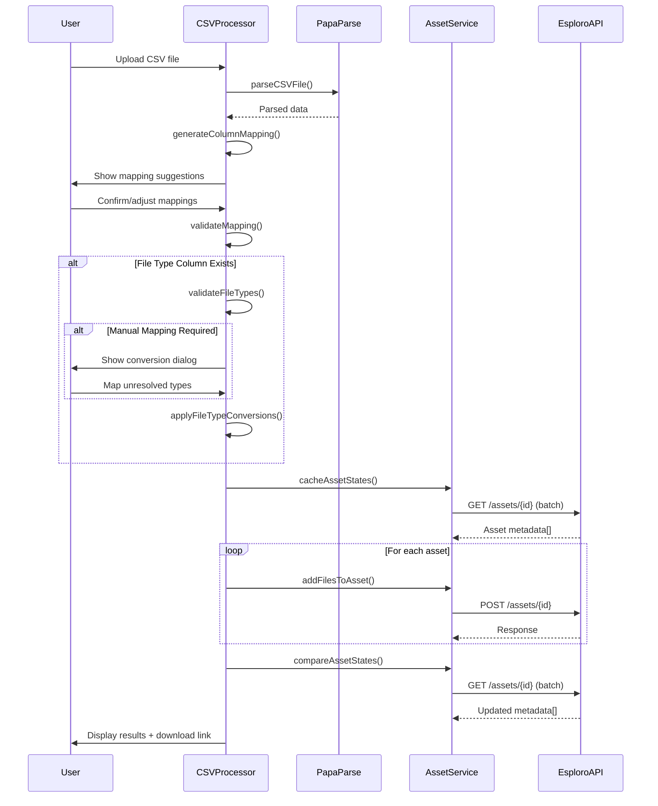

# Esploro Asset File Loader - Comprehensive Codebase Explanation

> **Last Updated:** October 9, 2025
> **Version:** 1.0.0
> **Purpose:** Complete technical documentation for developers, architects, and technical reviewers

---

## Table of Contents

1. [Executive Summary](#executive-summary)
2. [Project Overview](#project-overview)
3. [Architecture & Design](#architecture--design)
4. [Directory Structure](#directory-structure)
5. [Core Components](#core-components)
6. [Data Flow & Logic](#data-flow--logic)
7. [Dependencies & External Libraries](#dependencies--external-libraries)
8. [Coding Patterns & Practices](#coding-patterns--practices)
9. [Critical Logic & Complex Areas](#critical-logic--complex-areas)
10. [API Integration](#api-integration)
11. [Security Considerations](#security-considerations)
12. [Testing Strategy](#testing-strategy)
13. [Documentation Gaps](#documentation-gaps)
14. [Onboarding Guide](#onboarding-guide)
15. [Future Enhancements](#future-enhancements)

---

## Executive Summary

The **Esploro Asset File Loader** is an Angular-based cloud application designed to streamline the process of attaching external files to research assets in Ex Libris Esploro. It provides two distinct workflows:

1. **Manual Entry**: Guided form-based entry for individual file attachments
2. **CSV Upload**: Bulk processing with intelligent column mapping and validation

### Key Capabilities

- ✅ Validate asset IDs against Esploro's live API
- ✅ Intelligent CSV column mapping with fuzzy matching
- ✅ File type conversion from human-readable names to system IDs
- ✅ Before/after state comparison to detect unchanged assets
- ✅ Comprehensive error handling and user feedback
- ✅ Internationalization support (i18n)

### Technology Stack

- **Frontend Framework**: Angular 11.2.14
- **UI Library**: Angular Material 11.2.12
- **Programming Language**: TypeScript 4.1.5
- **Build Tool**: Angular CLI
- **CSV Parsing**: PapaParse 5.4.1
- **Reactive Programming**: RxJS 6.5.5
- **Integration SDK**: Ex Libris Cloud Apps SDK 1.4.7

---

## Project Overview

### What Problem Does It Solve?

Esploro is a research asset management system. Researchers and administrators often need to attach external files (PDFs, datasets, supplemental materials) to existing research assets. Doing this manually through the UI is time-consuming when dealing with hundreds or thousands of files.

This Cloud App automates the process by:
- Validating asset existence before attempting file attachment
- Queuing files for ingestion via Esploro's "Load files" job
- Providing detailed feedback on success/failure states
- Supporting both individual and bulk operations

### Typical Usage Scenarios

#### Scenario 1: Manual Entry for Small Batches
A librarian needs to attach 5-10 supplemental files to various research publications.

**Workflow:**
1. Open the app in Esploro's Cloud Apps panel
2. Enter asset IDs and file URLs in the form
3. Validate assets → Select file types → Submit
4. App queues files via API

#### Scenario 2: CSV Upload for Bulk Operations
An administrator has a spreadsheet with 500 assets that need file attachments.

**Workflow:**
1. Upload CSV with columns: `mmsId`, `remoteUrl`, `fileTitle`, `fileType`
2. Review intelligent column mapping suggestions
3. Resolve any file type name-to-ID conversions
4. Process batch → Review results → Download MMS ID list
5. Create asset set in Esploro → Run "Load files" job

---

## Architecture & Design

### Architectural Style

The application follows **Component-Based Architecture** with clear separation of concerns:

```
┌─────────────────────────────────────────────────┐
│           Angular Application Layer             │
│  ┌──────────────┐        ┌──────────────┐      │
│  │  Components  │◄──────►│   Services   │      │
│  │  (UI Logic)  │        │ (Business    │      │
│  │              │        │  Logic)      │      │
│  └──────┬───────┘        └──────┬───────┘      │
│         │                       │               │
│         ▼                       ▼               │
│  ┌──────────────┐        ┌──────────────┐      │
│  │   Models     │        │  Utilities   │      │
│  │ (Interfaces) │        │  (Helpers)   │      │
│  └──────────────┘        └──────────────┘      │
└─────────────────┬───────────────────────────────┘
                  │
                  ▼
┌─────────────────────────────────────────────────┐
│       Ex Libris Cloud Apps SDK Layer            │
│  ┌──────────────────────────────────────────┐  │
│  │      CloudAppRestService                 │  │
│  │  (HTTP client for Esploro APIs)          │  │
│  └──────────────────────────────────────────┘  │
└─────────────────┬───────────────────────────────┘
                  │
                  ▼
┌─────────────────────────────────────────────────┐
│            Esploro REST APIs                    │
│  • /esploro/v1/assets/{id}                      │
│  • /conf/mapping-tables/AssetFileAndLinkTypes   │
└─────────────────────────────────────────────────┘
```

### Design Patterns

1. **Service Layer Pattern**: Business logic encapsulated in `AssetService`
2. **Reactive Programming**: RxJS Observables for async operations
3. **Form Management**: Angular Reactive Forms for validation
4. **State Management**: Component-level state (no external store)
5. **Dependency Injection**: Angular's DI for service instantiation

### Key Design Decisions

#### Why No State Management Library (NgRx/Akita)?
- **Decision**: Use component-level state management
- **Rationale**: Small app scope, limited shared state, reduced complexity
- **Trade-off**: Harder to scale if app grows significantly

#### Why PapaParse Instead of Native CSV Parsing?
- **Decision**: Use PapaParse library for CSV parsing
- **Rationale**: RFC 4180 compliance, handles edge cases (quoted fields, newlines)
- **Trade-off**: Additional dependency (~50KB gzipped)

#### Why RxJS 6 Polyfills Instead of Upgrading?
- **Decision**: Implement custom `firstValueFrom`/`lastValueFrom` helpers
- **Rationale**: Ex Libris SDK locked to Angular 11 (uses RxJS 6)
- **Trade-off**: Maintenance burden, but ensures compatibility

---

## Directory Structure

```
esploro-csv-researcher-loader/
│
├── cloudapp/                          # Angular application root
│   ├── src/
│   │   ├── app/
│   │   │   ├── components/           # Reusable UI components
│   │   │   │   ├── csv-processor/    # CSV upload & processing logic
│   │   │   │   └── processing-results/ # Results display component
│   │   │   ├── constants/            # Application constants
│   │   │   │   └── file-types.ts     # File type mappings
│   │   │   ├── main/                 # Main entry component
│   │   │   │   ├── main.component.ts # Manual entry workflow
│   │   │   │   ├── main.component.html
│   │   │   │   └── main.component.scss
│   │   │   ├── models/               # TypeScript interfaces
│   │   │   │   ├── asset.ts          # Asset-related models
│   │   │   │   ├── types.ts          # Shared type definitions
│   │   │   │   └── settings.ts       # Settings models
│   │   │   ├── services/             # Business logic services
│   │   │   │   └── asset.service.ts  # Esploro API integration
│   │   │   ├── settings/             # Settings component
│   │   │   │   ├── profile/          # Profile management
│   │   │   │   └── settings.component.ts
│   │   │   ├── utilities/            # Helper functions
│   │   │   │   └── rxjs-helpers.ts   # RxJS 6 polyfills
│   │   │   ├── app.module.ts         # Root module
│   │   │   ├── app-routing.module.ts # Routing configuration
│   │   │   ├── enhanced-material.module.ts # Material UI config
│   │   │   └── utilities.ts          # General utilities
│   │   ├── i18n/                     # Internationalization
│   │   │   └── en.json               # English translations
│   │   └── assets/                   # Static assets
│   └── package.json                  # Angular dependencies
│
├── documentation/                     # Comprehensive docs
│   ├── API to Add new file to Asset.md
│   ├── CSV_ENHANCEMENT_IMPLEMENTATION.md
│   ├── DEVELOPER_QUICK_REFERENCE.md
│   ├── FILE_TYPE_IMPLEMENTATION_SUMMARY.md
│   ├── VISUAL_DIAGRAMS.md
│   └── example-api-response/         # Sample API responses
│
├── .github/                          # GitHub workflows
│   └── copilot-instructions.md       # AI assistant context
│
├── manifest.json                     # Cloud App configuration
├── package.json                      # Root dependencies
├── README.md                         # User-facing documentation
└── LICENSE                           # BSD-3-Clause license
```

### Key Files Explained

| File | Purpose | Importance |
|------|---------|------------|
| `manifest.json` | Cloud App metadata (title, icon, pages) | Critical - defines app identity |
| `app.module.ts` | Angular root module, dependency declarations | Critical - app won't run without it |
| `main.component.ts` | Manual entry workflow (584 lines) | High - core feature |
| `csv-processor.component.ts` | CSV workflow (910 lines) | High - core feature |
| `asset.service.ts` | Esploro API integration | Critical - all API calls |
| `rxjs-helpers.ts` | RxJS 6 compatibility polyfills | Critical - prevents deprecation warnings |

---

## Core Components

### 1. MainComponent (`main.component.ts`)

**Responsibility**: Orchestrates the manual entry workflow with 3-stage progression.

**Key Features:**
- **Stage 1**: Asset ID + file URL entry with form validation
- **Stage 2**: File type selection (optional, can be skipped)
- **Stage 3**: Review & confirm before submission

**State Management:**
```typescript
stage: 'stage1' | 'stage2' | 'stage3' = 'stage1';
assetMetadataMap: Map<string, AssetMetadata>; // Cached asset data
fileTypes: FileType[];  // Available file types from API
```

**Critical Methods:**
- `validateStageOneEntries()`: Validates asset IDs via API, caches metadata
- `assignDefaultType()`: Auto-selects file type based on asset type
- `buildSubmissionPayload()`: Constructs API payload structure
- `executeSubmission()`: Submits files via AssetService

**Complexity Score**: 🔴 High (584 lines, complex state transitions)

---

### 2. CSVProcessorComponent (`csv-processor.component.ts`)

**Responsibility**: Handles CSV upload, mapping, validation, and batch processing.

**Workflow Stages:**

```
Upload CSV → Parse → Column Mapping → Validate →
File Type Conversion (if needed) → Batch Process → Results
```

**Key Features:**
- **Intelligent Mapping**: Fuzzy matching for column headers
- **File Type Conversion**: Converts human names ("Dataset") to IDs ("DATA")
- **Required Field Validation**: Ensures `mmsId` and `remoteUrl` are populated
- **Before/After Comparison**: Detects unchanged assets post-import

**State Management:**
```typescript
csvData: CSVData | null;  // Parsed CSV content
columnMappingData: ColumnMapping[];  // User-configured mappings
fileTypeConversions: FileTypeConversion[];  // Name-to-ID mappings
assetCacheMap: Map<string, CachedAssetState>;  // Pre-import state
```

**Critical Methods:**
- `parseCSVFile()`: Uses PapaParse for RFC 4180 compliance
- `suggestFieldMapping()`: Intelligent column-to-field matching
- `validateFileTypes()`: Checks if file types are IDs or names
- `matchFileTypeByTargetCode()`: Fuzzy matching with confidence scores
- `cacheAssetStates()`: Pre-import metadata caching
- `compareAssetStates()`: Post-import change detection

**Complexity Score**: 🔴 Very High (910 lines, 15+ distinct responsibilities)

---

### 3. AssetService (`asset.service.ts`)

**Responsibility**: Encapsulates all Esploro API interactions.

**API Endpoints Used:**

| Method | Endpoint | Purpose |
|--------|----------|---------|
| `addFilesToAsset()` | `POST /esploro/v1/assets/{id}?op=patch&action=add` | Queue files for ingestion |
| `getAssetMetadata()` | `GET /esploro/v1/assets/{id}` | Fetch asset details |
| `getAssetFilesAndLinkTypes()` | `GET /conf/mapping-tables/AssetFileAndLinkTypes` | Fetch valid file types |

**Key Logic:**
- **Payload Construction**: Transforms `AssetFileLink[]` to Esploro's `temporary.linksToExtract` structure
- **Error Handling**: Maps 404 errors to `null` for missing assets
- **Type Filtering**: Filters file types by asset type using `SOURCE_CODE_2` field

**Example API Payload:**
```json
{
  "records": [
    {
      "temporary": {
        "linksToExtract": [
          {
            "link.title": "Supplemental Dataset",
            "link.url": "https://example.com/data.csv",
            "link.description": "Research data",
            "link.type": "DATA",
            "link.supplemental": "true"
          }
        ]
      }
    }
  ]
}
```

**Complexity Score**: 🟡 Medium (176 lines, straightforward API calls)

---

### 4. ProcessingResultsComponent

**Responsibility**: Displays batch processing results with status breakdown.

**Features:**
- Success/error/unchanged status categorization
- Downloadable MMS ID CSV for successful assets
- Workflow instructions for next steps (create set → run job)

**Complexity Score**: 🟢 Low (display logic only)

---

## Data Flow & Logic

### Manual Entry Workflow



### CSV Upload Workflow



### File Type Conversion Logic

This is one of the most complex pieces of logic in the application.

**Problem**: Esploro's API requires file type IDs (e.g., "DATA", "PUBLICATION"), but users might have CSV columns with human-readable names like "Dataset" or "Research Publication".

**Solution**: Multi-stage fuzzy matching with confidence scoring.

**Algorithm:**
```typescript
matchFileTypeByTargetCode(csvValue: string): FileTypeConversion {
  1. Normalize CSV value (lowercase, trim)

  2. Exact match check:
     - If assetFileAndLinkTypes.targetCode === csvValue
     - Return { matchedId, confidence: 0.95 }

  3. Partial match check:
     - If csvValue.includes(targetCode) OR targetCode.includes(csvValue)
     - Return { matchedId, confidence: 0.7 }

  4. No match:
     - Return { requiresManualMapping: true, confidence: 0 }
}
```

**User Experience:**
- Auto-matched values (confidence > 0.7) → automatically converted
- Unmatched values → dropdown for manual selection
- Conversion review screen → user can adjust before processing

---

## Dependencies & External Libraries

### Production Dependencies

| Package | Version | Purpose | Alternatives Considered |
|---------|---------|---------|------------------------|
| `@angular/core` | 11.2.14 | Framework foundation | None (Ex Libris requirement) |
| `@angular/material` | 11.2.12 | UI components | Angular CDK alone (Material provides better UX) |
| `@exlibris/exl-cloudapp-angular-lib` | 1.4.7 | SDK for Esploro integration | None (required) |
| `@exlibris/exl-cloudapp-base` | 1.4.7 | Base SDK utilities | None (required) |
| `papaparse` | 5.4.1 | CSV parsing | `csv-parser` (PapaParse has better browser support) |
| `rxjs` | 6.5.5 | Reactive programming | None (Angular dependency) |
| `@ngx-translate/core` | 13.0.0 | Internationalization | `ngx-i18n` (ngx-translate more mature) |
| `ngx-translate-parser-plural-select` | 1.1.3 | ICU pluralization | Custom logic (library handles edge cases) |

### Dev Dependencies

| Package | Version | Purpose |
|---------|---------|---------|
| `@angular/cli` | 11.2.13 | Build tooling |
| `typescript` | 4.1.5 | Type safety |
| `karma` | 6.3.2 | Test runner |
| `jasmine-core` | 3.7.1 | Test framework |

### Why PapaParse?

**Strengths:**
- ✅ RFC 4180 compliant (handles quoted fields with commas)
- ✅ Web Worker support for large files
- ✅ Streaming mode for memory efficiency
- ✅ Auto-detects delimiters
- ✅ 4.9M weekly downloads (well-maintained)

**Weaknesses:**
- ❌ Additional 50KB bundle size
- ❌ Overkill for simple CSVs

**Decision**: Benefits outweigh costs. CSV parsing edge cases (newlines in fields, encoding issues) justify the dependency.

---

## Coding Patterns & Practices

### 1. Reactive Forms Pattern

**Example:**
```typescript
this.form = this.fb.group({
  entries: this.fb.array([
    this.fb.group({
      assetId: ['', Validators.required],
      url: ['', [Validators.required, Validators.pattern(/^https?:\/\//i)]],
      type: ['']
    })
  ])
});
```

**Benefits:**
- Type-safe form controls
- Built-in validation
- Easy to add/remove dynamic entries

---

### 2. Observable-to-Promise Conversion

**Pattern:**
```typescript
// BEFORE (deprecated in RxJS 7+)
const result = await observable.toPromise();

// AFTER (using custom polyfill)
const result = await firstValueFrom(observable);
```

**Why?**: `toPromise()` deprecated, but Ex Libris SDK uses RxJS 6. Custom polyfill maintains compatibility.

---

### 3. Error Handling Pattern

**Consistent Structure:**
```typescript
try {
  await lastValueFrom(apiCall$);
  this.alert.success('Operation successful');
} catch (error: any) {
  const message = error?.status === 404
    ? 'Asset not found'
    : 'Unexpected error occurred';
  this.alert.error(message);
}
```

**Benefits:**
- User-friendly error messages
- Specific handling for common HTTP statuses
- Centralized alert service usage

---

### 4. Immutability in State Updates

**Example:**
```typescript
// Create new array instead of mutating
const newOrder = [...invalidControls, ...validControls];
this.replaceEntries(newOrder);
```

**Benefits:**
- Predictable state changes
- Easier debugging
- Change detection optimization

---

### 5. TypeScript Strict Mode Compliance

**Configuration:**
```json
{
  "strict": true,
  "noImplicitAny": true,
  "strictNullChecks": true
}
```

**Impact:**
- Catches null/undefined errors at compile time
- Forces explicit type declarations
- Reduces runtime errors

---

## Critical Logic & Complex Areas

### 🔴 Area 1: Asset Validation & Reordering

**Location**: `main.component.ts:406-467`

**Purpose**: Validate asset IDs exist in Esploro, cache metadata, and reorder form entries to show invalid IDs first.

**Complexity Drivers:**
- Parallel API calls with `forkJoin`
- Form manipulation (removing/re-adding controls)
- Error marker injection without breaking validation state

**Code Snippet:**
```typescript
private async validateStageOneEntries(): Promise<boolean> {
  const uniqueAssetIds = this.collectUniqueAssetIds();

  // Parallel API calls
  const responses = await lastValueFrom(
    forkJoin(
      uniqueAssetIds.map(id =>
        this.assetService.getAssetMetadata(id).pipe(
          map(metadata => ({ assetId: id, metadata }))
        )
      )
    )
  );

  // Build validation map
  responses.forEach(({ assetId, metadata }) => {
    if (metadata) {
      this.assetMetadataMap.set(assetId, metadata);
    }
  });

  // Find invalid entries
  const invalidIndices = this.entries.controls
    .map((group, index) => {
      const assetId = group.get('assetId')?.value?.trim();
      return !assetId || !this.assetMetadataMap.has(assetId) ? index : -1;
    })
    .filter(i => i !== -1);

  if (invalidIndices.length) {
    this.highlightInvalidEntries(invalidIndices);  // ⚠️ Modifies FormArray
    return false;
  }

  return true;
}
```

**Edge Cases Handled:**
- Duplicate asset IDs (only validate once)
- Network errors (catch and display user-friendly message)
- Empty asset ID strings (trim before validation)

**Potential Issues:**
- FormArray manipulation can trigger unwanted change detection
- Reordering can confuse users if not communicated via UI

---

### 🔴 Area 2: File Type Fuzzy Matching

**Location**: `csv-processor.component.ts:378-419`

**Purpose**: Match user-provided file type names to system IDs.

**Algorithm Stages:**

1. **Exact Match** (confidence: 0.95)
   ```typescript
   targetCode.toLowerCase() === normalizedValue
   ```

2. **Partial Match** (confidence: 0.7)
   ```typescript
   targetCode.toLowerCase().includes(normalizedValue) ||
   normalizedValue.includes(targetCode.toLowerCase())
   ```

3. **No Match** (confidence: 0, requires manual mapping)

**Example Mappings:**

| CSV Value | Matched ID | Confidence | Method |
|-----------|------------|------------|--------|
| "DATA" | "DATA" | 1.0 | Exact (ID already) |
| "Dataset" | "DATA" | 0.95 | Exact match on targetCode |
| "Research Data" | "DATA" | 0.7 | Partial match |
| "XYZ123" | null | 0.0 | No match |

**Trade-offs:**
- ✅ Flexible (handles variations in user data)
- ❌ False positives possible with partial matching
- ❌ Confidence thresholds are arbitrary (0.7 chosen empirically)

---

### 🔴 Area 3: Before/After State Comparison

**Location**: `csv-processor.component.ts:715-773`

**Purpose**: Detect assets where file import didn't actually add files (duplicate URLs, errors).

**Algorithm:**
```typescript
async compareAssetStates(processedAssets: ProcessedAsset[]) {
  // 1. Fetch post-import states
  const comparisonRequests = successfulAssets.map(asset =>
    this.assetService.getAssetMetadata(asset.mmsId)
  );
  const results = await lastValueFrom(forkJoin(comparisonRequests));

  // 2. Compare file counts
  results.forEach((metadata, index) => {
    const cachedState = this.assetCacheMap.get(asset.mmsId);
    const filesBeforeCount = cachedState.filesBefore.length;
    const filesAfterCount = metadata.files.length;

    // 3. Check if URL was actually added
    const remoteUrlAdded = cachedState.filesAfter.some(
      f => f.url === cachedState.remoteUrlFromCSV
    );

    // 4. Flag as unchanged if counts match and URL not found
    if (filesBeforeCount === filesAfterCount && !remoteUrlAdded) {
      asset.status = 'unchanged';
      asset.wasUnchanged = true;
    }
  });
}
```

**Why This Matters:**
- Esploro API returns 200 OK even if file wasn't added (e.g., duplicate URL)
- Users need to know which assets actually changed
- Helps identify data quality issues (malformed URLs, permissions)

**Edge Cases:**
- Asset had 5 files, API adds 1 but auto-removes a duplicate → still 5 files
- Multiple CSV rows target same asset → file count increases but some fail

**Performance:**
- Requires 2x API calls per asset (before + after)
- Mitigated by parallel `forkJoin` calls
- Only runs for successful assets (filters out errors)

---

### 🔴 Area 4: Sequential Batch Processing

**Location**: `csv-processor.component.ts:675-710`

**Purpose**: Process CSV rows sequentially to avoid API rate limiting.

**Code:**
```typescript
for (let i = 0; i < assets.length; i++) {
  const asset = assets[i];

  try {
    await this.validateAsset(asset.mmsId);

    if (asset.remoteUrl) {
      await this.processAssetFile(asset);
    }

    asset.status = 'success';
  } catch (error: any) {
    asset.status = 'error';
    asset.errorMessage = error.message;
  }

  // Small delay to prevent API throttling
  if (i < assets.length - 1) {
    await this.delay(100);  // 100ms delay
  }
}
```

**Why Sequential?**
- Esploro API may throttle rapid requests
- Progress indicator needs sequential updates
- Error isolation (one failure doesn't block others)

**Trade-offs:**
- ✅ Reliable, predictable behavior
- ✅ Easy to debug
- ❌ Slower than parallel (100 assets × 100ms = 10 extra seconds)
- ❌ Doesn't saturate available bandwidth

**Future Optimization:**
- Use semaphore pattern (max 5 concurrent requests)
- Adaptive delay based on response times
- Batch API if Esploro adds batch endpoints

---

## API Integration

### Esploro REST API Overview

The application interacts with two primary API categories:

1. **Assets API** - Manage research assets
2. **Configuration API** - Retrieve system mappings

### API Endpoint Reference

#### 1. Add Files to Asset

**Endpoint:**
```
POST /esploro/v1/assets/{assetId}?op=patch&action=add
```

**Request Headers:**
```json
{
  "Content-Type": "application/json",
  "Accept": "application/json"
}
```

**Request Body:**
```json
{
  "records": [
    {
      "temporary": {
        "linksToExtract": [
          {
            "link.title": "Supplemental Dataset",
            "link.url": "https://example.com/data.csv",
            "link.description": "Research data collected in 2024",
            "link.type": "DATA",
            "link.supplemental": "true"
          }
        ]
      }
    }
  ]
}
```

**Response (Success):**
```json
{
  "records": [
    {
      "mms_id": "991234567890123",
      "title": "Research Publication Title",
      "files_and_links": [...]
    }
  ]
}
```

**Error Responses:**

| Status | Meaning | User Message |
|--------|---------|--------------|
| 400 | Invalid payload | "Invalid file data provided" |
| 401 | Unauthorized | "Authentication failed" |
| 404 | Asset not found | "Asset {id} not found" |
| 500 | Server error | "Esploro API error" |

---

#### 2. Get Asset Metadata

**Endpoint:**
```
GET /esploro/v1/assets/{mmsId}
```

**Response:**
```json
{
  "records": [
    {
      "mms_id": "991234567890123",
      "title": {
        "value": "Research Publication Title"
      },
      "asset_type": {
        "value": "publication"
      },
      "files_and_links": [
        {
          "id": "file123",
          "title": { "value": "Main PDF" },
          "url": { "value": "https://example.com/main.pdf" },
          "type": { "value": "PUBLICATION" }
        }
      ]
    }
  ]
}
```

**Usage in App:**
- Pre-import caching (`cacheAssetStates()`)
- Asset validation (`validateStageOneEntries()`)
- Post-import comparison (`compareAssetStates()`)

---

#### 3. Get Asset File and Link Types

**Endpoint:**
```
GET /conf/mapping-tables/AssetFileAndLinkTypes
```

**Response:**
```json
{
  "mapping_table": {
    "rows": {
      "row": [
        {
          "id": "DATA",
          "target_code": "Dataset",
          "source_code_1": "both",
          "source_code_2": "publication,patent"
        },
        {
          "id": "PUBLICATION",
          "target_code": "Publication File",
          "source_code_1": "file",
          "source_code_2": ""
        }
      ]
    }
  }
}
```

**Field Meanings:**
- `id`: Value to use in API calls
- `target_code`: Human-readable label
- `source_code_1`: Applicability ("file", "link", "both")
- `source_code_2`: Comma-separated asset types (empty = all types)

**Usage in App:**
- File type dropdown population
- File type name-to-ID conversion
- Asset type filtering (`filterFileTypesByAssetType()`)

---

### API Error Handling Strategy

**Centralized Error Mapping:**
```typescript
catchError(error => {
  const message = this.mapErrorToUserMessage(error);
  this.alert.error(message);
  return throwError(() => ({ message }));
})
```

**Error Message Examples:**
- Network error: "Unable to connect to Esploro. Check your connection."
- 404: "Asset {id} not found in Esploro."
- 401: "You don't have permission to modify this asset."
- 500: "Esploro server error. Try again later."

---

## Security Considerations

### Input Validation

1. **Asset ID Validation**
   - Pattern: Must match Esploro MMS ID format
   - Server-side: Validated via API existence check
   - Protection: Prevents invalid API calls

2. **URL Validation**
   - Pattern: `^https?:\/\/`
   - Protection: Prevents non-HTTP protocols (javascript:, data:)
   - Limitation: Doesn't validate URL content (Esploro's responsibility)

3. **CSV Upload Limits**
   - Max file size: 10MB
   - Validation: Client-side check before parsing
   - Protection: Prevents memory exhaustion

### XSS Protection

**Angular's Built-in Protections:**
- Template sanitization (automatic)
- Property binding (doesn't interpret HTML)
- `DomSanitizer` for dynamic content

**Custom Measures:**
- No `innerHTML` usage
- All user input displayed via interpolation `{{ }}` or `[textContent]`

### API Security

**Authentication:**
- Handled by Ex Libris Cloud Apps SDK
- OAuth 2.0 token-based
- App never sees/stores credentials

**Authorization:**
- Permissions managed by Esploro
- App respects API 401/403 responses
- No client-side role checks (server is source of truth)

### Data Privacy

**No PII Storage:**
- App doesn't persist user data
- Session state only (component-level)
- CSV files processed in-memory, not uploaded to server

**Audit Trail:**
- Esploro logs all API calls
- App doesn't implement custom logging (relies on Esploro)

---

## Testing Strategy

### Current State

⚠️ **No unit tests currently implemented**

The project includes Karma/Jasmine setup but no `.spec.ts` files with tests.

### Recommended Testing Approach

#### 1. Unit Tests (High Priority)

**Critical Services:**
```typescript
// asset.service.spec.ts
describe('AssetService', () => {
  it('should map AssetFileLink to API payload structure', () => {
    const input: AssetFileLink = {
      title: 'Test',
      url: 'https://example.com/file.pdf',
      type: 'DATA',
      supplemental: true
    };

    const payload = service.buildPayload('123', [input]);

    expect(payload.records[0].temporary.linksToExtract[0]).toEqual({
      'link.title': 'Test',
      'link.url': 'https://example.com/file.pdf',
      'link.type': 'DATA',
      'link.supplemental': 'true'
    });
  });
});
```

**Critical Components:**
```typescript
// csv-processor.component.spec.ts
describe('CSVProcessorComponent', () => {
  it('should match file type by exact target code', () => {
    const result = component.matchFileTypeByTargetCode('Dataset');
    expect(result.matchedId).toBe('DATA');
    expect(result.confidence).toBe(0.95);
  });

  it('should require manual mapping for unmatched types', () => {
    const result = component.matchFileTypeByTargetCode('XYZ123');
    expect(result.requiresManualMapping).toBe(true);
    expect(result.confidence).toBe(0);
  });
});
```

#### 2. Integration Tests (Medium Priority)

**Test API Interactions:**
```typescript
describe('Asset Validation Flow', () => {
  it('should validate existing asset IDs', async () => {
    spyOn(restService, 'call').and.returnValue(of(mockAssetResponse));

    const result = await component.validateStageOneEntries();

    expect(result).toBe(true);
    expect(component.assetMetadataMap.size).toBe(1);
  });

  it('should handle 404 for invalid asset IDs', async () => {
    spyOn(restService, 'call').and.returnValue(throwError({ status: 404 }));

    const result = await component.validateStageOneEntries();

    expect(result).toBe(false);
    expect(alertService.error).toHaveBeenCalled();
  });
});
```

#### 3. E2E Tests (Low Priority)

**User Journey Testing:**
- Upload CSV → Map columns → Process → View results
- Manual entry → Validate → Submit → Success message

**Tools:**
- Protractor (deprecated, migrate to Cypress or Playwright)
- Selenium WebDriver

### Testing Gaps (Current)

| Area | Risk Level | Impact if Broken |
|------|------------|------------------|
| File type matching | 🔴 High | CSV processing fails |
| API payload construction | 🔴 High | API rejects requests |
| Before/after comparison | 🟡 Medium | Inaccurate results |
| Column mapping | 🟡 Medium | CSV misinterpreted |
| Form validation | 🟢 Low | UI prevents invalid input |

---

## Documentation Gaps

### 1. API Documentation

**Current State:**
- Partial documentation in `documentation/API to Add new file to Asset.md`
- Scattered examples in multiple files

**Recommendations:**
- ✅ Consolidate all API docs into single source
- ✅ Add request/response examples for every endpoint
- ✅ Document error codes and meanings
- ✅ Create OpenAPI/Swagger spec

---

### 2. Inline Code Comments

**Current State:**
- Minimal JSDoc comments
- Some complex methods lack explanation

**Examples of Needed Comments:**

```typescript
/**
 * Validates asset IDs by calling Esploro API and caches metadata.
 *
 * This method:
 * 1. Extracts unique asset IDs from form entries
 * 2. Calls Esploro API in parallel via forkJoin
 * 3. Caches successful responses in assetMetadataMap
 * 4. Reorders form entries to show invalid IDs first
 *
 * @returns Promise<boolean> - True if all IDs valid, false otherwise
 * @throws Error if network error or API unavailable
 */
private async validateStageOneEntries(): Promise<boolean> { ... }
```

---

### 3. Architecture Decision Records (ADRs)

**Missing Decisions:**
- Why PapaParse over native CSV parsing?
- Why component state vs NgRx?
- Why sequential vs parallel batch processing?

**Recommended Format:**
```markdown
# ADR-001: Use PapaParse for CSV Parsing

## Context
CSV files can contain edge cases (quoted commas, newlines in fields) that naive splitting can't handle.

## Decision
Use PapaParse library for RFC 4180 compliance.

## Consequences
- +50KB bundle size
- Better reliability with real-world CSV files
- Dependency maintenance burden
```

---

### 4. Troubleshooting Guide

**Needed:**
- Common error messages and solutions
- Network connectivity issues
- Permission errors
- CSV format problems

**Example Entry:**
```markdown
### Error: "Asset {id} not found"

**Cause**: Asset ID doesn't exist in Esploro or user lacks permission.

**Solution**:
1. Verify asset ID is correct (check in Esploro UI)
2. Confirm user has "View Asset" permission
3. Check if asset is in correct institution
```

---

### 5. Deployment Guide

**Missing:**
- Build process (`npm run build`)
- Deployment to Ex Libris Cloud Apps platform
- Environment variables (if any)
- Version update procedure

---

## Onboarding Guide

### For New Developers

#### Step 1: Environment Setup (30 minutes)

1. **Prerequisites**
   ```bash
   node -v  # Should be v14.x or v16.x
   npm -v   # Should be v6.x or v8.x
   ```

2. **Clone & Install**
   ```bash
   git clone <repo-url>
   cd esploro-csv-researcher-loader
   npm install
   ```

3. **Start Development Server**
   ```bash
   npm start
   # Opens http://localhost:4200
   ```

4. **Load in Esploro**
   - Enable Cloud Apps developer mode in Esploro
   - Add `http://localhost:4200/manifest.json`

---

#### Step 2: Code Walkthrough (2 hours)

**Reading Order:**
1. `README.md` - High-level overview
2. `manifest.json` - App configuration
3. `app.module.ts` - Dependency graph
4. `models/types.ts` - Data structures
5. `services/asset.service.ts` - API integration
6. `main.component.ts` - Manual entry flow
7. `csv-processor.component.ts` - CSV flow

**Key Concepts:**
- Reactive Forms (Angular docs)
- RxJS Observables (ReactiveX.io)
- Ex Libris SDK (Cloud Apps documentation)

---

#### Step 3: Make Your First Change (1 hour)

**Beginner Task**: Add a new validation rule

1. Open `main.component.ts`
2. Find `createEntryGroup()` method
3. Add new validator:
   ```typescript
   url: ['', [
     Validators.required,
     Validators.pattern(this.urlPattern),
     Validators.minLength(10)  // NEW
   ]]
   ```
4. Update `en.json` with error message
5. Test in browser

---

#### Step 4: Understand Data Flow (1 hour)

**Exercise**: Trace a CSV upload

1. Set breakpoint in `onFileSelected()`
2. Upload `documentation/example-csv/sample.csv`
3. Step through:
   - `parseCSVFile()`
   - `generateColumnMapping()`
   - `validateMapping()`
   - `processMappedData()`

**Questions to Answer:**
- Where is PapaParse initialized?
- How are column headers normalized?
- What triggers file type conversion?

---

### For Technical Reviewers

#### Checklist

- [ ] Review security measures (input validation, XSS protection)
- [ ] Verify error handling completeness
- [ ] Check API payload structure matches Esploro spec
- [ ] Assess code complexity (consider refactoring `csv-processor.component.ts`)
- [ ] Evaluate test coverage (currently 0%, needs improvement)
- [ ] Review accessibility (WCAG compliance)
- [ ] Check internationalization (i18n keys for all user-facing text)

#### Key Files to Audit

| File | Focus Area |
|------|------------|
| `asset.service.ts` | API integration correctness |
| `csv-processor.component.ts` | Business logic complexity |
| `rxjs-helpers.ts` | RxJS compatibility |
| `en.json` | User message clarity |

---

## Future Enhancements

### Phase 1: Testing & Quality

**Priority**: 🔴 High

- [ ] Implement unit tests (target: 80% coverage)
- [ ] Add integration tests for API calls
- [ ] Set up CI/CD pipeline (GitHub Actions)
- [ ] Add ESLint with strict rules
- [ ] Implement Prettier for consistent formatting

**Effort**: 2 weeks
**Impact**: Reduces regression risk, improves maintainability

---

### Phase 2: Performance Optimization

**Priority**: 🟡 Medium

- [ ] Parallelize CSV batch processing (semaphore pattern)
- [ ] Implement virtual scrolling for large CSV previews
- [ ] Add Web Worker for CSV parsing (already supported by PapaParse)
- [ ] Cache file type mappings in localStorage

**Effort**: 1 week
**Impact**: Faster processing for large datasets (500+ rows)

---

### Phase 3: Feature Enhancements

**Priority**: 🟢 Low

- [ ] Drag-and-drop reordering of manual entries
- [ ] Save manual entry form as draft
- [ ] Export processing results as CSV
- [ ] Bulk edit file types (apply same type to multiple rows)
- [ ] Preview file type dropdown filtered by asset type in Stage 1

**Effort**: 2 weeks
**Impact**: Improved user experience

---

### Phase 4: Job Automation

**Priority**: 🔵 Future

**Current Limitation**: User must manually:
1. Download MMS ID CSV
2. Create asset set in Esploro
3. Run "Load files" job

**Proposed Enhancement**: Automate steps 2-3 via API

**Requirements:**
- Esploro API must support:
  - `POST /sets` - Create asset set
  - `POST /jobs` - Submit "Load files" job
- Cloud App needs elevated permissions

**Effort**: 3 weeks (depends on API availability)
**Impact**: True end-to-end automation

---

## Conclusion

### Strengths

- ✅ **Robust CSV parsing**: PapaParse handles real-world edge cases
- ✅ **Intelligent mapping**: Fuzzy matching reduces manual work
- ✅ **Comprehensive validation**: Asset IDs, file types, required fields
- ✅ **User feedback**: Clear error messages, progress indicators
- ✅ **Change detection**: Before/after comparison flags unchanged assets

### Weaknesses

- ❌ **No automated tests**: High regression risk
- ❌ **Code complexity**: `csv-processor.component.ts` too large (910 lines)
- ❌ **Sequential processing**: Slow for large datasets
- ❌ **Limited error recovery**: Failed batches require re-upload

### Recommended Next Steps

1. **Immediate** (1 week):
   - Add unit tests for critical methods
   - Refactor `csv-processor.component.ts` (split into smaller services)

2. **Short-term** (1 month):
   - Implement parallel batch processing
   - Add CI/CD pipeline
   - Create comprehensive troubleshooting guide

3. **Long-term** (3 months):
   - Explore job automation (if Esploro APIs support it)
   - Migrate to Angular 12+ (if Ex Libris SDK updates)
   - Consider Web Components for reusable logic

---

## Appendices

### Appendix A: Glossary

| Term | Definition |
|------|------------|
| **MMS ID** | Machine-Readable Serial number, unique identifier for assets in Esploro |
| **Asset** | Research output (publication, dataset, patent, etc.) in Esploro |
| **Cloud App** | Third-party extension running in Esploro's iframe |
| **Mapping Table** | Configuration table in Esploro (e.g., file types, languages) |
| **AssetFileAndLinkTypes** | System mapping of file type IDs to display names |
| **Load Files Job** | Esploro batch job that processes queued file attachments |

### Appendix B: Key Metrics

| Metric | Value |
|--------|-------|
| Total Lines of Code | ~2,500 (TypeScript) |
| Largest File | `csv-processor.component.ts` (910 lines) |
| Number of Components | 4 |
| Number of Services | 1 |
| External Dependencies | 8 (production) |
| Supported Languages | 1 (English, i18n-ready) |
| Test Coverage | 0% (needs improvement) |

### Appendix C: Contact & Support

| Role | Contact |
|------|---------|
| **Original Author** | Ex Libris |
| **Documentation** | [Esploro Help](https://knowledge.exlibrisgroup.com/Esploro) |
| **Support** | Ex Libris Support Portal |

---

**Document Version**: 1.0.0
**Last Updated**: October 9, 2025
**Contributors**: Claude AI Assistant (Technical Documentation)

